# Tiny-YOLO from scratch to an FPGA: a bit-exact chain from NumPy to an HLS accelerator driven by an ARM SoC

*Léonard Rivals* · draft, <!-- article:rev -->rev. `1808467-dirty`, 2026-10-07<!-- /article -->

> Working article of the repository (milestone [M17](../tasks/M17-article.md)). Numbers,
> tables, figures and milestone status sit in generated blocks (`<!-- article:… -->`
> comments) and are rewritten by `make article`; only the narrative is written by hand.
> A superscript gives the status of a number when it is not a measurement on the full
> test set: C-sim computed by the HLS kernel in C simulation,
> proj. cycle or resource model without synthesis, est. analytical
> estimate, tier R subset of images (M12 rule), pub. figure taken
> from a paper. Figure captions come from the figure registry (`tools/figures`) and are
> still in French until milestone M19 translates them.

## Abstract

We rewrite the Tiny-YOLOv2 and Tiny-YOLOv3 detectors from scratch in NumPy, without any
deep-learning library, with forward and backward passes checked by finite differences.
With the published Darknet weights, the float model reaches
<!-- article:n:map.voc.float -->56.30<!-- /article --> mAP on VOC2007 test
(<!-- article:n:map.voc.images -->4,952<!-- /article --> images). We fuse batch normalization,
quantize weights per channel and activations per layer to INT8, and run the network in
integer arithmetic only: the gap to the float model is
<!-- article:n:map.voc.drop -->−0.64<!-- /article --> point
(<!-- article:n:map.voc.int8 -->55.66<!-- /article --> mAP), without quantization-aware
training. A C++ golden model and a single-engine Vitis HLS accelerator reproduce the
integer model byte for byte; driven by the ARM driver over the C-simulated kernel, the
whole test set gives <!-- article:n:map.voc.identical -->4,952C-sim<!-- /article --> identical
images, hence <!-- article:n:map.voc.csim -->55.66C-sim<!-- /article --> mAP. On a Kria KV260 at
200 MHz, the cycle model of the optimized kernel projects
<!-- article:n:perf.kv260.v2.ms -->37.2proj.<!-- /article --> ms per image, i.e.
<!-- article:n:perf.kv260.v2.gops -->187.3proj.<!-- /article --> GOPS for
<!-- article:n:model.v2.gmacs -->3.49<!-- /article --> GMAC; the board itself has not been
measured yet. Extensions compare power-of-two weights, 4-bit quantization, integer
hardware post-processing (<!-- article:n:map.formats.hwpp -->55.56<!-- /article --> mAP) and
a streaming architecture (<!-- article:n:stream.w8.fps -->32.1est.<!-- /article --> images/s), and
first sweeps fine-tune Tiny-YOLOv3 on five other datasets.

## 1. Introduction and contributions

Object detection on embedded FPGAs is usually reached through vendor toolchains: a
network trained in a deep-learning framework is quantized by a vendor tool and mapped to
a preconfigured processing unit, as with the Vitis AI DPU used by 2026-fata on the same
board as ours. Every layer of that stack hides choices that change the
result: preprocessing, rounding, the integer approximation of the activation, the head
decoding. This work takes the opposite route and rebuilds each layer by hand, so that
every number can be traced to a line of code and checked against the stage before it.

The YOLO family predicts boxes on a grid in a single pass over the image
[1506.02640#002.0]; Tiny-YOLOv2 keeps one 13×13 output map [1612.08242#002.2] and
Tiny-YOLOv3 adds a second one at 26×26 [2023-zhai#004.1]. These two networks are small
enough for a mid-range Zynq UltraScale+ and are the reference workload of most FPGA
papers of the base (§2).

Contributions:

1. **A complete chain without a learning library**: layers, losses, training, decoding,
   NMS and VOC evaluation in NumPy, each gradient checked by finite differences (§3, §4).
2. **Bit-exactness from the NumPy integer model to the HLS kernel**: the integer model,
   the C++ golden model, the C-simulated kernel behind the ARM driver produce the same
   bytes, verified on the whole VOC2007 test set (§5, §6, §8).
3. **One engine for v2 and v3**: a single parameterized layer-by-layer accelerator runs
   both networks from a manifest, with route and upsample handled by addressing (§7).
4. **Formats compared on the same model**: INT8, power-of-two weights after REQ-YOLO,
   4-bit weights and activations, and integer post-processing, all evaluated on the same
   test set with the same protocol (§9).
5. **Reproducible tooling**: tiers of test profiles, figures, notebooks and this article
   are regenerated from the repository by `make` targets (§12).

State of the project at the last render: <!-- article:etat:resume -->155 of 247 tasks done across 24 milestones, 7 milestones complete<!-- /article -->
(details in §11).

## 2. Related work

Two families of CNN accelerators coexist on FPGAs [2018-venieris#004.0]. A *streaming*
architecture instantiates one hardware stage per layer and pipelines them, which gives
latency and throughput but needs one bitstream per network; SATAY keeps all parameters on
chip this way [2023-montgomerie-corcoran#006.0]. A *single engine* runs the layers one
after the other on a systolic array or a matrix unit, scheduled by software
[2018-venieris#007.1]; it fits a small Zynq and serves several networks with one
bitstream, at the price of DDR traffic at every layer. The tiling of the convolution loop
nest and its roofline analysis come from 2015-zhang [2015-zhang#009.0, 2015-zhang#010.2].

Table 1 lists the results of the base (specification §10.4) next to ours. Most rows
cannot be compared directly with this work, for reasons the numbers alone do not show:

- **2024-zhang** is the only reference on the same model (Tiny-YOLOv2 416, INT8, batch
  of 1). It runs on an FPGA without an ARM core, packs two multiplications per DSP
  [2024-zhang#011.0] and includes hardware post-processing [2024-zhang#013.1].
- **2026-fata** runs on the same KV260, but with a preconfigured DPU, a YOLOv3-tiny pruned
  at 70 % and QAT [2026-fata#015.0]: pruning divides the MACs by about three, so images
  per second do not convert.
- **2023-zhai** uses INT16 and a pruned network on a vehicle dataset; only the order of
  magnitude of its GOPS compares [2023-zhai#004.1].
- **2019-ding** (REQ-YOLO) uses FFT-based convolutions and power-of-two weights chosen by
  ADMM [2019-ding#008.1, 2019-ding#009.4], on another architecture.
- **2025-kim** is a slow functional prototype of the full YOLOv2 on a Zybo, with decoding
  on the ARM [2025-kim#026.0]: not a performance reference.
- Power is reported with different perimeters (chip estimate, board, unspecified); ours
  will be measured both on the chip (`report_power`) and on the SOM (INA260).

*Table 1 — Published results (`results/benchmarks.csv`) and this work.*

<!-- article:table:benchmarks -->
| Work | Model | FPGA | Format | img/s | ms | GOPS | W | Status |
|---|---|---|---|---|---|---|---|---|
| 2023-zhai | YOLOv3-tiny pruned, 1 module | Zynq XC7Z035 | INT16 | 91.65 | — | 67.91 | 12.51 | published |
| 2023-zhai | YOLOv3-tiny pruned, 2 modules | Zynq XC7Z035 | INT16 | 168.72 | — | 124.01 | 15.18 | published |
| 2024-zhang | YOLOv2-Tiny 416, batch 1 | Kintex-7 325T | INT8 | — | 14.49 | 406 | 12.3 | published |
| 2024-zhang | YOLOv3-Tiny 416, batch 1 | Kintex-7 325T | INT8 | — | 15.2 | 401 | 12.3 | published |
| 2023-montgomerie-corcoran | YOLOv3-Tiny 416 | VCU110 | W8A16 | — | — | 418.9 | 15.4 | published |
| 2019-ding | Tiny-YOLOv2, ADMM heterogeneous | Virtex-7 690T | FFT + powers of 2 | 314.2 | — | — | 21 | published |
| 2026-fata | YOLOv3-tiny pruned at 70 % (DPU Vitis AI) | Kria KV260 (DPU) | INT8 QAT | 24.3 | — | 60.18 | 2.13 | published |
| 2025-kim | YOLOv2 full (prototype) | Zybo Z7-20 | INT16 | 0.083 | 12,000 | — | — | published |
| this work (C-sim projection) | Tiny-YOLOv2 VOC 416 | Kria KV260 (XCK26) | INT8 (W8A8, per channel) | 26.87 | 37.2 | 187.3 | — | projection |
| this work (C-sim projection) | Tiny-YOLOv3 COCO 416 | Kria KV260 (XCK26) | INT8 (W8A8, per channel) | 27.72 | 36.1 | 154.3 | — | projection |
<!-- /article -->

<!-- article:fig:etat_art -->
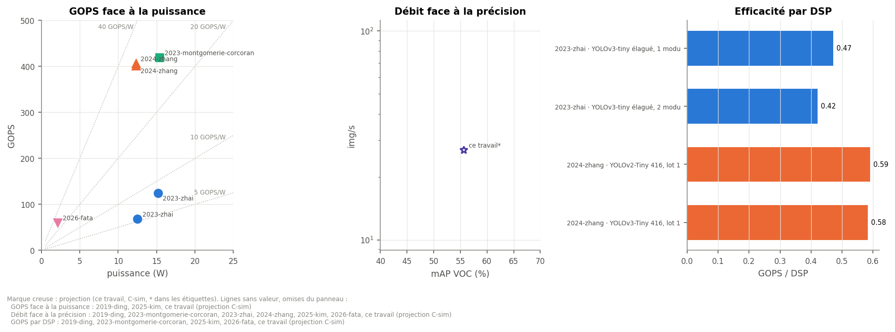

*Figure 1 (`etat_art`): Comparaison aux accélérateurs publiés : GOPS et puissance, débit et mAP, GOPS par DSP (marque creuse : projection de ce travail).* <!-- python -m tools.figures etat_art -->
<!-- /article -->

## 3. Networks and NumPy building blocks

Tiny-YOLOv2 is a stack of nine 3×3 convolutions with batch normalization and leaky ReLU,
six max-pooling layers (the last one 2×2 with stride 1) and a linear 1×1 head with
$5 \times (5 + C)$ filters; Tiny-YOLOv3 adds a second head at 26×26 fed by an upsample
and a route that concatenates an earlier map [1804.02767#005.0, 2023-zhai#016.2]. Counted
by `make count-macs` from the network descriptions, Tiny-YOLOv2 VOC has
<!-- article:n:model.v2.mparams -->15.86<!-- /article --> M parameters and
<!-- article:n:model.v2.gmacs -->3.49<!-- /article --> GMAC at 416×416, in agreement with the
count of CoDeNet [2006.08357#025.0]; Tiny-YOLOv3 VOC has
<!-- article:n:model.v3.mparams -->8.71<!-- /article --> M parameters and
<!-- article:n:model.v3.gmacs -->2.74<!-- /article --> GMAC.

<!-- article:fig:graphe/graphe_tiny-yolov2-voc -->
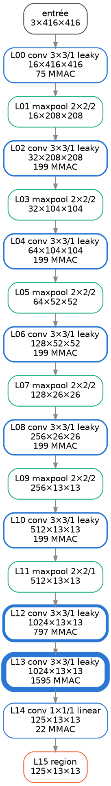

*Figure 2 (`graphe`): Graphe couche par couche (type, noyau et stride, forme de sortie C×H×W ; bord épais = beaucoup de MACs).* <!-- python -m tools.figures graphe -->
<!-- /article -->

<!-- article:fig:fiche/fiche_tiny-yolov2-voc -->
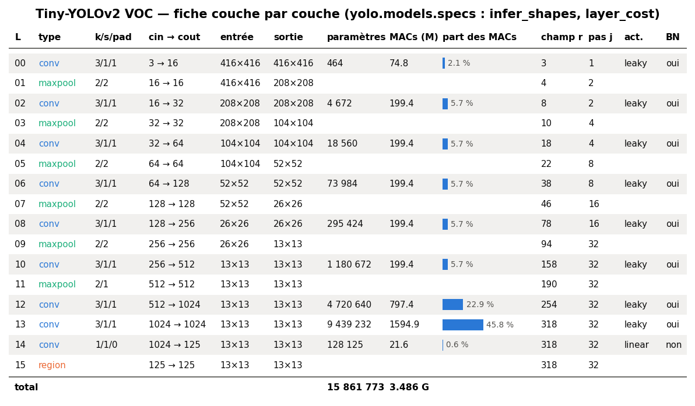

*Figure 3 (`fiche`): Fiche couche par couche : type, noyau, formes, paramètres, MACs et leur part, champ réceptif et pas cumulé (CSV à côté de l'image).* <!-- python -m tools.figures fiche -->
<!-- /article -->

Every layer exposes the same interface, `forward(x) -> (y, cache)` and
`backward(dy, cache) -> (dx, grads)`. The convolution exists in a naive version, kept as
the test reference, and an im2col version used for training; both agree to $10^{-12}$.
The weight gradient is the correlation of the output gradient with the input
[2202.10935#013.0]. Each layer passes a gradient check with centered differences in
float64, using the max norm over the tensor so that a gradient that happens to be small
is not drowned in rounding noise (outside the base).

<!-- article:fig:convolution -->
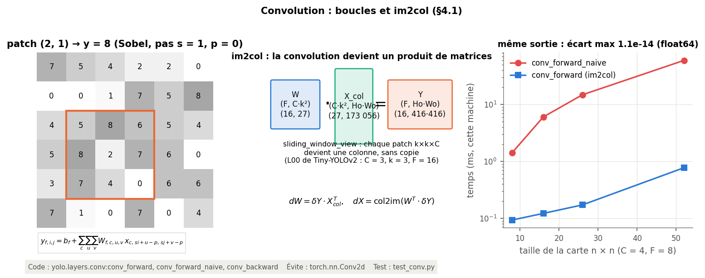

*Figure 4 (`convolution`): Convolution : la formule sur un patch, le dépliage im2col en produit de matrices, et le temps des boucles face à im2col.* <!-- python -m tools.figures convolution -->
<!-- /article -->

<!-- article:fig:retropropagation -->
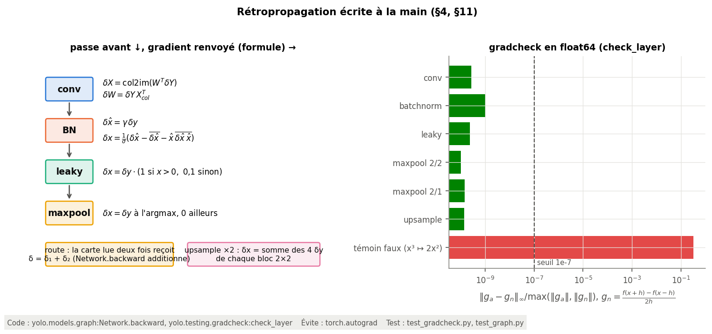

*Figure 5 (`retropropagation`): Rétropropagation écrite à la main : formule du gradient renvoyé par chaque couche, puis l'erreur du gradcheck par couche face au seuil 1e-7.* <!-- python -m tools.figures retropropagation -->
<!-- /article -->

The loss is the YOLOv3 one: direct regression of the box offsets, whose gradient is
"ground truth minus prediction" [1804.02767#003.0], logistic objectness with an *ignore*
rule for predictions that overlap a ground truth without being responsible for it
[1804.02767#003.1], and multi-label binary cross-entropy for the classes
[1804.02767#004.0]. Targets are assigned to the best anchor by IoU of the shapes, anchors
come from k-means with the distance $1 - \text{IoU}$ [1612.08242#002.4]. The training loop
(SGD, burn-in, multi-scale inputs [1612.08242#003.2]) overfits a single image, which
validates targets, loss and optimizer together.

<!-- article:fig:perte -->
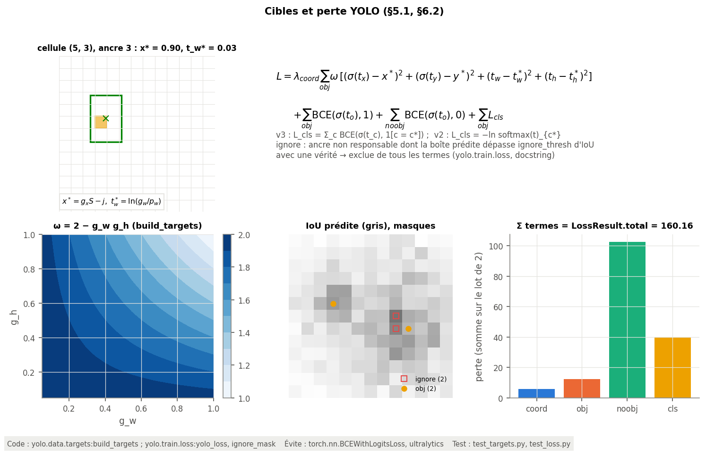

*Figure 6 (`perte`): Cibles et perte YOLO : encodage d'une vérité, la perte terme par terme, le poids ω = 2 − g_w g_h, le masque ignore et la part de chaque terme sur un lot.* <!-- python -m tools.figures perte -->
<!-- /article -->

## 4. Inference and evaluation

Inference decodes each head with the YOLOv2 parameterization [1612.08242#003.1], filters
predictions by confidence, then applies a per-class NMS at IoU 0.45. Evaluation follows
the VOC2007 protocol: 11-point AP, `difficult` objects ignored, confidence threshold
0.005; our implementation matches the official devkit to $10^{-12}$
(`python/tests/test_metrics.py`).

With the published Darknet weights the reference mAP is
<!-- article:n:map.voc.float -->56.30<!-- /article -->, against
<!-- article:n:map.voc.darknet -->57.1pub.<!-- /article --> published by Darknet. Preprocessing
explains most of what separates the variants (Table 2): these weights were trained by the
Darknet of the YOLOv2 era, which resizes the image to a square without keeping its aspect
ratio. A letterbox, as in our training pipeline, shrinks and distorts the objects
differently than in training and loses about two points; reproducing the Darknet
bilinear interpolation instead of Pillow's barely changes the result. The reference
therefore uses the direct resize (`stretch`), which is also the simplest one to
reproduce on hardware. The remaining gap to the published figure is below the one-point
tolerance of the project; its plausible causes (JPEG decoder, details of the Darknet
evaluation loop) are not measured.

*Table 2 — Float mAP on VOC2007 test by preprocessing (`results/map_float.md`).*

<!-- article:table:map.voc.float.table -->
| Preprocessing | Interpolation | mAP |
|---|---|---|
| direct resize (`stretch`) | Pillow bilinear | 56.30 |
| direct resize (`stretch`) | Darknet (`resize_image`) | 56.32 |
| letterbox | Pillow bilinear | 54.18 |
| letterbox | Darknet (`resize_image`) | 53.98 |
<!-- /article -->

<!-- article:fig:pr/pr_variantes -->
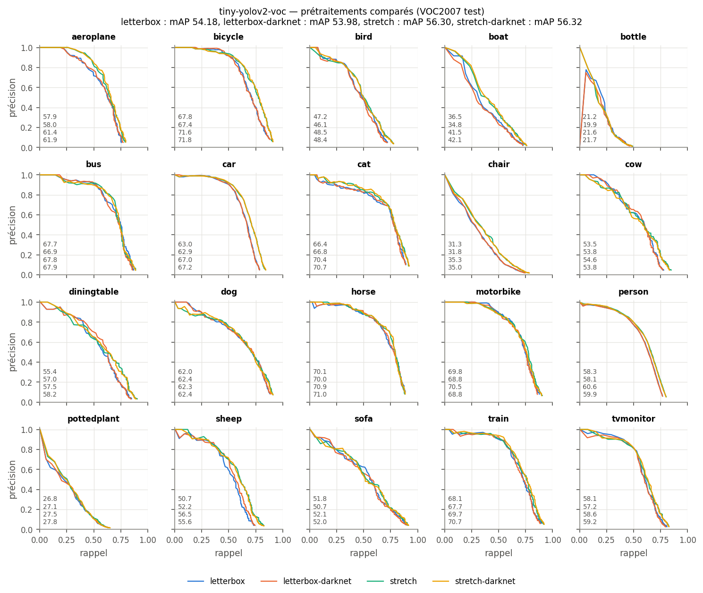

*Figure 7 (`pr`): Courbes précision-rappel par classe (11 points VOC07) pour chaque prétraitement évalué, puis les quatre superposées.* <!-- python -m tools.figures pr -->
<!-- /article -->

<!-- article:fig:nms_map -->
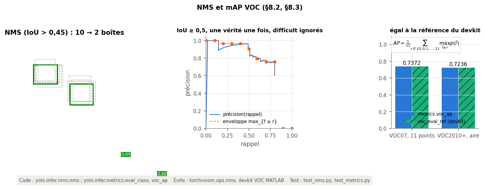

*Figure 8 (`nms_map`): NMS pas à pas, appariement détections / vérités et courbe précision-rappel, AP VOC07 sur 11 points face à l'aire sous l'enveloppe, égale à la référence du devkit.* <!-- python -m tools.figures nms_map -->
<!-- /article -->

## 5. INT8 quantization

The integer model follows the usual post-training quantization path [2607.13106#008.0].
Batch normalization is first folded into the convolution weights and biases
[2023-zhai#039.0]. Weights are quantized symmetrically per output channel; activations
per layer, with scales calibrated on 500 VOC2007 trainval images (percentile `p99.99` of
$|x|$, chosen by a mean-squared-error criterion). Each convolution accumulates in 32 bits
and requantizes its output with an integer multiplier $M_0$ and a shift, so that no
floating point remains in the network (outside the base). The leaky ReLU slope becomes
$13/128$, computed as $(13y + 64) \gg 7$: rounding instead of flooring avoids a bias of
half a step on every negative value, which accumulates from layer to layer. The heads are
decoded by 256-entry tables for the sigmoid and the exponential, as in 2024-zhang
[2024-zhang#014.0]; their input step is $1/8$, because at $1/16$ the class logits of
Tiny-YOLOv2 saturate and the softmax flattens.

<!-- article:fig:quantification -->
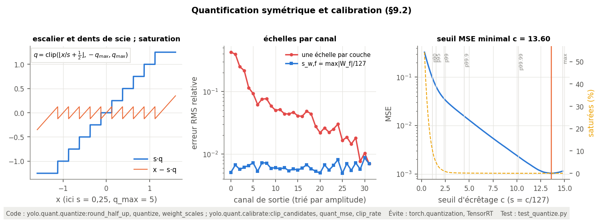

*Figure 9 (`quantification`): Quantification symétrique : l'escalier et son erreur, échelles par canal face à une échelle par couche, choix du seuil d'écrêtage par la MSE.* <!-- python -m tools.figures quantification -->
<!-- /article -->

<!-- article:fig:entier -->
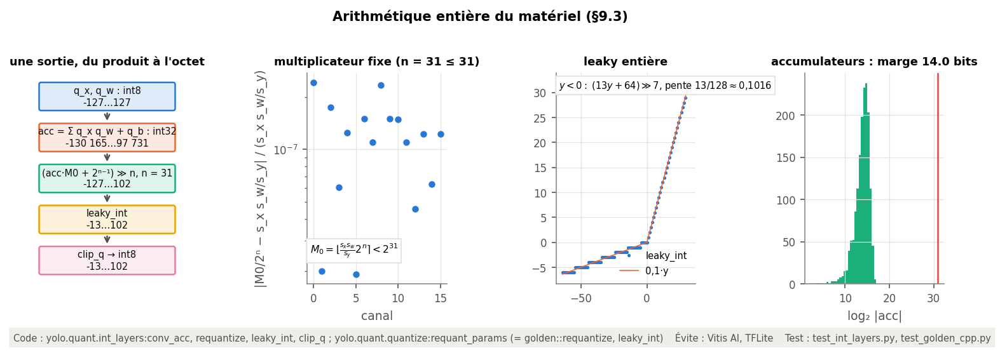

*Figure 10 (`entier`): Arithmétique entière du matériel : chaîne d'une sortie, multiplicateur fixe M0/2ⁿ, leaky entière 13/128 et marge des accumulateurs int32.* <!-- python -m tools.figures entier -->
<!-- /article -->

<!-- article:fig:calibration/calibration_tiny-yolov2-voc -->
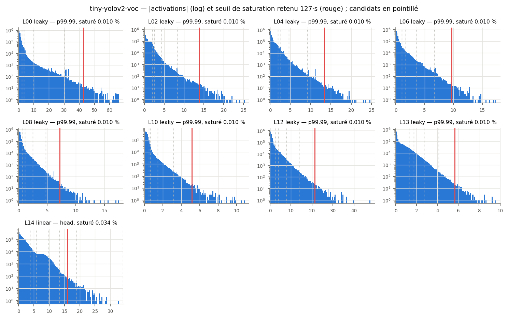

*Figure 11 (`calibration`): Distribution des activations par couche et seuil de saturation retenu par la calibration ; échelles des poids par canal.* <!-- python -m tools.figures calibration -->
<!-- /article -->

The integer model stays within <!-- article:n:map.voc.drop -->−0.64<!-- /article --> point of the float
model with the reference preprocessing (Table 3), below the one-point target: quantization-aware
training is not needed. Quantizing one layer at a time on a subset of the test set, the
most sensitive layer is <!-- article:n:quant.sensitive.layer -->L10tier R<!-- /article -->
(<!-- article:n:quant.sensitive.gap -->−0.61tier R<!-- /article --> point alone), of the same order
as the noise of the subset: no single layer dominates the loss, which spreads over the
network.

*Table 3 — mAP of the float and INT8 models on VOC2007 test (`results/map_int8.md`).*

<!-- article:table:map.voc.int8.table -->
| Preprocessing | Float (fused BN) | Integer INT8 | Gap |
|---|---|---|---|
| stretch (`make eval-float`) | 56.30 | 55.66 | −0.64 |
| letterbox (the training one) | 54.18 | 53.68 | −0.50 |
<!-- /article -->

<!-- article:fig:erreur_couches/erreur_couches_tiny-yolov2-voc -->
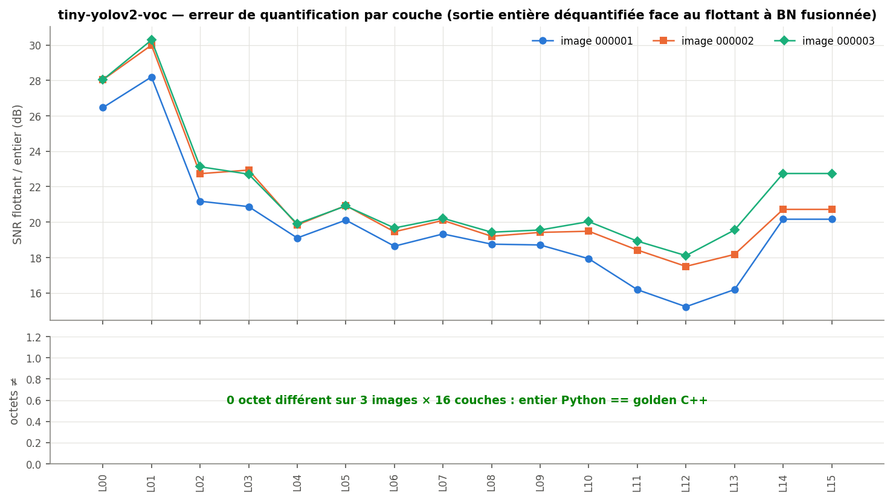

*Figure 12 (`erreur_couches`): SNR par couche entre le flottant et l'entier déquantifié, et écart entier Python ↔ golden C++ (0 partout : bit-exact).* <!-- python -m tools.figures erreur_couches -->
<!-- /article -->

## 6. Golden C++ model and verification chain

The quantized network is exported as a manifest and binary blobs (`model/<net>/`), with
the integer activations of every layer on a few images as dumps. A C++ golden model reads
the same export and runs the network *as the hardware will*: tiled convolution with
fixed-size buffers, output stage with bias, requantization, leaky and fused max pooling,
route by addressing. It is the testbench of the HLS stage.

Equality is checked at every hand-over. `make golden-check` runs the golden model on
<!-- article:n:verif.dumps -->6<!-- /article --> dumps (three images per quantized
network) and compares every layer to the Python dumps; the HLS kernel in C simulation is
compared to the golden model layer by layer (`make csim-gcc`); the ARM driver, built with
a simulation backend that calls the C-simulated kernel, is compared to the golden model on
the final heads (`make sw-sim`). The integer post-processing kernel of §9 is compared to
its golden mirror on <!-- article:n:verif.hwpp.cases -->1,014C-sim<!-- /article --> cases. All of
these run in `make ci` on every commit, on a synthetic export when the Darknet weights
are absent.

<!-- article:fig:chaine_verif -->
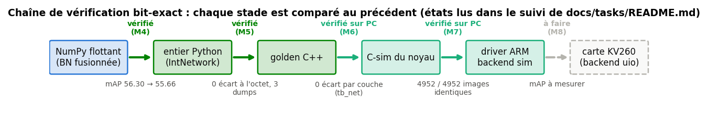

*Figure 13 (`chaine_verif`): Chaîne de vérification bit-exact, du flottant NumPy à la carte : critère et état de chaque passage.* <!-- python -m tools.figures chaine_verif -->
<!-- /article -->

## 7. HLS accelerator and SoC integration

The board was chosen with a roofline explorer before writing any HLS (ADR 0003): the Kria
KV260 offers, at the same price, about six times the roofline performance of a
Zynq-7020 board for these networks. The accelerator is a single layer-by-layer engine:
the convolution loop nest is tiled over output channels, input channels, rows and
columns [2015-zhang#010.2], with $T_m = 32$, $T_n = 24$ and $T_r = T_c = 13$, i.e. 768
MACs per cycle at 200 MHz. One engine runs every layer of both networks; upsample and
route need no compute, they change the read address of the next layer.

<!-- article:fig:moteur -->
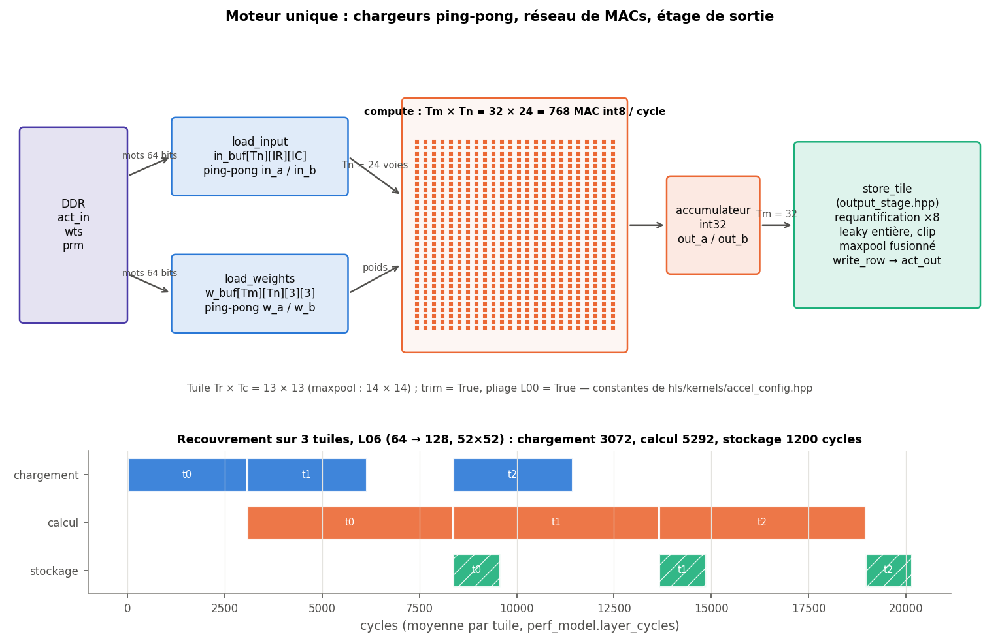

*Figure 14 (`moteur`): Moteur unique : chargeurs ping-pong, réseau Tm × Tn de MACs, accumulateur, étage de sortie, et chronogramme du recouvrement sur 3 tuiles.* <!-- python -m tools.figures moteur -->
<!-- /article -->

<!-- article:fig:tuilage -->
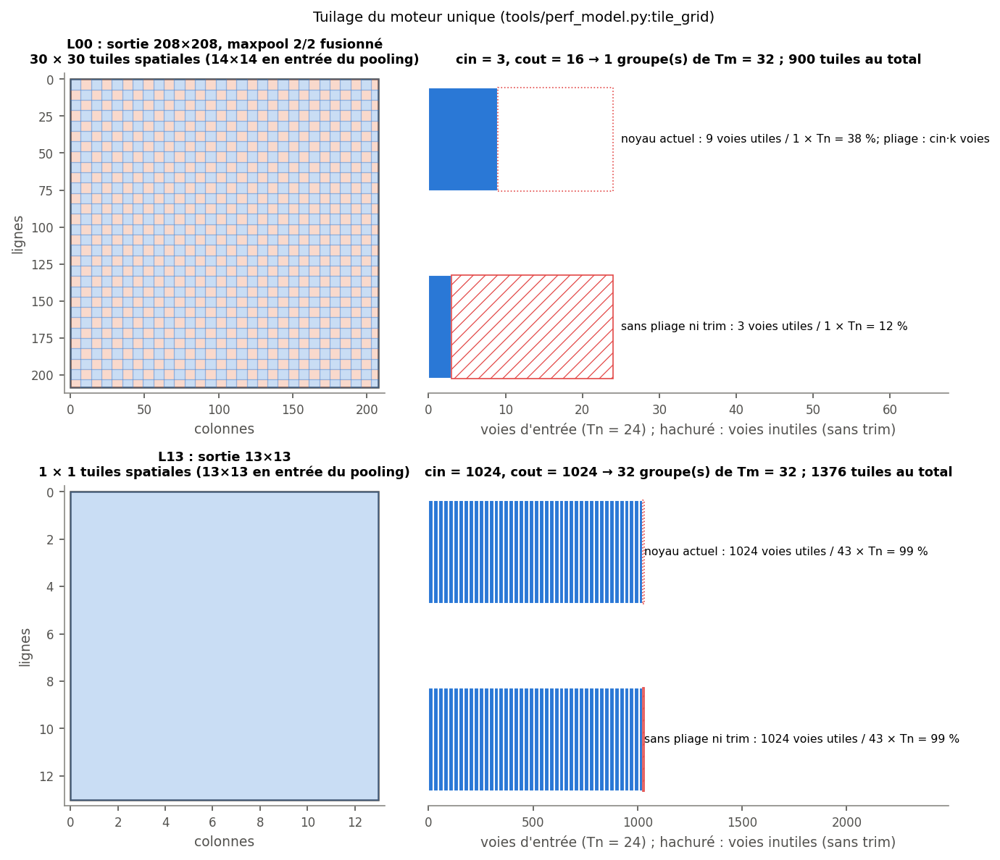

*Figure 15 (`tuilage`): Tuilage de deux couches : tuiles spatiales et voies d'entrée, avec le pliage de L00 (cin = 3) et la couche 13×13 couverte par une seule tuile.* <!-- python -m tools.figures tuilage -->
<!-- /article -->

The ARM side loads the manifest and the blobs in contiguous memory, programs the
AXI-Lite registers of the kernel layer after layer and waits for its interrupt. The block
design, the device-tree overlay and the firmware packaging are scripted
(`make vivado-build`, `make fpga-firmware`) but have not run yet: Vivado and Vitis are not
installed on the development machine. Everything above the hardware runs on the PC
through the simulation backend.

<!-- article:fig:soc -->
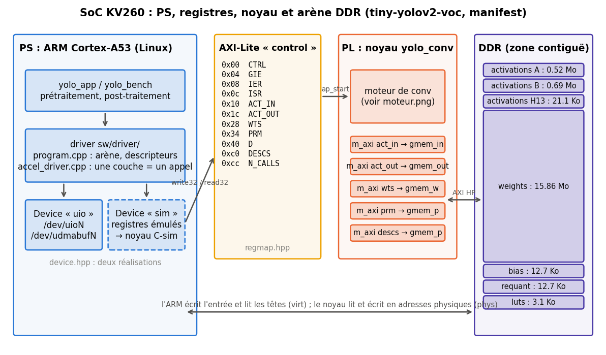

*Figure 16 (`soc`): Schéma du SoC : application et driver sur l'ARM, registres AXI-Lite, ports m_axi du noyau et découpage de l'arène DDR.* <!-- python -m tools.figures soc -->
<!-- /article -->

A cycle model in Python (`tools/perf_model.py`) reproduces the cycle counters of the
C-simulated kernel exactly, layer by layer (`make perf-model` checks it in CI). It shows
where the first kernel (M6) lost its time: with 8-bit memory ports it spent most of its
cycles outside the MAC loop, waiting for its ports and its output stage, and its
projection was <!-- article:n:perf.kv260.m6.ms -->206.5proj.<!-- /article --> ms per image. The
optimization cascade of milestone M10 (Table 4) widens the ports to 64 bits, loads only
the valid input channels, requantizes eight channels per cycle, folds the first layer
onto the input lanes and uses 14×14 tiles for the pooled convolutions; each step is
C-sim equal to the golden model. The current kernel projects
<!-- article:n:perf.kv260.v2.ms -->37.2proj.<!-- /article --> ms, against a compute bound of
<!-- article:n:perf.kv260.bound.ms -->31.6proj.<!-- /article --> ms and a roofline point of
<!-- article:n:perf.kv260.roofline.ms -->31.9proj.<!-- /article --> ms.

*Table 4 — Optimization cascade of the kernel, Tiny-YOLOv2, accelerator only
(`results/rapport.md`).*

<!-- article:table:perf.cascade -->
| Kernel configuration (Tiny-YOLOv2) | Mcycles | ms | img/s | GOPS | MAC efficiency (%) |
|---|---|---|---|---|---|
| M6: ports 8 bits | 41.30 | 206.5 | 4.8 | 33.8 | 11.0 |
| valid channels only (trim) | 32.67 | 163.3 | 6.1 | 42.7 | 13.9 |
| ports 64 bits | 12.27 | 61.3 | 16.3 | 113.6 | 37.0 |
| ports 128 bits + trim | 12.13 | 60.6 | 16.5 | 115.0 | 37.4 |
| ports 64 bits + trim + requantization ×8 (+28 DSP) | 9.29 | 46.4 | 21.5 | 150.1 | 48.9 |
| ... + L00 folding | 8.38 | 41.9 | 23.9 | 166.4 | 54.2 |
| ... + 14×14 tiles for pooled convs (M10 kernel) | 7.44 | 37.2 | 26.9 | 187.3 | 61.0 |
| compute bound of M6 (free loads) | 8.23 | 41.1 | 24.3 | 169.5 | 55.2 |
| compute bound of the M10 kernel | 6.32 | 31.6 | 31.7 | 220.7 | 71.8 |
| KV260 roofline point (roofline.md) | — | 31.9 | 31.3 | 218.5 | — |
| ideal (MACs / 768, efficiency 100 %) | 4.54 | 22.7 | 44.1 | 307.2 | 100.0 |

*Status of every number of this table: projection.*
<!-- /article -->

<!-- article:fig:cascade_m10 -->
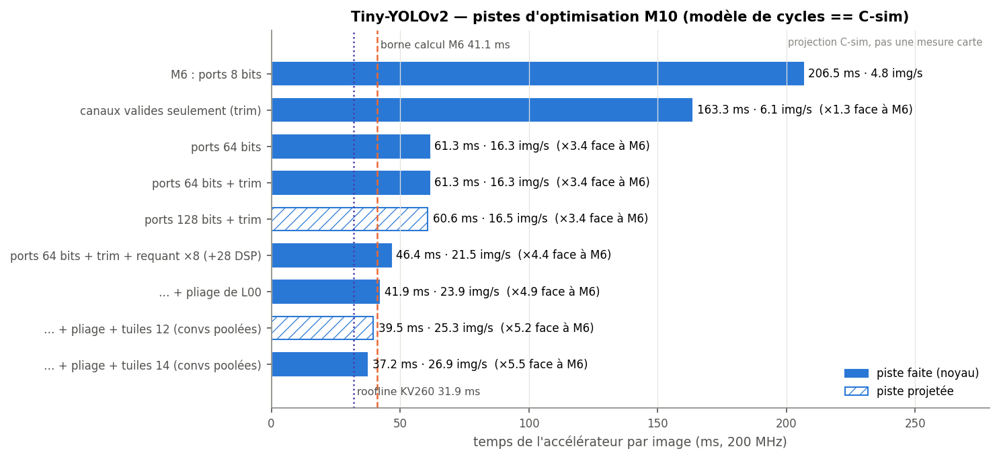

*Figure 17 (`cascade_m10`): Temps par image de Tiny-YOLOv2 à chaque piste d'optimisation M10, face à la borne de calcul et au roofline KV260.* <!-- python -m tools.figures cascade_m10 -->
<!-- /article -->

<!-- article:fig:roofline_couches/roofline_couches_kv260 -->
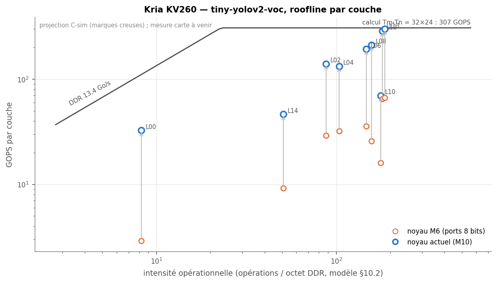

*Figure 18 (`roofline_couches`): Roofline KV260 avec un point par couche de Tiny-YOLOv2, avant et après les optimisations M10.* <!-- python -m tools.figures roofline_couches -->
<!-- /article -->

<!-- article:fig:cycles_couches -->
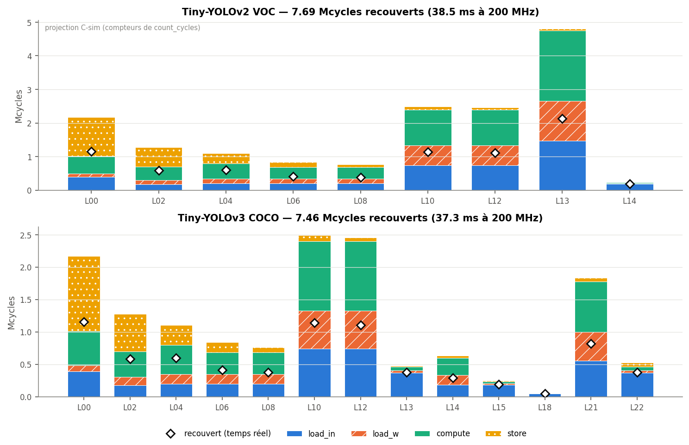

*Figure 19 (`cycles_couches`): Cycles par couche du noyau actuel, décomposés en chargements, calcul et stockage ; le losange donne le temps réel avec recouvrement.* <!-- python -m tools.figures cycles_couches -->
<!-- /article -->

## 8. Results

Table 5 gives the mAP at the three stages of the chain. The float model and the Python
integer model are evaluated on the full test set; the FPGA stage runs the ARM driver over
the C-simulated kernel, compiled with native integers (same arithmetic as `ap_int`, which
was also checked on part of the set). Its detections are identical to those of the
integer model image by image, so the whole accuracy loss comes from quantization, and the
board will give the integer mAP if `run_compare` confirms zero mismatch there.

*Table 5 — mAP at the stages of the chain, VOC2007 test (`results/map_stades.md`).*

<!-- article:table:map.stades -->
| Stage | mAP | Equality with the integer model | Status |
|---|---|---|---|
| Float (fused BN, NumPy float32) | 56.30 | — | measured |
| Integer, Python (`IntNetwork`, bit-exact) | 55.66 | reference | measured |
| FPGA, C-sim (ARM driver, sim backend, PC) | 55.66 | 4,952 / 4,952 identical images | csim |
| FPGA, KV260 (uio backend) | — | to be measured | — |
<!-- /article -->

<!-- article:fig:map_stades -->
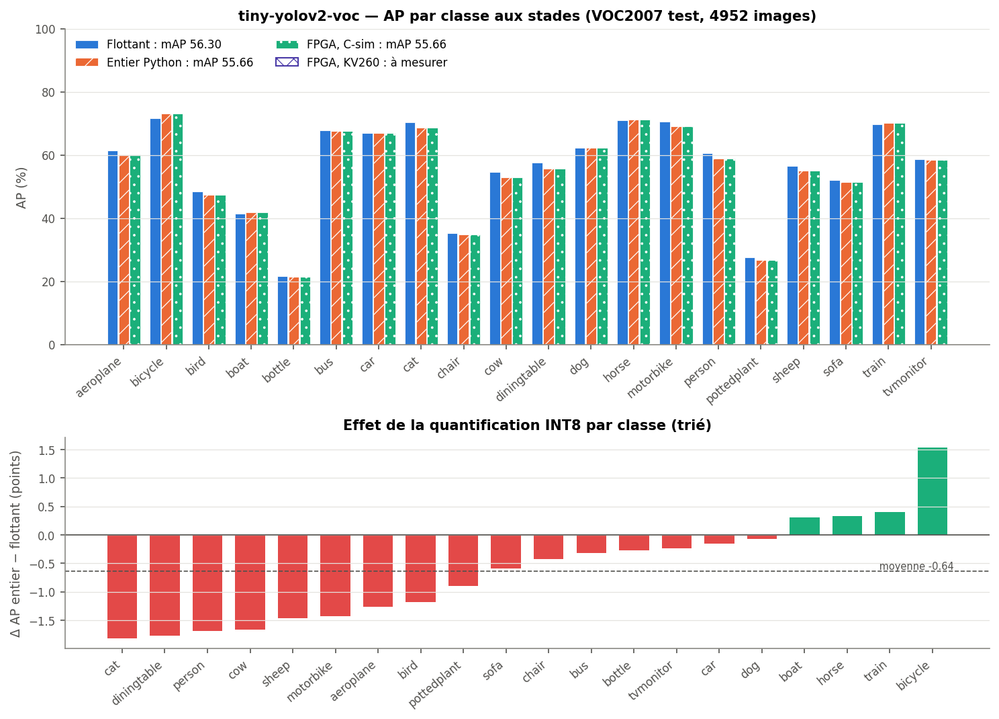

*Figure 20 (`map_stades`): AP par classe aux stades flottant, entier et C-sim (la carte quand elle sera mesurée), et écart entier − flottant trié.* <!-- python -m tools.figures map_stades -->
<!-- /article -->

Table 6 gives the performance of the accelerator. These are projections of the cycle
model, a lower bound of the accelerator time: they assume an initiation interval of one in
the inner loop and ignore pipeline depths, DDR latency and the ARM control. Resources
will only be known after synthesis; the resource figure below compares the roofline model
with the streaming plan of §9.

*Table 6 — Projected performance on the KV260 at 200 MHz (`results/mesures.md`).*

<!-- article:table:perf.kv260 -->
| Network | GMAC | Mcycles | ms | img/s | GOPS | MAC efficiency (%) | Status |
|---|---|---|---|---|---|---|---|
| `tiny-yolov2-voc` | 3.486 | 7.44 | 37.2 | 26.9 | 187.3 | 61.0 | projection |
| `tiny-yolov3-coco` | 2.782 | 7.21 | 36.1 | 27.7 | 154.3 | 50.2 | projection |
<!-- /article -->

<!-- article:fig:ressources -->
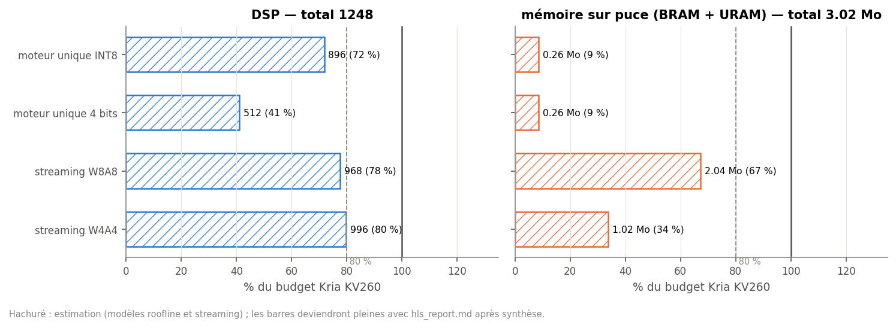

*Figure 21 (`ressources`): DSP, mémoire sur puce et LUT des architectures (moteur unique INT8, pow2 et 4 bits, streaming) face au budget de la KV260 ; hachuré : estimation, plein : synthèse.* <!-- python -m tools.figures ressources -->
<!-- /article -->

Against 2024-zhang, the only reference on the same model, the remaining gap is roughly
its larger number of multipliers (two MACs per DSP) and the share of time our kernel still
spends outside the MAC loop. On the same board, the projected throughput of the current
kernel exceeds the DPU of 2026-fata in images per second, without pruning (Table 1).

## 9. Extensions

**Hardware post-processing.** Following 2024-zhang [2024-zhang#013.1, 2024-zhang#014.0], a
separate HLS kernel decodes the heads and runs the NMS in integers only: the objectness
threshold is applied to the integer logit, the softmax uses one reciprocal per cell, box
corners are Q4 pixels, the IoU test becomes an integer inequality, and the NMS keeps 256
slots in stream order without sorting. This NMS does not always give the result of the
sorted one (a chain of three overlapping boxes keeps only one); on the test set the
integer post-processing reaches <!-- article:n:map.formats.hwpp -->55.56<!-- /article --> mAP.
The kernel equals its golden mirror in C simulation; its synthesis is pending.

<!-- article:fig:hw_postproc -->
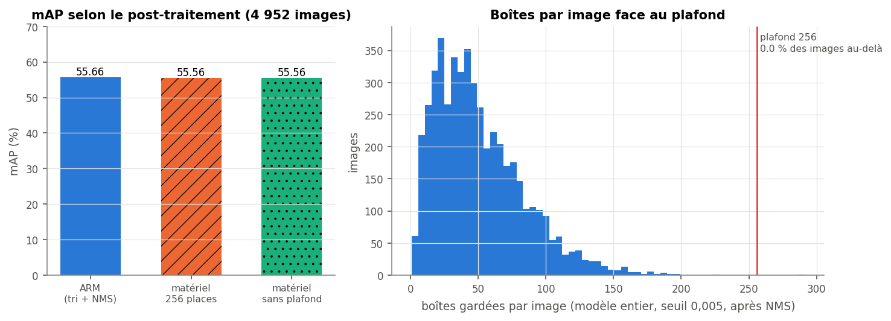

*Figure 22 (`hw_postproc`): mAP avec le post-traitement matériel, avec et sans plafond de boîtes, et nombre de boîtes par image face au plafond.* <!-- python -m tools.figures hw_postproc -->
<!-- /article -->

**Power-of-two weights (REQ-YOLO).** We reproduce the "mixed powers of two" levels of
2019-ding [2019-ding#008.1]: each weight is a sum of at most two powers of two, so a
multiplication becomes two shifts and an addition, and the engine needs no DSP for its
MACs (estimate). The direct projection of the trained weights gives
<!-- article:n:map.formats.mixed6 -->52.46<!-- /article --> mAP, against
<!-- article:n:map.formats.uniform6 -->54.35<!-- /article --> for uniform 6-bit levels. The
ADMM fine-tuning [2019-ding#009.1] *did not converge*: the residual between the weights
and their projection grew instead of vanishing, the detection loss rose, and the result,
<!-- article:n:map.formats.admm -->43.07<!-- /article --> mAP, is worse than the projection
alone. The likely causes (fine-tuning without BN, small batches, a penalty too weak) are
not verified. The power-of-two variant of the PE is C-sim equal to the golden model.

**4-bit weights and activations.** With 4-bit weights per channel and 4-bit activations
on power-of-two steps [2024-yan#006.0], keeping the input and the head on 8 bits,
post-training quantization collapses to <!-- article:n:map.formats.w4a4.ptq -->17.06<!-- /article -->
mAP. A short quantization-aware training (600 iterations, a fraction of an epoch, on CPU)
recovers part of it, to <!-- article:n:map.formats.w4a4.qat -->36.38<!-- /article --> mAP; the
loss was still decreasing, so a longer run should do better. The 4-bit export is
reproduced byte for byte by the golden model and the C-simulated kernel.

*Table 7 — Formats on the same model, VOC2007 test (`results/req_yolo.md`,
`results/quant_4bits.md`, `results/postproc_hw.md`).*

<!-- article:table:map.formats -->
| Weights / activations | Method | mAP | Gap to INT8 |
|---|---|---|---|
| INT8 per channel (reference) | PTQ | 55.66 | — |
| uniform6 (±31) | PTQ | 54.35 | −1.31 |
| mixed6 (powers of 2) | PTQ, direct projection | 52.46 | −3.20 |
| mixed6 | ADMM, 600 iterations, then projection | 43.07 | −12.59 |
| w4a4 | PTQ (power-of-2 steps) | 17.06 | −38.60 |
| w4a4 | QAT, 600 iterations | 36.38 | −19.28 |
| INT8 + hardware post-processing | unsorted NMS, Q4 boxes | 55.56 | −0.10 |
<!-- /article -->

<!-- article:fig:map_formats -->
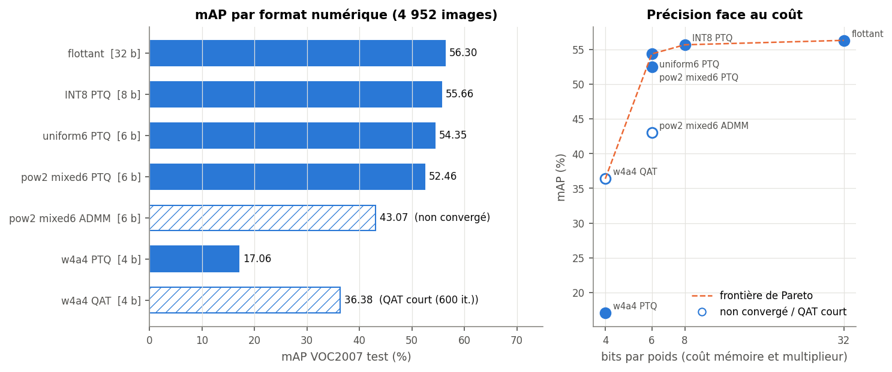

*Figure 23 (`map_formats`): mAP de Tiny-YOLOv2 selon le format des poids (flottant, INT8, puissances de 2, 4 bits), et frontière précision / bits.* <!-- python -m tools.figures map_formats -->
<!-- /article -->

**Streaming architecture.** The second family of §2 [2018-venieris#004.0] is planned
with one stage per convolution and line buffers [2023-montgomerie-corcoran#011.0]. The
weights of Tiny-YOLOv2 do not fit on the chip of the KV260, so the plan is hybrid: the
small layers stream with their weights on chip, the two largest read theirs from DDR once
per image. The resource model estimates <!-- article:n:stream.w8.fps -->32.1est.<!-- /article -->
images/s with <!-- article:n:stream.w8.dsp -->968est.<!-- /article --> DSPs, at a latency of
<!-- article:n:stream.w8.latency -->85.2est.<!-- /article --> ms, and
<!-- article:n:stream.w4.fps -->64.2est.<!-- /article --> images/s with 4-bit weights. The
streaming kernel equals the golden model in C simulation, stage by stage; these figures
are estimates until synthesis.

<!-- article:fig:streaming -->
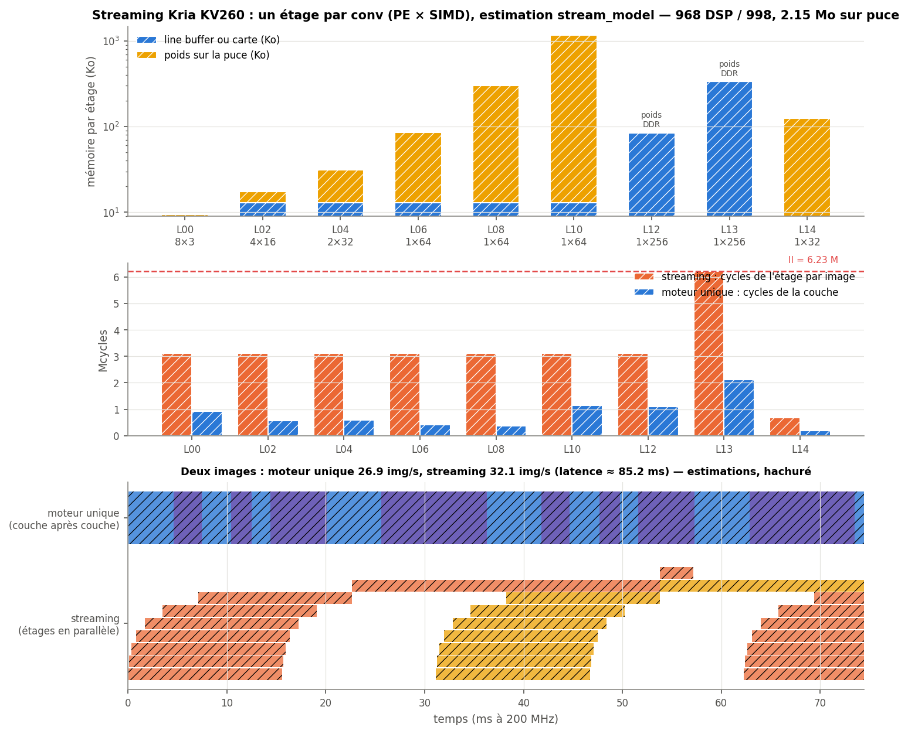

*Figure 24 (`streaming`): Architecture streaming face au moteur unique : mémoire et parallélisme par étage, cycles par couche, chronogramme sur deux images (estimations).* <!-- python -m tools.figures streaming -->
<!-- /article -->

## 10. Beyond VOC

Milestones M11, M15 and M16 take Tiny-YOLOv3 to other datasets: VisDrone (aerial views),
KITTI (driving), FLIR (thermal), ExDark (low light) and CrowdHuman (crowds). Each dataset
has generated notebooks for statistics, inference and a sweep of batch size × training
subset, run on a Colab GPU from COCO weights. The first sweeps use short runs of 600
iterations and score them on 50 images (tier R): these scores *rank* runs and are not
publishable results. On VOC itself, the published Tiny-YOLOv2 weights score higher on
these 50 images than on the full split, which gives the order of magnitude of the bias.

*Table 8 — Best run of the first sweep of each dataset
(`docs/tasks/resultats-balayages.md`).*

<!-- article:table:balayages.meilleurs -->
| Dataset | Training images | Best run | Batch | Training subset | Metric | Score (50 images) | Status |
|---|---|---|---|---|---|---|---|
| VOC | 16,551 | `b32-sall` | 32 | all | mAP, 11 points | 36.27 | tier-R |
| VisDrone | 6,471 | `b32-sall` | 32 | all | mAP, 11 points | 2.24 | tier-R |
| KITTI | 5,985 | `b32-sall` | 32 | all | mAP, 11 points | 2.38 | tier-R |
| FLIR | 10,742 | `b8-sall` | 8 | all | AP@[.5:.95] (COCO) | 0.70 | tier-R |
| ExDark | 3,000 | `b32-sall` | 32 | all | mAP, 11 points | 13.29 | tier-R |
| CrowdHuman | 15,000 | `b16-sall` | 16 | all | mAP, 11 points | 35.87 | tier-R |
<!-- /article -->

The scores show that none of these runs has converged. On VisDrone, objects are tiny at
416 pixels, many targets collide in the same cell, and the 50-image ranking does not hold
on the full split; the M15 campaign replaces the sweep by longer runs, matching resize
between training and evaluation, and tiles. FLIR uses the COCO metric, which does not
compare with the 11-point AP of the others. The sweep figures (`balayage`, `balayages`)
are not yet published in `results/figures/` and will be cited here once they are.

<!-- article:fig:detections -->
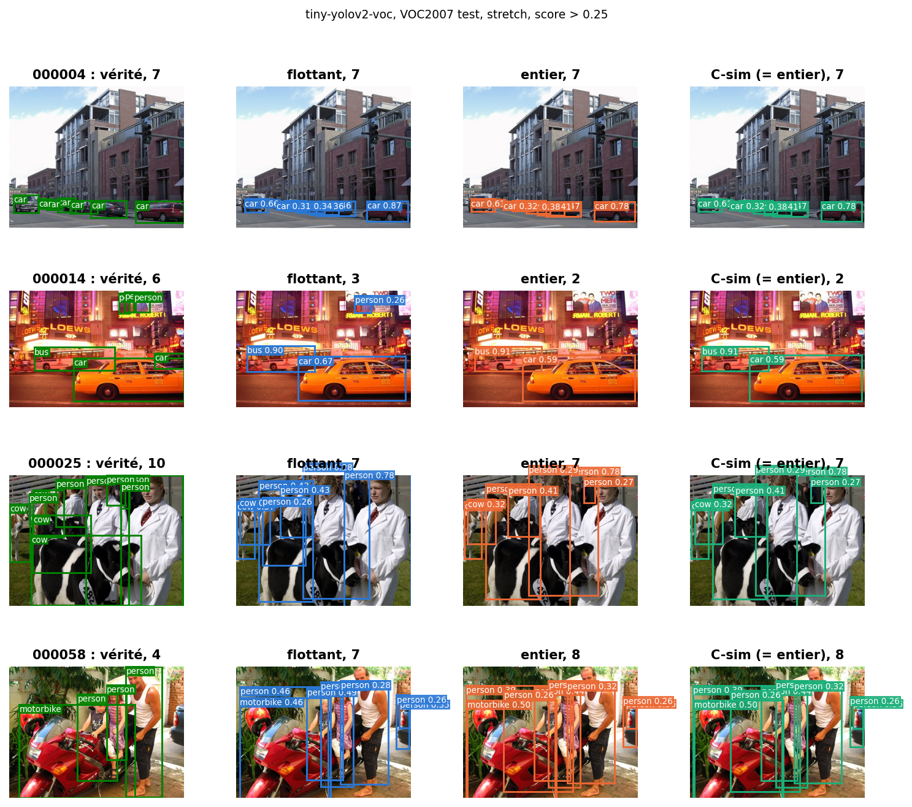

*Figure 25 (`detections`): Vérité terrain, flottant, entier et C-sim sur quatre images de VOC2007 test : les colonnes entier et C-sim sont identiques.* <!-- python -m tools.figures detections -->
<!-- /article -->

## 11. Limitations and future work

The main limitation is that no number of this article has been measured on the board.
The KV260, Vivado and Vitis are not available yet (milestones M6 to M8): performance is a
cycle-model projection, resources are estimates, and the FPGA mAP is a C simulation. The
keys still in that state are listed below; milestone task T17.19 switches them to
measurements and rewrites §0, §8 and this section.

<!-- article:list:status -->
- **projection** (10): `perf.cascade`, `perf.kv260`, `perf.kv260.bound.ms`, `perf.kv260.m6.ms`, `perf.kv260.roofline.ms`, `perf.kv260.v2.eff`, `perf.kv260.v2.fps`, `perf.kv260.v2.gops`, `perf.kv260.v2.ms`, `perf.kv260.v3.ms`
- **estimate** (4): `stream.w4.fps`, `stream.w8.dsp`, `stream.w8.fps`, `stream.w8.latency`
- **tier-R** (9): `balayage.crowdhuman.meilleur.map`, `balayage.exdark.meilleur.map`, `balayage.flir.meilleur.map`, `balayage.kitti.meilleur.map`, `balayage.visdrone.meilleur.map`, `balayage.voc.meilleur.map`, `balayages.meilleurs`, `quant.sensitive.gap`, `quant.sensitive.layer`
- **csim** (3): `map.voc.csim`, `map.voc.identical`, `verif.hwpp.cases`
<!-- /article -->

Other limits: the power-of-two ADMM did not converge and the 4-bit QAT ran for a fraction
of an epoch (§9); the training from scratch in NumPy (fine-tuning on VOC, M2) is not
finished, so the reference mAP uses the published Darknet weights; the datasets beyond
VOC have only been explored at tier R (§10). Progress by milestone:

<!-- article:etat -->
| Milestone | Tasks | Done | Progress |
|---|---|---|---|
| M0 | 6 | 6 | 100 % |
| M1 | 9 | 8 | 89 % |
| M2 | 9 | 8 | 89 % |
| M3 | 4 | 4 | 100 % |
| M4 | 7 | 7 | 100 % |
| M5 | 6 | 6 | 100 % |
| M6 | 6 | 1 | 17 % |
| M7 | 4 | 0 | 0 % |
| M8 | 3 | 0 | 0 % |
| M9 | 1 | 0 | 0 % |
| M9.1 | 3 | 2 | 67 % |
| M9.2 | 4 | 3 | 75 % |
| M9.3 | 5 | 5 | 100 % |
| M9.4 | 3 | 3 | 100 % |
| M10 | 13 | 0 | 0 % |
| M12 | 11 | 0 | 0 % |
| M11 | 8 | 0 | 0 % |
| M13 | 54 | 54 | 100 % |
| M14 | 12 | 5 | 42 % |
| M15 | 16 | 1 | 6 % |
| M16 | 19 | 17 | 89 % |
| M17 | 21 | 17 | 81 % |
| M18 | 11 | 8 | 73 % |
| M19 | 12 | 0 | 0 % |
| **Total** | **247** | **155** | **63 %** |
<!-- /article -->

## 12. Reproducibility

Every number of this article is regenerated from the repository: `make article` reads the
results (`collect`) into [chiffres.json](chiffres.json), which records for each key its
value, status, source file, command and the revision where it last changed, then rewrites
the blocks of this file (`render`). `python -m tools.article --check` runs in `make ci`.
The main commands are:

| Stage | Command |
|---|---|
| tests (Python, C++) | `make test`, `make ci` |
| float and integer mAP | `make eval-float`, `make eval-int` |
| export and golden model | `make export`, `make golden-check` |
| HLS kernel in C simulation | `make csim-gcc`, `make hls-cycles` |
| ARM driver on PC | `make sw-sim` |
| mAP at the three stages | `make m8-inputs m8-int bench-sim map-stades` |
| performance projection | `make perf-model bench-report` |
| figures, notebooks | `make figures`, `make notebooks` |
| this article | `make article`, `make article-pdf` |

Each evaluation has a test profile (M12): tier R on a few images for development, tier M
on a mid-size subset, tier N on the full split; only tier N numbers go to `results/`.
The notebooks of M14 run the same tools on Colab and are versioned with their outputs.

<!-- article:fig:tests -->
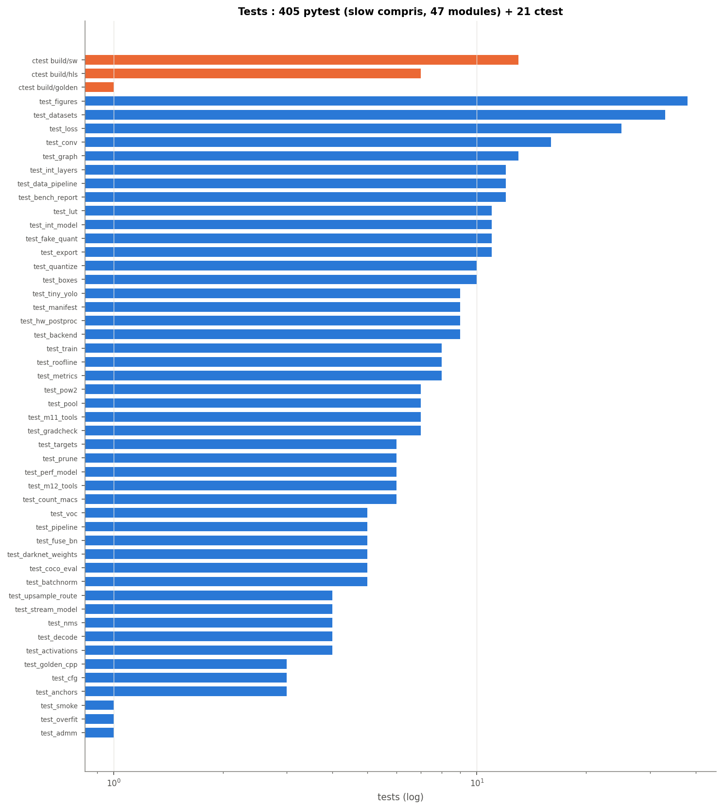

*Figure 26 (`tests`): Nombre de tests par module Python (pytest, slow compris) et par build C++ (ctest), et leur durée quand `make test-durations` a été lancé.* <!-- python -m tools.figures tests -->
<!-- /article -->

<!-- article:fig:code -->
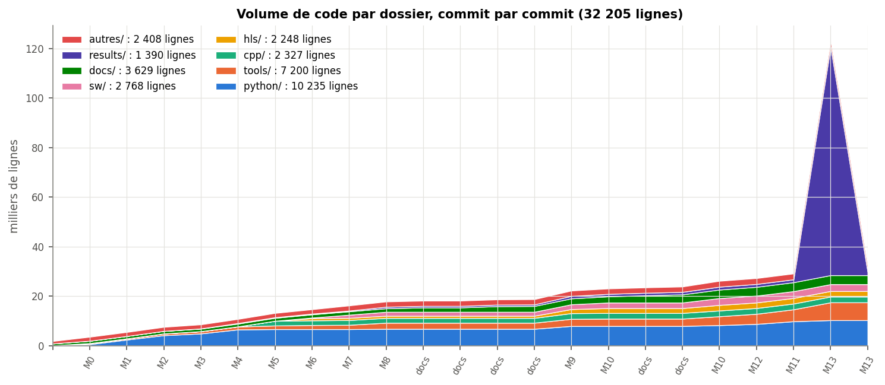

*Figure 27 (`code`): Lignes par dossier (python, tools, cpp, hls, sw, docs, results) commit par commit.* <!-- python -m tools.figures code -->
<!-- /article -->

Article rendered at <!-- article:rev -->rev. `1808467-dirty`, 2026-10-07<!-- /article -->.

## References

See [refs.md](refs.md).

## Appendix A. Version log

Written by hand, one entry per update of the article (procedure "Mise à jour à chaque
jalon" of [M17](../tasks/M17-article.md)).

| Version | Date | Revision | Changes |
|---|---|---|---|
| v0 | 2026-10-07 | first render | Infrastructure (`tools/article.py`, `make article`, `--check` in CI) and first draft of every section, in English (M19 rule). Board measurements pending. |
