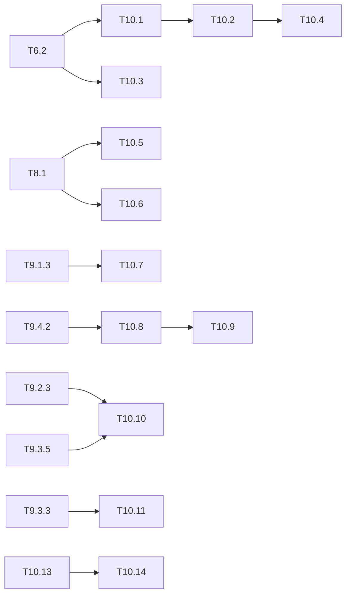

# M10 — Améliorations (optionnel)

Objectif : rassembler les améliorations d'ingénierie repérées pendant M6 à M9 et les rendre
planifiables. Point de départ : la projection C-sim de Tiny-YOLOv2 (206,5 ms accélérateur,
4,8 img/s, 33,8 GOPS, efficacité MAC 11,0 %). Cibles : la borne calcul (41,1 ms), puis le
point roofline KV260 (31,9 ms). Chaque tâche garde le contrat **C-sim == golden à
l'octet**.

Les gains chiffrés viennent de `tools/perf_model.py` (`make perf-model`) et de
[rapport.md §3](../../results/rapport.md). Les gains qui n'y figurent pas sont marqués
« à estimer ». M9 regroupe les extensions de recherche ; M10 les optimisations et
l'outillage.
Avant d'engager une piste, la classer par gain / effort avec les profils PC de
[T12.8](M12-profils-pc.md#-t128--performance-estimée-m6-m8-m94-m10).

## A. Noyau moteur unique

### [ ] T10.1 — Ports m_axi 64 bits
- **Spec** : §10.2 · **Dépend de** : T6.2 · **Taille** : L
- **Livrables** : chargeurs `in_buf` (lecture par lignes) et `w_buf` (poids dans l'ordre
  des tuiles) en mots de 64 bits dans `hls/kernels/conv_pe.cpp` ; écriture de `out_buf` en
  64 bits ; réordonnancement des poids, fait une fois par le driver
  (`sw/driver/program.cpp`) ; arène alignée sur 8 octets
- **Acceptation** : C-sim == golden (v2, v3, 3 images, tuiles KV260 et Zybo) ; cycles
  C-sim == scénario « ports 64 bits » de `perf_model` (Tiny-YOLOv2 : 41,30 → 11,89 Mcycles,
  206,5 → 59,4 ms, 16,8 img/s)
- **Notes** : piste au plus fort gain (×3,5). Les quatre ports lisent un octet par cycle
  (0,2 Go/s par bundle) alors que le roofline suppose 13,4 Go/s. Passer à 128 bits
  n'apporte presque rien de plus (58,3 ms avec trim) : le goulot passe à l'étage de sortie
  (T10.2). Le second segment d'entrée (route) et l'adressage `up` (T6.4) doivent rester
  corrects quand une ligne n'est pas alignée sur 8 octets (w = 13, 26).
- **Fait** :
  - ports `act_in`, `act_out` et `wts` en mots de `ACC_WORD_BYTES` = 8 octets
    (`hls/kernels/accel_config.hpp`). `in_buf` est chargé ligne par ligne, avec
    `row_words(IC)` = 3 mots par (voie, ligne) quel que soit l'alignement (lignes non
    alignées, second segment de route, adresse `up` divisée par 2).
  - Poids réordonnés une fois dans l'ordre des tuiles (`hls/kernels/weight_layout.hpp`,
    `Program::weights`). La tuile de poids est un bloc contigu, lu en mots pleins.
  - Écritures de sortie en mots, ligne par ligne, avec masque d'octets sur les mots de
    bord. Marge `ARENA_SLACK` après l'arène.
  - Modèle de cycles **réaliste, ligne par ligne**, identique dans `count_cycles` et
    `tools/perf_model.py`. Avec `ACC_WORD_BYTES=1` et les autres pistes coupées, la C-sim
    redonne les compteurs M6 à l'identique.
  - Tiny-YOLOv2, ports 64 bits seuls : 41,30 → 12,27 Mcycles, 206,5 → 61,3 ms
    (16,3 img/s). Le modèle idéal `cdiv(octets, 8)` annonçait 59,4 ms.
  - C-sim == golden et dumps (v2, v3, 3 images ; tuiles KV260 et Zybo, `tb_net_pow2`) ;
    `perf_model --check` : 0 écart.
- **Reste** :
  - synthèse et co-sim (Vitis) ;
  - masque d'octets (WSTRB) des écritures partielles ; repli possible : port de sortie
    8 bits élargi par `m_axi_max_widen_bitwidth` ;
  - II du chargeur en upsample (2·WORD colonnes par mot, L21 de v3).

### [ ] T10.2 — Requantification parallèle
- **Spec** : §9.3, §10.3 · **Dépend de** : T10.1 · **Taille** : M
- **Livrables** : `store_tile` (`hls/kernels/output_stage.hpp`) à 8 multiplieurs acc·M0 ;
  paramètre `requant` du modèle de cycles relié à une constante du noyau
- **Acceptation** : C-sim == golden ; cycles == scénario « ports 128 bits + trim +
  requant ×8 » (8,62 Mcycles, 43,1 ms, 23,2 img/s, 52,6 %), soit 5 % de la borne calcul
- **Notes** : aujourd'hui, un seul multiplieur 32 × 31 bits (4 DSP) traite les Tm canaux
  l'un après l'autre, soit Tm × 169 cycles par tuile. Le passage à 8 multiplieurs coûte
  +28 DSP, alors que 896 DSP sur 1 248 sont utilisés.
- **Fait** :
  - `store_tile` requantifie `ACC_RQ` = 8 canaux par cycle, avec 8 appels de
    `golden::requantize` déroulés ;
  - le modèle lit `requant` dans `accel_config.hpp` ;
  - ports 64 bits + trim + requant ×8 : 9,29 Mcycles, 46,4 ms (21,5 img/s, 48,9 %).
- **Reste** : DSP réellement ajoutés et fréquence tenue (synthèse).

### [ ] T10.3 — Canaux valides seulement (trim)
- **Spec** : §10.2 · **Dépend de** : T6.2 · **Taille** : S
- **Acceptation** : C-sim == golden ; cycles == scénario « trim » (−21 % sur le noyau
  actuel : 163,3 ms)
- **Notes** : L00 a cin = 3 mais le noyau charge Tn = 24 canaux, si bien que 87 % de son
  chargement est inutile. Le gain devient presque nul après T10.1 : ne faire cette tâche
  que si T10.1 est repoussée (Vitis absent).
- **Fait** :
  - `ACC_TRIM` : seules les voies valides de la dernière tuile ti sont chargées ; les
    voies au-delà sont masquées dans `compute` (un mux par voie) ;
  - avec les ports 64 bits, le gain est presque nul (12,27 → 12,27 Mcycles en v2) ;
  - le trim reste actif parce qu'il réduit la taille des poids réordonnés.

### [ ] T10.4 — Pertes de tuilage
- **Spec** : §10.2 · **Dépend de** : T10.2 · **Taille** : L
- **Livrables** : PE dédiée à L00, ou Tn réduit pour cette couche ; tuiles
  Tr = Tc = 12 ou 14 pour les couches poolées ; scénarios correspondants dans
  `perf_model`
- **Acceptation** : C-sim == golden ; cycles C-sim == modèle ; écart à la borne calcul
  (41,1 ms) et au point roofline (31,9 ms) rapporté
- **Notes** :
  - L00 occupe 6 % des 768 multiplieurs : 1,86 Mcycles, soit 23 % de la borne calcul pour
    2 % des MACs. La PE 3×3 de 2025-kim est un modèle possible.
  - Avec un pooling 2×2/2 et Tr = Tc = 13, chaque tuile ne donne que 12 × 12 sorties utiles.
  - Le gain est à estimer avec `perf_model` avant d'écrire le moindre code HLS.
- **Fait** :
  - Estimation `perf_model` d'abord : pliage de L00 −10 % ; tuile 12 −6 % ; tuile 14
    −11 %. La tuile 14 est retenue.
  - **Pliage** (`ACC_FOLD`) à la place d'une PE dédiée : quand cin·k ≤ Tn (L00), les voies
    portent (canal, ligne du noyau) et la conv devient 1 × k, d'où un calcul de L00 3 fois
    plus court.
  - **Tuile par couche** : nouveaux champs `tr`, `tc` et `fold` de `LayerDesc` (30 mots),
    choisis par `driver::conv_desc`. Tr = Tc = 14 pour les convs suivies d'un maxpool de
    stride 2 (tuile entière utile) ; 13 ailleurs, L11 de v3 (stride 1) comprise.
  - Noyau actuel, Tiny-YOLOv2 : 7,44 Mcycles, **37,2 ms, 26,9 img/s, 187 GOPS, 61,0 %**.
    C'est sous l'ancienne borne calcul (41,1 ms), parce que le pliage et la tuile 14
    abaissent la borne elle-même (31,6 ms). L'écart au point roofline (31,9 ms) est de
    5,3 ms. Tiny-YOLOv3 : 36,1 ms, 27,7 img/s.
- **Reste** :
  - L00 reste limitée par le stockage (requant de 2 groupes + écritures ≈ calcul) ;
  - les convs 1×1 chargent IR lignes par voie au lieu de Tr ;
  - tampons 14 × 14 : BRAM à confirmer en synthèse.

## B. Logiciel ARM

### [ ] T10.5 — Pipeline inter-images
- **Spec** : §10.4 · **Dépend de** : T8.1 · **Taille** : M
- **Livrables** : option `--pipeline` de `yolo_bench` et `yolo_app` : deux threads et deux
  arènes. Le prétraitement de l'image i + 1 recouvre l'accélérateur de l'image i.
- **Acceptation** : détections identiques au mode séquentiel (backend sim) ; débit mesuré
  ≈ max des étages au lieu de leur somme
- **Notes** : le gain est à estimer avec les temps `pre` mesurés sur la KV260. Il
  augmente après T10.1-T10.2, car l'accélérateur cesse alors de dominer.
- **Fait** :
  - `Accelerator(dev, m, n_arenas)` : plusieurs arènes dans le même u-dma-buf, et des
    descripteurs relatifs, partagés par toutes les arènes ;
  - `--pipeline` dans `yolo_bench` : un thread producteur prépare l'image i + 1 (lecture,
    prétraitement, `load_input`) dans l'arène libre pendant que le thread principal fait
    accélérateur et post de l'image i ; les images sont rendues dans l'ordre ;
  - `--pipeline` dans `yolo_app` : la copie de la passe suivante recouvre l'accélérateur,
    avec `--repeat` ;
  - `yolo_bench` affiche le débit mesuré à côté des débits attendus (somme et maximum des
    étages) ;
  - ctests `yolo_bench_pipeline` (détections identiques au mode séquentiel, 3 images) et
    `yolo_app_pipeline`.
- **Reste** : le gain de débit, mesurable seulement sur la KV260. En C-sim, l'accélérateur
  prend 8 s par image et masque tout.

### [ ] T10.6 — Tampon DMA caché
- **Spec** : §10.4 · **Dépend de** : T8.1 · **Taille** : S
- **Livrables** : `uio_device.cpp` ouvre u-dma-buf sans `O_SYNC` ;
  `sync_for_cpu` et `sync_for_device` sont appelés autour de chaque accès
- **Acceptation** : sortie == golden sur la carte ; temps de copie et de post-traitement
  comparés au mode non caché
- **Notes** : à faire seulement si `yolo_bench` montre que la copie DDR ou le
  post-traitement pèsent.
- **Fait** :
  - option `--cached` : u-dma-buf ouvert sans `O_SYNC` ;
  - `Device::sync_for_device` et `sync_for_cpu` prennent une plage, écrite dans le sysfs
    de u-dma-buf (`sync_offset`, `sync_size`, `sync_direction`), sous mutex pour le
    pipeline ;
  - `Accelerator` ne synchronise plus que l'arène du slot (après `load_input`, après le
    noyau), la table de `yolo_post` et son résultat, au lieu du tampon entier à chaque
    couche ;
  - le backend uio compile (`make sw-board` sur PC).
- **Reste** : sortie == golden sur la carte, temps de copie et de post-traitement comparés
  au mode non caché.

### [ ] T10.7 — Enchaînement conv → post sans l'ARM
- **Spec** : §10.3 · **Dépend de** : T9.1.3 · **Taille** : S
- **Livrables** : `Accelerator` lance `yolo_post` dès la fin de la dernière conv. La tête
  est lue directement dans l'arène, et l'ARM n'attend qu'une seule IRQ par image.
- **Acceptation** : boîtes == golden `hw_postproc` (backend sim) ; temps ARM par image
  rapporté
- **Fait** :
  - séquenceur dans `yolo_conv`, nouveaux arguments `descs` et `n_calls` :
    - avec `n_calls > 0`, le noyau lit les descripteurs en DDR et enchaîne toutes les
      convs : une seule fin, une seule IRQ ;
    - avec `n_calls = 0`, le mode par registres est inchangé ;
  - `regmap.hpp` : `DESCS` et `N_CALLS` ajoutés, offsets à vérifier par
    `make check-regmap` ;
  - `Accelerator::run_all` lance la passe, puis `run_post` lit les têtes directement dans
    l'arène : 2 IRQ par image au lieu de N + 1 ;
  - `yolo_bench` et `yolo_app` passent par le séquenceur ; colonne `arm_ms` (temps CPU du
    thread pendant acc + post) ;
  - ctest `run_compare_chain` : têtes == dumps et boîtes `yolo_post` == golden
    `hw_postproc` (v2, v3).
- **Reste** :
  - offsets réels des registres (en-tête Vitis) ;
  - temps ARM par image mesuré sur la carte : en C-sim, le noyau tourne dans le thread
    appelant.

## C. Streaming (suite de M9.4)

### [ ] T10.8 — `yolo_stream` synthétisable
- **Spec** : §10.1 · **Dépend de** : T9.4.2 · **Taille** : L
- **Livrables** : poids sur puce initialisés comme ROM (aujourd'hui des pointeurs m_axi en
  C-sim) ; ordre « PE extérieur » de L12-L13 en matériel ; profondeurs des FIFO
- **Acceptation** : synthèse : DSP, LUT, BRAM/URAM et fréquence atteinte, comparés au plan
  de T9.4.1 (968 DSP, 32,1 img/s) ; co-sim du DATAFLOW sans interblocage
- **Notes** : les boucles PE × SIMD déroulées de 256 sont un risque de timing.

### [ ] T10.9 — Intégration du streaming
- **Spec** : §10.5 étape 5 · **Dépend de** : T10.8, T7.1 · **Taille** : L
- **Livrables** : AXI-Stream ↔ DMA dans le block design, backend du driver, `yolo_bench`
- **Acceptation** : sortie == golden sur la carte ; débit et latence mesurés face à
  [streaming.md](../../results/streaming.md)

## D. Modèle et quantification

### [ ] T10.10 — Précision mixte par couche
- **Spec** : §9.2, §9.3 · **Dépend de** : T9.2.3, T9.3.5 · **Taille** : L
- **Livrables** : choix de 4, 6 (puissances de 2) ou 8 bits par couche, guidé par une
  mesure de sensibilité (mAP quand une seule couche passe en bas bit) ; paquetage
  2 × 4 bits en mémoire (exclu de T9.3.1)
- **Acceptation** : front de Pareto mAP / (DSP, octets de poids) face à INT8 et au tout
  4 bits ; golden et C-sim à l'octet pour la configuration retenue

### [ ] T10.11 — Élagage de canaux
- **Spec** : §10.4 · **Dépend de** : T9.3.3 · **Taille** : L
- **Livrables** : élagage structuré par norme de filtre, puis affinage
  (`tools/train.py`) et export d'un manifeste aux canaux réduits
- **Acceptation** : mAP VOC2007 test et cycles `perf_model` pour plusieurs taux ;
  comparaison avec 2026-fata (élagué à 70 %, 24,3 img/s, KV260) et 2023-zhai (élagué) qui
  ne soit plus faussée par l'élagage
- **Notes** : quand cout n'est pas multiple de Tm, la perte de tuilage peut annuler le gain.
  Il faut élaguer par multiples de Tm (32) et Tn (24).

### T10.12 — Poids propres (renvoi)
Ce n'est pas une nouvelle tâche : voir [T2.9](M2-cibles-perte-entrainement.md) (affinage
sur VOC). Elle devient nécessaire si T10.11 ou un autre jeu de données exige de
s'affranchir des poids Darknet.

## E. Vérification et outillage

### [ ] T10.13 — Intégration continue
- **Spec** : §11 · **Dépend de** : — · **Taille** : S
- **Livrables** : workflow CI (par exemple `.github/workflows/ci.yml`) : `make lint`,
  `make test`, `make golden-check`, `make csim-gcc`, ctest de `sw/` en backend sim
- **Acceptation** : la CI est verte sur `main` ; un écart d'un octet au golden la fait
  échouer
- **Notes** : rien qui demande Vitis, la carte ou VOC complet. Les poids et dumps
  nécessaires sont mis en cache, ou réduits à un sous-ensemble versionné.

### [ ] T10.14 — Non-régression des cycles
- **Spec** : §10.4 · **Dépend de** : T10.13 · **Taille** : S
- **Livrables** : `make perf-model` (`perf_model.py --check` contre
  `build/hls/cycles_conv.csv`) ajouté à la CI
- **Acceptation** : la CI échoue si le modèle de cycles et les compteurs C-sim divergent.
  Cette vérification garde fiables les gains annoncés par T10.1-T10.4.

## F. Pistes de recherche (renvois)

- Apprentissage en ligne sur FPGA : [T9.5](M9-extensions.md).
- Maxpool 2×2 de stride 1 : la base ne le couvre pas (gap du §12 de la spec), mais il est
  traité ici (T6.3 par réplication du bord, T9.4.2 en flux). C'est une contribution à
  rédiger dans le rapport.

## Ordre recommandé et dépendances

T10.13 → T10.1 → T10.2 → T10.5, par gain décroissant comme dans `rapport.md`. Après
T10.1 et T10.2, Tiny-YOLOv2 projeté atteint ≈ 23 img/s et ≈ 160 GOPS. C'est le niveau de
2026-fata en débit de calcul, sans élagage.

