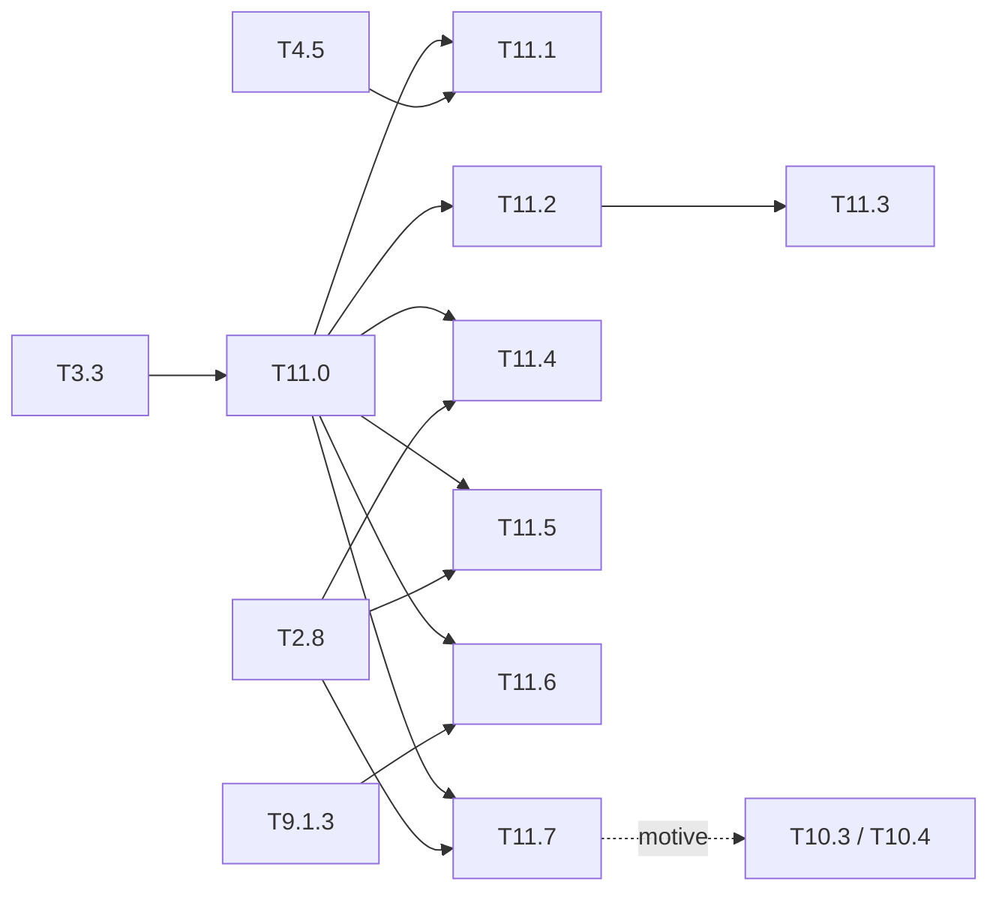

# M11 — Autres jeux de données (optionnel)

Objectif : sortir la chaîne de PASCAL VOC, aujourd'hui son seul banc d'essai (VOC2007
test : 56,30 en flottant, 55,66 en entier et sur FPGA en C-sim). Chaque jeu proposé éprouve
une partie précise de la chaîne : la calibration INT8, la NMS matérielle, la grille 13×13,
une entrée non carrée, L00 à un canal ou le changement de domaine. La variété pour
elle-même n'est pas un critère.

Constat de départ :
- `python/yolo/data/voc.py` et `tools/eval_voc.py` codent `VOC_CLASSES` en dur ;
- `model/tiny-yolov3-coco` est calibré sur 500 images VOC2007 trainval
  ([calibration](../../results/calibration_tiny-yolov3-coco.md)) et n'a jamais été évalué
  sur COCO.

## Synthèse

Les chiffres extérieurs au dépôt (taille, licence) viennent des pages des jeux de données
et sont **à vérifier** au téléchargement. Une licence non commerciale suffit pour ce
projet, qui ne publie pas de poids.

| Jeu | Images annotées | Classes | Résolution typique | Licence | Ce qu'il éprouve | Tâche |
|---|---|---|---|---|---|---|
| COCO val2017 | 5 000 | 80 | ≈ 640×480 | CC BY 4.0 (annotations) | `tiny-yolov3-coco` dans son domaine, AP@[.5:.95], calibration | T11.1 |
| ExDark | 7 363 | 12 (proches de VOC) | variable | recherche | calibration INT8 sous faible luminosité | T11.3 |
| KITTI 2D object | 7 481 (train) | 8 | ≈ 1242×375 | CC BY-NC-SA 3.0 | entrée non carrée, letterbox, ancres | T11.4 |
| VisDrone2019-DET | 6 471 + 548 (train + val) | 10 | jusqu'à 2000×1500 | recherche | petits objets, grille 13×13, résolution | T11.5 |
| CrowdHuman | 15 000 + 4 370 (train + val) | 1 (personne) | variable | recherche | NMS dense, 256 emplacements, débordements | T11.6 |
| FLIR ADAS (thermique) | ≈ 10 000 et plus selon la version | ≈ 15 | 640×512 | recherche | entrée à 1 canal, L00 | T11.7 |

Le coût CPU vient du rythme mesuré en T2.7, ≈ 0,45 s/image à 416 en entraînement. Une
époque sur 7 000 images prend donc ≈ 1 h. Une évaluation en inférence seule coûte bien
moins cher. Pour comparaison, le stade FPGA de M8 en C-sim (`make bench-sim`) prend
≈ 40 min pour 4 952 images.

## Tâches

### [ ] T11.0 — Adaptateur de jeu de données générique
- **Spec** : §5, §8.3 · **Dépend de** : T3.3 · **Taille** : M
- **Livrables** : `python/yolo/data/datasets.py` (registre `{nom: (classes, chargeur)}`) ;
  chaque chargeur rend le même dict que `voc.parse_annotation` (`boxes`, `xyxy`, `labels`,
  `difficult`, `width`, `height`) ; option `--dataset` dans `tools/eval_voc.py`,
  `tools/eval_quant.py`, `tools/calibrate.py`, `tools/kmeans_anchors.py`,
  `tools/make_inputs.py`, `tools/train.py`
- **Acceptation** : avec `--dataset voc`, la mAP VOC2007 test est inchangée à la décimale
  près (56,30 / 55,66) ; tests d'un chargeur sur une annotation factice de chaque format
- **Notes** : prérequis de toutes les tâches suivantes. Les formats à couvrir sont COCO
  JSON, KITTI txt, VisDrone txt, CrowdHuman odgt et ExDark bbGt. Une correspondance de
  classes explicite (`{classe source: classe modèle}`) sert à T11.2.

### [ ] T11.1 — COCO val2017
- **Spec** : §8.3, §10.4 · **Dépend de** : T11.0, T4.5 · **Taille** : M
- **Livrables** : `python/yolo/infer/coco_eval.py` (AP@[.5:.95], AP50, AP75, AP par taille,
  interpolation 101 points) ; `results/map_coco.md`
- **Acceptation** :
  - la métrique NumPy est égale à pycocotools (à 1e-4 près) sur un sous-ensemble, et
    pycocotools n'est utilisé qu'en test ;
  - mAP de `tiny-yolov3-coco` en flottant, entier et FPGA C-sim, avec égalité image par
    image entre l'entier et le FPGA (comme T8.2) ;
  - effet de la calibration, VOC actuelle contre 500 images COCO train2017.
- **Notes** : seule comparaison directe avec la littérature YOLOv3-tiny (2026-fata,
  2023-zhai), à condition de signaler l'élagage et la métrique. On attend un AP50 proche
  de la valeur publiée par Darknet pour ce réseau (≈ 33), qui sert de référence externe et
  doit être reportée **avec sa source**.

### [ ] T11.2 — Changement de domaine sans réentraînement
- **Spec** : §9.2, §11 · **Dépend de** : T11.0 · **Taille** : S
- **Livrables** : `results/hors_domaine.md`
- **Acceptation** : mAP des poids VOC et COCO, sans affinage, sur les classes communes
  d'ExDark, KITTI (car, person, bicycle…) et VisDrone, en flottant et en entier ;
  l'écart flottant → entier y est comparé à celui de VOC (−0,64)
- **Notes** : c'est l'étape la moins chère, à faire avant tout affinage. Elle répond à une
  question précise : la calibration faite sur VOC reste-t-elle valable hors domaine ? Si
  l'écart flottant → entier se creuse, le problème vient de la quantification, pas des
  poids.

### [ ] T11.3 — ExDark (faible luminosité)
- **Spec** : §9.2 · **Dépend de** : T11.2 · **Taille** : S
- **Livrables** : section dans `results/hors_domaine.md`, rapports de calibration
  `results/calibration_*-exdark.md`
- **Acceptation** : mAP entière avec la calibration VOC face à une calibration ExDark ;
  histogrammes des activations de L00-L04 sur les deux jeux
- **Notes** : les images sombres resserrent les activations des premières couches. Avec
  des échelles calibrées sur VOC, les 256 niveaux int8 sont alors mal exploités. Le 4 bits
  (M9.3) devrait y être plus fragile : à mesurer dès que T9.3.5 est fait.

### [ ] T11.4 — KITTI 2D (automobile, entrée non carrée)
- **Spec** : §5.2, §10.2 · **Dépend de** : T11.0, T2.8 · **Taille** : L
- **Livrables** : découpage train/val de KITTI (le test n'a pas d'annotations publiques) ;
  ancres recalculées (`tools/kmeans_anchors.py --dataset kitti`) ; poids affinés ;
  manifeste à entrée non carrée, par exemple 640×192 ; `results/kitti.md`
- **Acceptation** :
  - mAP en letterbox 416×416 face à l'entrée native non carrée ;
  - golden et C-sim == Python à l'octet pour l'entrée non carrée ;
  - cycles `perf_model` aux deux résolutions.
- **Notes** :
  - En letterbox 416×416, une image 1242×375 n'occupe que ≈ 30 % de l'entrée, si bien
    qu'environ 70 % des MACs sont dépensés sur du remplissage.
  - `LayerDesc` sépare déjà `h` et `w`. Il reste à vérifier le manifeste, le golden, les
    tuiles en bord et le décodage, qui suppose une grille carrée.
  - BDD100K (1280×720, 10 classes) est l'alternative plus grande, au même usage.

### [ ] T11.5 — VisDrone-DET (drone, petits objets)
- **Spec** : §3, §10.2 · **Dépend de** : T11.0, T2.8 · **Taille** : L
- **Livrables** : poids affinés (Tiny-YOLOv3) ; `results/visdrone.md`
- **Acceptation** :
  - AP par taille d'objet de Tiny-YOLOv2 (une tête 13×13) face à Tiny-YOLOv3 (têtes
    13×13 et 26×26) ;
  - effet d'une entrée 608 ou 832 sur la mAP, la latence (`perf_model`) et le placement
    roofline.
- **Notes** :
  - Les objets ne mesurent souvent que quelques pixels. Une cellule 13×13 couvre 32 × 32
    pixels à 416, ce qui la rend aveugle à ces objets.
  - Ce jeu donne un argument chiffré pour une troisième tête ou une entrée plus grande.
  - À plus haute résolution, il faut aussi vérifier la place sur puce des line buffers de
    `hls/stream/` (M9.4).

### [ ] T11.6 — CrowdHuman (scènes denses, NMS matérielle)
- **Spec** : §8.2, §10.3 · **Dépend de** : T11.0, T9.1.3 · **Taille** : M
- **Livrables** : `results/nms_dense.md`
- **Acceptation** :
  - débordements de la sélection à 256 emplacements de `yolo_post` ;
  - cycles de la NMS face au pire cas mesuré, 342 375 cycles soit 1,7 ms
    ([postproc_hw.md](../../results/postproc_hw.md)) ;
  - écart de la NMS sans tri à la NMS triée de référence, rapporté en AP et en rappel.
- **Notes** :
  - Sur VOC, l'écart est de −0,10 et la sélection ne déborde que 50 fois sur 4 952
    images (seuil 0,005). Avec ≈ 23 personnes par image en moyenne, la NMS sans tri
    (une boîte éliminée par une boîte elle-même remplacée ne revient pas) et la capacité
    fixe seront réellement sollicitées.
  - Pas d'affinage nécessaire pour une première mesure : les poids VOC et COCO ont la
    classe person.

### [ ] T11.7 — FLIR ADAS (thermique, un canal)
- **Spec** : §10.2 · **Dépend de** : T11.0, T2.8 · **Taille** : L
- **Livrables** : manifeste à entrée 1 canal ; poids affinés (L00 réinitialisée ou
  moyennée sur les 3 canaux) ; `results/thermique.md`
- **Acceptation** :
  - mAP en flottant, en entier et en FPGA C-sim, avec l'entier == FPGA à l'octet ;
  - cycles de L00 à cin = 1, face à cin = 3.
- **Notes** :
  - Avec cin = 1, L00 n'occupe plus que 1/24 des Tn canaux chargés : la perte de tuilage
    de L00 s'aggrave. C'est le cas d'usage qui justifie T10.3 (trim) et la PE dédiée de
    T10.4.
  - Le prétraitement ARM se simplifie (pas de conversion RGB).

### T11.8 — Affinage VOC07+12 (renvoi)
Ce n'est pas une nouvelle tâche : VOC07+12 trainval reste le jeu d'affinage de référence,
voir [T2.9](M2-cibles-perte-entrainement.md).

## Hors périmètre

- Boîtes orientées (DOTA) et segmentation : la tête YOLOv2/v3 n'en produit pas.
- Open Images et Objects365 : trop grands pour un entraînement NumPy sur CPU, et ils
  n'éprouvent rien que COCO n'éprouve déjà.

## Ordre recommandé et dépendances

T11.0 → T11.1 → T11.2 → T11.6 : ces tâches n'exigent aucun réentraînement et coûtent peu.
Les affinages (T11.3, T11.4, T11.5, T11.7) viennent ensuite, selon le temps CPU
disponible.

