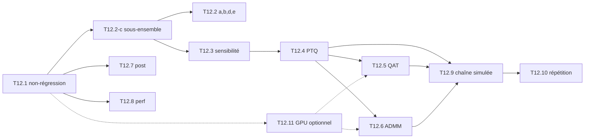

# M12 — Profils de test sur PC (avant la carte)

Objectif : épuiser ce qui se mesure sur PC avant de passer sur la KV260. Pour chaque
évaluation déjà en place (M3 à M9.4), on fixe des **profils** : quels réglages faire
varier, ce que ça coûte, le critère chiffré et la décision à prendre selon le résultat.
La carte n'a ensuite plus qu'à **confirmer** des chiffres déjà connus en simulation : 0 écart
avec la C-sim, et des temps à rapprocher du modèle de cycles.

## Conventions communes

### Paliers de coût

| Palier | Durée | Typiquement |
|---|---|---|
| **R** (rapide) | < 5 min | tests unitaires, 3 dumps, `--subset 100`, modèles analytiques |
| **M** (moyen) | < 1 h | `--subset 500`, entraînement court (300 itérations) |
| **N** (nuit) | plusieurs heures | VOC2007 test complet (4 952 images), `make bench-sim`, ≥ 600 itérations |

Repères mesurés (journaux de `build/`) :

| Mesure | Durée |
|---|---|
| `eval_quant.py` complet `--variants int`, 8 jobs | ≈ 120 ms/image, ≈ 10 min |
| `eval_quant.py` complet `--variants float,int` | ≈ 150-300 ms/image, 12-25 min |
| `make bench-sim`, 22 threads | ≈ 40 min |
| QAT, batch 8, CPU | ≈ 0,45 s/image (≈ 36 min pour 600 itérations) |
| ADMM | ≈ 50 min pour 600 itérations |
| QAT / ADMM sur GPU (`--device gpu`, T12.11) | à mesurer (T12.11-e) |

### Fiche d'un profil

Chaque profil se rédige comme le diagnostic de l'ADMM (T12.6), dans cet ordre :

1. **Diagnostic / hypothèse** : ce qu'on observe ou ce qu'on cherche, avec un chiffre.
2. **Réglages fixes** : ce qui ne bouge pas (réseau, `--resize`, seuils, calibration).
3. **Grille** : les valeurs testées, une ligne par essai.
4. **Commande** : une commande exacte par point de la grille.
5. **Coût** : le palier et une durée estimée.
6. **Mesure** : le fichier produit et la grandeur lue.
7. **Critère** : le seuil chiffré de réussite.
8. **Décision** : quoi faire si le critère est atteint, et quoi faire sinon. Documenter un
   échec comme « non convergé » ou « rejeté » est une décision valable.

### Règles

- **Sous-ensemble** : une mAP sur 500 images (`--subset 500`) sert seulement à **classer**
  des variantes. Un chiffre rapporté dans `results/` vient toujours des 4 952 images.
  T12.2-c vérifie que ce classement est fiable.
- **Réglages de référence** : sauf mention contraire, Tiny-YOLOv2 VOC, `--resize stretch`
  (PIL), `--conf 0.005`, NMS 0,45, calibration `build/quant/tiny-yolov2-voc/calib.json`.
  Chiffres de référence : flottant **56,30**, INT8 **55,66** ([map_stades](../../results/map_stades.md)).
- **Sorties** : `build/m12/<profil>/` (journal, JSON des mAP de `--out`, CSV). On recopie
  dans `results/` uniquement les chiffres validés sur les 4 952 images.
- **Exécution** : `tools/m12.sh <profil>` lance un profil (liste en tête du script), et
  `tools/m12_report.py` produit les tables de synthèse (mAP, perte, ADMM, égalité des
  détections).
- **Backend d'entraînement** : `--device cpu` (défaut, référence) ou `--device gpu`
  seulement sur demande (T12.11, option de `tools/train.py`). Les
  évaluations (mAP, entier, golden, C-sim) restent toujours sur le CPU.
- **Une seule variable à la fois** par rapport à la référence, sauf pour les grilles
  croisées annoncées.

---

### [ ] T12.1 — Non-régression fonctionnelle
- **Spec** : §10.5 · **Dépend de** : M5, M6, M7 · **Taille** : S · **Palier** : R
- **Livrables** : ordre d'exécution et temps relevés, dans les notes de cette tâche
- **Acceptation** : chacun des trois profils passe avec 0 écart à l'octet ; temps de chacun
  noté
- **Profils** :

  | Profil | Contenu | Quand |
  |---|---|---|
  | *Fumée* | `make test-py` (sans `-m slow`) + `make test-cpp` | après toute modification |
  | *Bit-exact* | `make golden-check` (v2, v3, 3 dumps) + `make csim-gcc` (tb_conv, tb_net, tb_post, tb_stream, tb_net_pow2) + `make sw-sim` (run_compare, run_compare_hw_post, yolo_app, yolo_bench) | après une modification du contrat entier, du noyau ou du driver |
  | *Avant carte* | *Bit-exact* + `make test-slow` + `make perf-model` (cycles == C-sim) + `make check-regmap` (si l'en-tête Vitis existe) | avant de produire un bitstream |

- **Décision** : si un écart apparaît, `run_compare --layer N` localise la couche
  fautive, puis `tools/compare_dumps.py` sur cette couche. On ne lance aucun profil M ou N
  tant que *Bit-exact* n'est pas vert.

- **Fait (code)** : `tools/m12.sh fumee | bitexact | avant-carte` (journal et durées dans
  `build/m12/regress/log.txt`). À exécuter.

### [ ] T12.2 — mAP flottante et entière (M3, M4)
- **Spec** : §8.3, §9.2 · **Dépend de** : T4.5, T8.2 · **Taille** : M · **Palier** : M puis N
- **Livrables** : `build/m12/map/*.json`, et une table de synthèse dans les notes
- **Acceptation** : les cinq profils ci-dessous ont un chiffre et une décision

**a) Prétraitement**
- Diagnostic : l'entier perd 2 points en `letterbox` (53,68) par rapport à `stretch`
  (55,66), alors que la calibration est faite en letterbox.
- Grille :
  - `--resize letterbox | stretch` ;
  - `--interp pil | darknet` (avec `eval_voc.py` seulement).
- Commande : `python tools/eval_quant.py --variants float,int --resize <r> --subset 500 --out build/m12/map/pre_<r>.json`
- Critère : mesurer l'écart flottant/entier (environ 0,5 point en référence).
- Décision : si l'écart entier grandit en letterbox, recalibrer en `stretch` (lien avec
  T12.2-d).

**b) Seuils**
- Grille :
  - `--conf 0.005 | 0.01 | 0.25` ;
  - `--iou 0.40 | 0.45 | 0.50`.
- Critère : mAP et nombre de détections par image. À 0,25, la mAP chute ; ce seuil sert à
  la démonstration, pas à la mAP.
- Décision : garder 0,005 / 0,45, sauf si un autre couple gagne plus de 0,3 point sur
  500 images *et* sur 4 952 images.

**c) Fidélité du sous-ensemble** (à faire en premier)
- Grille :
  - `--subset 100 | 500 | 1000 | 0` (0 = toutes les images) ;
  - modèles : INT8 (`--variants int`) et pow2 mixed6 en PTQ
    (`--model-dir build/m9/models/tiny-yolov2-voc-pow2-ptq`).
- Critère : sur 500 images, l'écart à la mAP complète reste sous 1 point, et l'ordre
  INT8 > pow2 est conservé.
- Décision : si le critère tient, 500 images deviennent le palier M de tout le jalon.
  Sinon, passer à 1 000 images et ajuster les durées.

**d) Calibration**
- Grille :
  - `tools/calibrate.py --choice mse | p99 | p99.9 | p99.99 | max` ;
  - `--images 100 | 500 | 2000` ;
  - `--seed 0 | 1 | 2`, avec `--out build/m12/calib/<…>` ;
  - puis `eval_quant.py --variants int --calib <…>/calib.json --subset 500`.
- Mesure : mAP et écart-type selon la graine.
- Critère : la référence (mse, 500 images) reste à moins de 0,3 point de la meilleure
  variante.
- Décision : changer la calibration seulement si le gain dépasse l'écart-type mesuré entre
  graines.

**e) Échelle de la tête**
- Grille : `tools/calibrate.py --head-scale` autour de la valeur par défaut (×0,5, ×1, ×2).
- Critère : mAP entière et saturation de la tête.

- **Fait (code)** : `tools/m12.sh map-c` (à lancer en premier), puis `map-a`, `map-b`,
  `map-d` et `map-e`. `SUBSET=1000` passe tout le jalon à 1 000 images si T12.2-c l'exige.
  - Le JSON de `eval_quant.py --out` donne maintenant `dets_per_image` par variante (b), ainsi
    que `conf`, `iou` et `model_dir`.
  - d) fait varier une seule variable autour de mse / 500 images / graine 0 : 5 choix, 100 et
    2 000 images, graines 1 et 2. Les calibrations vont dans `build/m12/calib/<essai>/`, et
    `--markdown` les garde hors de `results/`.
  - e) teste `--head-scale` 1/16, 1/8 (défaut) et 1/4.
  - Synthèse : `python tools/m12_report.py map build/m12/map/<motif>*.json`. À exécuter.

### [ ] T12.3 — Sensibilité par couche
- **Spec** : §9.2, §10.5 étape 2 · **Dépend de** : T12.2-c · **Taille** : M · **Palier** : M
- **Livrables** : `build/m12/sens/` ; classement des couches (table couche × schéma)
- **Acceptation** : pour chaque conv (0, 2, 4, 6, 8, 10, 12, 13, 14) et chaque schéma, la
  perte de mAP sur 500 images face à la référence INT8 projetée
- **Grille** :
  - une seule couche passe en `mixed6`, `uniform6` ou w4, et les autres restent en
    `int8` ;
  - c'est le modèle de `build/m9/run_sensitivity.sh`, étendu à trois schémas.
  - Complément en fake-quant :
    `eval_quant.py --variants float,fq:all,fq:each --subset 500`.
- **Coût** : 9 couches × 3 schémas, soit 27 évaluations sur 500 images (≈ 1 min chacune
  avec 8 jobs, plus l'export). Prévoir moins d'1 h.
- **Décision** : les couches qui perdent plus de 1 point restent en INT8 dans les plans
  mixtes de T12.4. Le classement alimente aussi T10.10.
- **Fait (par T10.10)** : grille couche × {uniform4, uniform6, mixed6} mesurée par
  `tools/mixed_precision.py sens`. Sorties dans `build/m10/mixed/sensitivity.csv` (et non
  `build/m12/sens/`), tableau dans [precision_mixte](../../results/precision_mixte.md).
  Plus de 1 point de perte : L00 (les trois schémas), L02 et L04 en 4 bits. Le complément
  en fake-quant reste à faire.

- **Fait (code)** : `tools/m12.sh fq` (complément en fake-quant, `build/m12/sens/fq.json`).
  À exécuter.

### [ ] T12.4 — PTQ basse précision (M9.2, M9.3)
- **Spec** : §9.2, §9.3 · **Dépend de** : T12.3 · **Taille** : M · **Palier** : M puis N
- **Livrables** : `build/m12/ptq/map_*.json` ; une table mAP × schéma
- **Acceptation** : chaque variante est placée face au plancher pow2 en PTQ (52,46) et à
  INT8 (55,66). Le contrôle `w8a8` redonne 55,66 à 0,1 près
- **Diagnostic** : `w4a4` en PTQ s'effondre (17,06). Il faut savoir si la cause vient des
  poids ou des activations.
- **Grille** :

  | Variante | Commande `quant_lowbit.py` | Rôle |
  |---|---|---|
  | w8a8 | `--scheme w8a8` | contrôle de l'outil |
  | w8a4 | `--scheme w8a4` | isole les activations |
  | w4a8 | `--scheme w4a8` | isole les poids |
  | w4a4 | `--scheme w4a4` | référence (17,06) |
  | uniform6 | `--weights pow2 --weights-plan build/m9/plan_uniform6.json` | équidistant 6 bits |
  | mixed6 | `--weights pow2` | REQ-YOLO (52,46) |
  | mixed6 sauf les couches sensibles | `--weights pow2 --weights-plan <plan T12.3>` | plan mixte |
  | w4a4, 1re et dernière couche en INT8 | à décrire par plan (si l'outil le permet) | règle usuelle de la 4 bits |

  Pour chaque variante : `--out build/m12/ptq/<v>`, puis
  `eval_quant.py --model-dir build/m12/ptq/<v> --variants int --subset 500`.
- **Décision** :
  - si w8a4 ≪ w4a8, l'effort de QAT (T12.5) porte d'abord sur les pas d'activation ;
  - les deux meilleures variantes passent sur les 4 952 images (N).

- **Fait (code)** :
  - Nouvelle option `quant_lowbit.py --int8-layers 0,14` (`lowbit.layer_qmax`) : poids et
    sortie de ces convs restent en INT8 dans un schéma wXaY. Elle couvre la dernière ligne
    de la grille.
  - `tools/m12.sh ptq` couvre les 8 variantes, avec le plan T12.3 = `{"0": "int8"}` (seule
    L00 perd plus de 1 point en mixed6) ; puis `tools/m12.sh ptq-full <v1> <v2>` (palier N).
  - À exécuter.

### [ ] T12.5 — QAT 4 bits
- **Spec** : §7.1, §9.2 · **Dépend de** : T12.4 · **Taille** : M · **Palier** : M puis N
- **Livrables** : `build/m12/qat/<essai>/` (loss.csv, checkpoint, mAP)
- **Acceptation** : la perte décroît ; la mAP sur 500 images après export dépasse nettement
  la PTQ w4a4
- **Diagnostic** : l'essai actuel (600 itérations, lr 1e-4, batch 8) finit avec une perte
  bruitée, entre 6 et 13 sur les dernières itérations. La tendance ne se voit pas sans
  moyenne glissante, et aucune mAP n'a encore été mesurée après export.
- **Réglages fixes** : `--init weights/yolov2-tiny-voc.weights`, `--burn-in 50`,
  `--qat-steps build/m9/models/tiny-yolov2-voc-w4a4-ptq/steps.json`.
- **Grille**, une variable à la fois :
  - `--lr 1e-4 | 3e-4 | 1e-3` ;
  - `--iters 300 | 600 | 2000` ;
  - `--batch 8 | 16` ;
  - `--qat-steps` : pas de la PTQ, ou absent.
- **Commande** :
  - `python tools/train.py --net tiny-yolov2-voc --qat w4a4 … [--device gpu] --out build/m12/qat/<essai>` ;
  - puis `python tools/quant_lowbit.py --scheme w4a4 --checkpoint build/m12/qat/<essai>/checkpoint.npz --out build/m12/qat/<essai>/model` ;
  - puis `eval_quant.py --model-dir … --variants int --subset 500`.
- **Coût** : environ 18 min pour 300 itérations et environ 36 min pour 600 (batch 8).
  2 000 itérations relèvent du palier N sur CPU, et peuvent passer en palier M sur GPU si
  T12.11 est validée.
- **Mesure** : moyenne glissante sur 50 itérations de `loss.csv` (début contre fin), puis
  mAP.
- **Décision** :
  - si la perte ne baisse pas à lr 1e-4, essayer 3e-4 ;
  - si la mAP reste sous 40 sur 500 images après 600 itérations, documenter « QAT court
    insuffisant » et chiffrer le coût de 2 000 itérations ou plus avant de les lancer.

- **Fait (code)** : `tools/m12.sh qat <essai>`, avec l'essai parmi `ref`, `lr3e-4`, `lr1e-3`,
  `it300`, `it2000`, `b16` et `nosteps`. Le script enchaîne entraînement, export, mAP sur
  500 images et `m12_report.py loss` (moyenne glissante sur 50 itérations, début contre fin).
  `DEVICE=gpu` ajoute `--device gpu`. **Aucun entraînement lancé.**

### [ ] T12.6 — ADMM REQ-YOLO
- **Spec** : §9.2 · **Dépend de** : T12.4, T9.2.3 · **Taille** : M · **Palier** : M
- **Livrables** : `build/m12/admm/<essai>/` (admm.csv, checkpoint, mAP)
- **Acceptation** : résidu ‖W − Z‖/‖W‖ < 0,01 sur toutes les couches à la fin, et mAP
  après projection finale > 52,46 (PTQ pow2)
- **Diagnostic** : l'ADMM ne converge pas avec les réglages actuels
  (`--admm-rho 1e-3 --admm-every 50`, 600 itérations). Le résidu par couche devrait tendre
  vers 0. Au lieu de ça, il monte de 0,05-0,06 (itération 50) à environ 0,087
  (`build/train/admm-mixed6/admm.csv`). La pénalité ρ, qui ramène les poids vers les
  niveaux, reste trop faible : elle n'atteint que 0,023 à l'itération 600
  (1e-3 × 1,3¹²). Les poids ne sont donc pas vraiment attirés vers les niveaux, et le
  résultat final sera proche de la projection directe sans réentraînement (52,46).
- **Grille** :

  | Essai | ρ₀ | `growth` | `rho_max` | `--admm-every` | Itérations | ρ final |
  |---|---|---|---|---|---|---|
  | réf | 1e-3 | 1,3 | 1 | 50 | 600 | 0,023 |
  | A | 1e-2 | 1,3 | 1 | 50 | 600 | 0,23 |
  | B | 5e-2 | 1,3 | 1 | 50 | 600 | 1 (plafond) |
  | C | 5e-2 | 1,3 | 1 | 25 | 300 | 1 (plafond) |
  | D | 1e-1 | 1,5 | 1 | 50 | 300 | 1 (plafond) |
  | E | 5e-2 | 1,3 | 1 | 100 | 600 | 0,2 |

- **Prérequis** : `growth` et `rho_max` existent dans `python/yolo/train/admm.py`
  (1,3 et 1,0), mais `tools/train.py` ne les expose pas. Les essais A, B, C et E
  fonctionnent avec les options actuelles. D demande une option `--admm-growth`.
- **Commande** : `python tools/train.py --net tiny-yolov2-voc --init weights/yolov2-tiny-voc.weights --admm build/m9/plan_mixed6.json --admm-rho <ρ₀> --admm-every <k> --lr 1e-4 --burn-in 50 --batch 8 --iters <n> [--device gpu] --out build/m12/admm/<essai>`,
  puis `quant_lowbit.py --weights pow2 --checkpoint …`, puis `eval_quant.py … --subset 500`.
- **Coût** : environ 25 min pour 300 itérations et environ 50 min pour 600. Les essais C
  et D tiennent dans le palier M ; on peut les lancer en parallèle des évaluations. Sur
  GPU (T12.11), la grille entière devient envisageable en une soirée.
- **Mesure** : la dernière ligne de `admm.csv` (colonnes `res_*`), ainsi que la pente du
  résidu entre deux pas Z / U.
- **Décision** :
  - si le résidu descend sous 0,01, passer la mAP sur les 4 952 images ;
  - si ρ fort fait diverger la perte (pénalité qui écrase la perte de détection), revenir
    à l'essai A ;
  - sinon, documenter le résultat « non convergé » dans T9.2.3 avec la table ci-dessus.

- **Fait (code)** : `tools/train.py --admm-growth` existe, donc l'essai D est possible.
  `tools/m12.sh admm <essai>` lance l'un des essais `ref`, `A`, `B`, `C`, `D` ou `E` de la
  table : entraînement, projection, mAP sur 500 images, puis `m12_report.py admm` (dernière
  ligne, résidu max, pente). **Aucun entraînement lancé.**

### [ ] T12.7 — Post-traitement matériel (M9.1)
- **Spec** : §8.2, §10.3 · **Dépend de** : T9.1.3 · **Taille** : S · **Palier** : R puis M
- **Livrables** : `build/m12/hwpp/` ; table capacité × débordements × mAP
- **Acceptation** : 0 écart entre Python, golden et C-sim ; perte de mAP de la
  variante retenue < 0,2 face à `int`
- **Grille** :
  - **capacité** : `eval_quant.py --variants int,int-hwpp --hw-cap 64 | 128 | 256 | 1024 --subset 500`.
    On lit les candidates perdues affichées ; la référence actuelle est 256, avec 50
    débordements sur 4 952 images et 55,56 de mAP.
  - **seuil** : `--conf 0.005 | 0.25`. La NMS sans tri s'écarte de la NMS triée surtout
    à faible seuil.
  - **robustesse** : `tb_post` (ctest). Le nombre de têtes aléatoires est fixé dans le
    code (800 pour v2, 200 pour v3). Le passer en option permettrait une nuit à 10⁵ cas.
  - **pire cas en cycles** : les 845 candidates de v2 passent toutes, avec une capacité
    de 64, 128 ou 256. Les cycles se comparent aux 342 000 de
    [`postproc_hw.md`](../../results/postproc_hw.md).
- **Décision** : retenir la plus petite capacité dont la perte reste sous 0,05 point. Le
  coût en cycles et en BRAM de la capacité est noté pour T10.7.

- **Fait (code)** :
  - `tb_post --random N` fixe le nombre de têtes aléatoires (défaut 800 / 200), pour la nuit
    à 10⁵ cas.
  - `-DHWPP_CAP=N` (`golden/hw_postproc.hpp`) compile le noyau et le golden à une autre
    capacité, pour les cycles du pire cas.
  - `eval_quant.py` écrit les candidates perdues (`overflow`) dans le JSON.
  - `tools/m12.sh hwpp` : capacité × seuil sur 500 images, puis `tb_post` compilé à 64, 128
    et 256 dans `build/m12/hwpp/build_cap<N>`. `RANDOM_HEADS=100000` lance la version
    longue.
  - À exécuter.

### [ ] T12.8 — Performance estimée (M6, M8, M9.4, M10)
- **Spec** : §10.2, §10.4 · **Dépend de** : T8.1, T9.4.1 · **Taille** : S · **Palier** : R
- **Livrables** : une table des gains attendus par piste, à confirmer sur la carte
- **Acceptation** : `make perf-model` vert (cycles égaux à la C-sim, cycle pour cycle) ;
  chaque piste de M10 a un chiffre de projection
- **Grille** :
  - **moteur unique** : `make hls-cycles` puis `make perf-model` (scénarios : ports
    64 et 128 bits, canaux valides, requantification parallèle). Référence : 206,5 ms,
    soit 4,8 img/s.
  - **roofline** : `make roofline` (toutes les cartes de `hw/boards/`). On vérifie que le
    point Tm = 32, Tn = 24 reste le meilleur sous le budget de la KV260.
  - **streaming** : `tools/stream_model.py --board kv260 --wbits 8|4 --abits 8|4`, plus
    `--net tiny-yolov3-voc`. Références : 32,1 img/s en 8 bits et 64,2 img/s en 4 bits.
  - **sensibilité au réseau** : les mêmes commandes sur `tiny-yolov3-coco`.
- **Décision** : classer les pistes de M10 par gain divisé par effort. Les écarts
  carte / projection de T8.1 seront lus face à cette table.

- **Fait (code)** : `tools/m12.sh perf` lance perf-model, roofline (`--out build/m12/perf`),
  `stream_model` (8/4 bits, poids et activations) et les autres réseaux s'ils sont
  exportés. À exécuter.

### [ ] T12.9 — Chaîne carte simulée
- **Spec** : §11 · **Dépend de** : T12.1, T8.2 · **Taille** : M · **Palier** : M puis N
- **Livrables** : `build/m12/sim/<variante>/` (dets, temps) ; `make map-stades` relancé
- **Acceptation** : pour chaque variante, images identiques entre l'entier et la C-sim,
  avec un écart égal à 0
- **Grille** :

  | Variante | Ce qui change | Palier |
  |---|---|---|
  | paliers d'images | `yolo_bench --start 0 --count 100`, puis 500, puis `make bench-sim` | R → M → N |
  | `ap_int` contre `ACC_NO_APINT` | `BENCH=build/sw/yolo_bench` (ap_int) contre `build/sw-fast` sur 500 images | M |
  | post-traitement matériel | `yolo_bench --hw-post` contre logiciel ; comparaison à `eval_quant --variants int-hwpp --save-dets` | M |
  | modèles basse précision | `--model` sur un modèle exporté par T12.4 / T12.5 / T12.6 (si `tb_net_pow2` / lowbit sont verts) | M |

- **Décision** : un seul écart bloque la carte. On le localise avec `run_compare` sur
  l'image en cause avant toute autre mesure.

- **Fait (code)** :
  - `tools/bench_sim.sh` accepte `COUNT=N` (N premières images), `OUT=<dossier>` et
    `EXTRA="--hw-post"`.
  - `eval_quant.py --save-dets` accepte `int-hwpp` évalué seul.
  - `m12_report.py dets REF GOT…` vérifie l'égalité exacte sur les images présentes.
  - `tools/m12.sh sim` couvre :
    - les paliers 100 et 500 (ap_int) ;
    - `ACC_NO_APINT` sur 500 ;
    - `--hw-post` contre `int-hwpp` ;
    - les modèles basse précision (`MODELS="dir…"`, 100 images).
  - `make bench-sim` reste le palier N. À exécuter.

### [ ] T12.10 — Répétition générale du protocole carte
- **Spec** : §10.4 · **Dépend de** : T12.9 · **Taille** : S · **Palier** : M
- **Livrables** : les fichiers de sortie du protocole produits sur PC (backend sim) et lus
  par les outils de rapport
- **Acceptation** : tout [`protocole.md`](../../results/protocole.md) se déroule sur PC,
  sauf la puissance et les temps absolus. Sur la carte, il ne reste qu'à changer de backend
  (`sw-board`, `--backend uio`).
- **Profils** :
  - **JPEG** : `yolo_bench --images <dir> --count 1000 --warmup 5 --times … --dets …`,
    avec le décodage stb. Ensuite, comparer avec les détections `--inputs` (prétraitement
    PIL). On mesure l'écart de mAP entre stb et PIL, qui se verra aussi sur la carte.
  - **Lecture des sorties** : `tools/bench_report.py` et `tools/map_stades.py` lisent les
    fichiers produits sans modification (formats, noms de colonnes, chemins
    `board/dets_*.jsonl` simulés).
  - **Temps** : les temps par étage sur PC n'ont pas de valeur absolue. On vérifie
    seulement que `pre`, `load`, `acc` et `post` sont tous renseignés et que p99 est
    calculé.
- **Décision** : tout format ou chemin cassé se corrige avant la carte, pas sur la carte.

- **Fait (code)** : `tools/m12.sh repetition` (`COUNT=100` par défaut) couvre :
  - JPEG décodé par stb contre entrées PIL, avec les détections dans
    `build/m12/repetition/board/` ;
  - la lecture des temps par `bench_report.py`, dans `build/m12/repetition/`.

  `map_stades.py` demande les 4 952 images. Sur un sous-ensemble, l'égalité est vérifiée
  par `m12_report.py dets`. À exécuter.

### [ ] T12.11 — Entraînement sur CPU ou GPU (au choix)
- **Spec** : §7.1 · **Dépend de** : T2.7, T9.3.3 · **Taille** : M · **Palier** : M
- **Livrables** (code, à venir) :
  - un module de backend (`python/yolo/backend.py` ou équivalent) qui fournit `xp`,
    c'est-à-dire `numpy` ou `cupy`, choisi une fois au démarrage ;
  - l'option `tools/train.py --device cpu|gpu`, `cpu` par défaut ;
  - des tests GPU sautés quand CuPy est absent (`pytest.importorskip("cupy")`).
- **Acceptation** : le profil d'équivalence CPU / GPU ci-dessous passe (a à f), et le gain
  de vitesse est mesuré
- **Contexte** : l'entraînement (affinage, QAT T9.3.3, ADMM T9.2.3) tourne en NumPy sur le
  CPU, à environ 0,45 s par image, soit 36 à 50 min pour 600 itérations. Cette durée
  limite les grilles de T12.5 et T12.6. Le PC a un GPU NVIDIA RTX 1000 Ada Laptop
  (6 Go, vu par `lspci`).
- **Choix** : **CuPy**, qui garde l'API de NumPy et donc le style « couches écrites à la
  main » (`forward` / `backward`) de la spécification. PyTorch apporterait son propre
  autograd et un second chemin de calcul.
- **Comportement attendu** :
  - Le **CPU reste le défaut et la référence**. Le GPU sert **seulement si l'utilisateur
    le demande** (`--device gpu`).
  - **Pas de repli silencieux** : `--device gpu` sans CuPy, sans pilote ou sans GPU
    s'arrête avec un message clair.
  - CuPy est importé **seulement** par `--device gpu`. Sans cette option, `python/yolo/`
    n'a toujours aucune dépendance hors NumPy.
  - Les données, l'augmentation et les cibles (`python/yolo/data/`) restent calculées sur
    le CPU. Seul le lot est copié vers le GPU.
  - Les checkpoints sont sauvés en NumPy (`.get()` avant `np.savez`), donc lisibles par
    les deux backends. La reprise **exacte** n'est garantie que sur le même backend.
  - Tout ce qui est entier ou bit-exact (`IntNetwork`, `eval_quant.py`, export, golden,
    HLS) reste sur le CPU, sans changement.
- **Code touché** (à vérifier à l'implémentation) :
  - `python/yolo/layers/` : `conv.py` utilise `sliding_window_view` et `np.tensordot` ;
    `pool.py` utilise `np.add.at`, qui devient `cupyx.scatter_add` ;
  - `models/graph.py` ;
  - `train/loss.py`, `optim.py`, `trainer.py`, `admm.py` ;
  - `quant/fake_quant.py`, `quant/pow2.py`.
- **Prérequis machine** :
  - pilote NVIDIA et CUDA installés (aujourd'hui, `nvidia-smi` est absent) ;
  - `pip install cupy-cuda12x` (dans l'environnement Python du projet, pas dans
    `python/yolo/`) ;
  - contrôle : `python -c "import cupy; print(cupy.cuda.runtime.getDeviceCount())"`
    doit afficher au moins 1.
- **Profil d'équivalence CPU / GPU** :

  | Point | Mesure | Critère |
  |---|---|---|
  | a) gradcheck | `yolo.testing.gradcheck` en float64 sur GPU | ≤ 1e-7, comme dans `conventions.md` |
  | b) couches | passes avant et arrière GPU contre CPU, mêmes entrées | float64 ≤ 1e-12 ; float32, erreur relative ≤ 1e-5 |
  | c) surapprentissage | T2.8 (`make test-slow`) sur GPU | converge, comme sur CPU |
  | d) entraînement court | 50 itérations à graine égale, QAT w4a4 puis ADMM | perte moyenne GPU à moins de 1 % de la perte CPU |
  | e) vitesse | s/image et batch maximal qui tient dans 6 Go, en 416×416 | gain chiffré face à 0,45 s/image |
  | f) non-régression CPU | 10 itérations avec `--device cpu` (et sans l'option) | checkpoint identique à l'octet à celui d'avant |

- **Notes** :
  - La règle « pas de dépendance hors NumPy » de `docs/conventions.md` est à amender au
    moment de l'implémentation : « CuPy optionnel, importé seulement par
    `--device gpu` ».
  - TF32 désactivé (float32 strict), pour que le point b) ait un sens.
  - `sliding_window_view` : vérifier sa présence dans la version de CuPy installée, sinon
    passer par `as_strided`.
  - Mémoire : la vue im2col de la première conv est la plus grosse. On la mesure avant de
    monter le batch.
  - Un chiffre publié dans `results/` à partir d'un poids entraîné indique le backend
    utilisé.
- **Décision** :
  - si le gain est d'au moins 5×, les grilles longues de T12.5 et T12.6 passent sur GPU
    (palier M au lieu de N), avec `--device gpu` explicite dans chaque commande ;
  - sinon, le GPU reste une option et on documente le gain mesuré.

- **Fait (code)** :
  - `python/yolo/backend.py` : `use("cpu" | "gpu")`, avec un arrêt clair sans CuPy, CUDA ou
    GPU. Il fournit aussi `get_xp`, `to_device`, `to_numpy`, `copy_into`,
    `sliding_window_view` (repli `as_strided`) et `add_at` (`cupyx.scatter_add`).
  - Les couches prennent le module de leurs entrées, donc un tableau NumPy reste calculé
    par NumPy.
  - Code touché :
    - `layers/` ;
    - `models/graph.py` (`Network.to_device` / `to_numpy`) ;
    - `train/trainer.py` : lot copié vers le GPU ; perte et cibles **sur le CPU**, sur les
      sorties des têtes ; checkpoints en NumPy ;
    - `train/optim.py` ;
    - `train/admm.py` : Z et U sur le GPU, projection Π_S sur le CPU ;
    - `quant/fake_quant.py`, `quant/quantize.weight_scales` ;
    - `testing/gradcheck.py`.
  - `loss.py`, `pow2.py` et `data/` sont inchangés.
  - `tools/train.py --device cpu|gpu`, avec `cpu` par défaut.
  - `docs/conventions.md` est amendé.
  - Tests, `python/tests/test_backend.py` :
    - Point f : 6 itérations sur le réseau de test, ADMM compris. Paramètres, état, vitesses
      et checkpoint sont identiques à l'octet avec ou sans `use("cpu")` / `to_device()`.
    - Points a, b et d (réduit) : sautés tant que CuPy est absent. Leur corps a été vérifié
      avec NumPy à la place de CuPy.
  - Reste à faire sur la machine :
    - pilote NVIDIA et `pip install cupy-cuda12x` ;
    - `make test-py` (a, b, d), le point c (`make test-slow` sur GPU, à brancher) et le
      point e (vitesse) avant toute décision.

---

## Ordre conseillé
---

## Ordre conseillé

- **En parallèle**, sur une machine à 22 threads :
  - T12.5 et T12.6 tournent ensemble, chacun avec 8 threads BLAS (comme
    `build/m9/run_train_short.sh`) ;
  - une évaluation sur 500 images peut s'y ajouter avec `--jobs 4` ;
  - sur GPU (T12.11), T12.5 et T12.6 se lancent l'un après l'autre (un seul GPU de
    6 Go), pendant que les évaluations occupent le CPU.
- **La nuit** : T12.9 complet (`make bench-sim`) seul, puis les évaluations des variantes
  retenues sur les 4 952 images.
- **Rien de M12 ne demande Vitis ni la carte.** La synthèse et la co-simulation restent
  dans M6 et M9.x.
