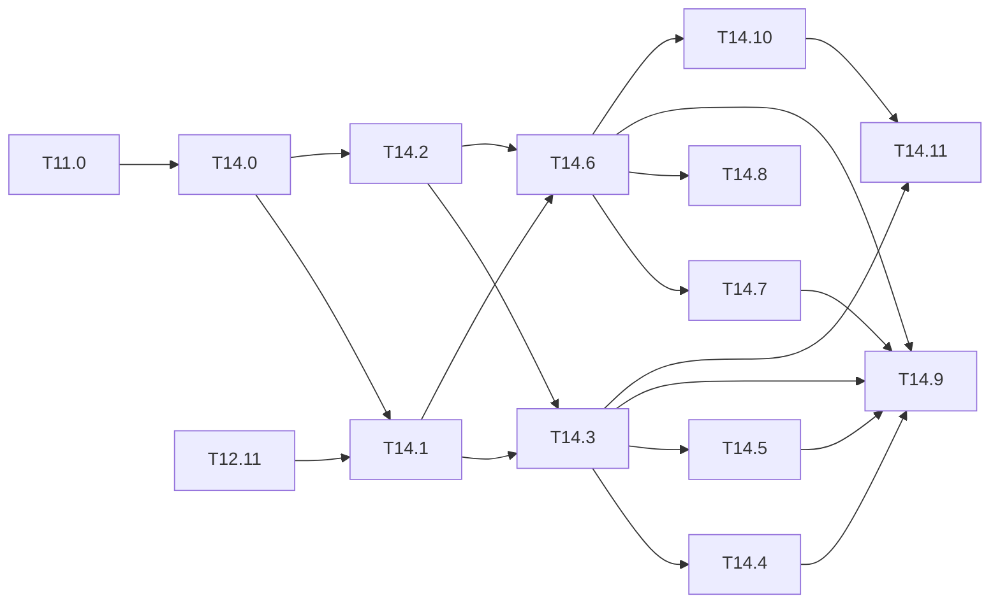

# M14 — Notebooks d'entraînement et d'inférence (optionnel)

Objectif : un notebook Jupyter par couple **modèle × jeu de données** et par rôle
(**entraînement** ou **inférence**), généré depuis un gabarit et exécutable en local comme
sur Colab (GPU).

Constat de départ :
- la chaîne ne se pilote qu'en ligne de commande : `tools/train.py`, `tools/detect.py`,
  `tools/eval_voc.py`, `tools/calibrate.py`, `tools/eval_quant.py`, et les profils
  `tools/m11.sh` et `tools/m12.sh` ;
- le dépôt ne contient aucun `.ipynb` ;
- les affinages hors VOC (T11.4, T11.5, T11.7) coûtent des heures sur CPU (≈ 0,45 s/image,
  [M12](M12-profils-pc.md#paliers-de-coût)) ; un GPU distant (Colab) les rend praticables,
  à condition que la chaîne s'y installe en une cellule.

Un notebook n'apporte **aucun calcul nouveau** : il enchaîne les outils existants, montre
les images, les courbes et les tables, et garde la trace des paramètres. Comme les figures
de [M13](M13-figures.md), il **appelle le code du dépôt** (`python/yolo/` et les `main()`
de `tools/`), jamais une réécriture.

**État** : 5 tâches faites sur 12 (T14.0, T14.2, T14.7, T14.10, T14.11). Les 7 autres sont
implémentées ; il leur manque un passage long (palier N), un essai sur Colab ou un
entraînement (« Reste » de chaque tâche).

## Conventions communes

### Outillage

- **Paquet** : `tools/notebooks/`. Il contient :
  - `matrice.py`, le registre des notebooks (couple modèle × jeu × rôle, voir plus bas) ;
  - `gabarits.py`, les cellules communes et les gabarits `infer` et `train` ;
  - `__main__.py`, la ligne de commande.
- **Commandes** :
  - `python -m tools.notebooks <nom|jeu|rôle|all>` écrit les notebooks demandés ;
  - `python -m tools.notebooks --list` affiche le registre ;
  - `python -m tools.notebooks --check` échoue si un notebook versionné diffère de ce que
    produirait le générateur ;
  - `make notebooks` régénère tout ; `make ci` lance `--check`.
- **Format** : JSON nbformat 4 écrit avec `json` de la bibliothèque standard. `nbformat`
  n'est pas une dépendance obligatoire ; il sert seulement à valider le schéma dans le test,
  qui est sauté s'il est absent.
- **Dépendances** : extra `notebooks = ["jupyter", "matplotlib>=3.7", "pillow>=10"]` dans
  `python/pyproject.toml`. Le paquet `yolo` reste en NumPy pur
  ([ADR 0001](../adr/0001-numpy-pur.md)) : ni Jupyter ni matplotlib ne sont importés depuis
  `python/yolo/`.

### Sorties

- **Notebooks** : `notebooks/<jeu>/<modèle>_<rôle>.ipynb`, par exemple
  `notebooks/voc/tiny-yolov2-voc_infer.ipynb` ou
  `notebooks/kitti/tiny-yolov3-kitti_train.ipynb`.
- **Index** : `notebooks/README.md`, réécrit depuis le registre comme
  [results/figures.md](../../results/figures.md). Une ligne par notebook : jeu, modèle,
  rôle, palier de coût, poids requis, badge « Open in Colab ».
- **Visionneuse** : `notebooks/figures_live.ipynb`, hors registre modèle × jeu, générée
  avec l'index (`gabarits.viewer`). Affichage seul : elle surveille les PNG de
  `results/figures/`, `build/figures/`, `docs/tasks/figures/` et `build/notebooks/` et les
  réaffiche dès qu'une image apparaît ou change.
- **Résultats d'exécution** : `build/notebooks/<jeu>/<modèle>/` (checkpoints, JSON des mAP,
  figures). Un notebook n'écrit **jamais** dans `results/`.

### Règles

- **Versionnés sans sorties, ou exécutés en entier sans erreur** : un notebook versionné
  a les cellules du générateur, et soit aucune sortie (ni `outputs`, ni `execution_count`),
  soit **toutes** ses cellules de code exécutées sans sortie d'erreur ; ses sorties sont
  alors visibles sur GitHub. Les métadonnées du noyau (`kernelspec`, `language_info`) sont
  ignorées. Une exécution partielle ou en erreur ne se versionne pas : `--check` la
  refuse et `make notebooks` la remplace par le notebook vide. Une exécution complète est
  gardée par `make notebooks` tant que le gabarit ne change pas ; une cellule ajoutée ou
  retouchée à la main est refusée dans les deux cas.
- **Structure fixe** de chaque notebook, dans cet ordre :
  1. titre, rôle, palier de coût M12, liens vers la tâche M11/M2/M9 concernée ;
  2. **cellule de paramètres** (tag `parameters`, compatible papermill sans l'exiger) :
     `NET`, `DATASET`, `SPLIT`, `WEIGHTS`, `DEVICE`, `SUBSET`, `SIZE`, `RESIZE`, et pour
     l'entraînement `ITERS`, `BATCH`, `LR`, `INIT`, `QAT`, `ADMM` ;
  3. **cellule d'environnement** (T14.1) ;
  4. corps du gabarit `infer` ou `train` ;
  5. résumé : table des mAP, chemins des sorties, commande CLI équivalente.
- **Commande équivalente** : chaque étape affiche la commande `python tools/… ` qu'elle
  exécute. Un résultat de notebook se reproduit donc en CLI, et inversement.
- **Paramètres par défaut prudents** : `SUBSET` petit (palier R) pour un premier passage.
  Les règles de [M12](M12-profils-pc.md#règles) s'appliquent : une mAP sur `--subset` n'est
  jamais publiée dans `results/`.
- **GPU** : `DEVICE = "gpu"` (défaut des notebooks `_train` et `_sweep`, faits pour
  Colab ; `"cpu"` sur un PC sans GPU) passe `--device gpu` à `tools/train.py` (T12.11). Pas de
  repli silencieux : sans CuPy ou sans GPU, la cellule s'arrête avec le message de
  `yolo.backend`. Tout ce qui est entier (`eval_quant.py`, export) reste sur CPU.
- **Figures** : celles du mode automatique de M13 (`tools/figures/auto.py`), affichées
  depuis `build/notebooks/…` ; pas de tracé ad hoc qui dupliquerait un générateur.
- **Acceptation commune** (toutes les tâches) :
  - le notebook est produit par `make notebooks` et listé dans `notebooks/README.md` ;
  - `--check` passe ;
  - le test de fumée l'exécute de bout en bout avec `SUBSET` et `ITERS` minimaux (T14.9).

### Matrice des notebooks

Le registre se construit depuis le code : `NETWORKS` et les cfg de
`python/yolo/models/tiny_yolo.py`, `DATASETS` et `MAPPINGS` de
`python/yolo/data/datasets.py`. Ajouter un jeu au registre `DATASETS` ajoute ses notebooks
d'inférence hors domaine sans toucher au générateur.

| Jeu | Inférence | Entraînement | Tâche source |
|---|---|---|---|
| voc | `tiny-yolov2-voc` (poids Darknet), `tiny-yolov3-coco` (via `MAPPINGS`), `tiny-yolov3-voc` (poids affinés) | `tiny-yolov3-voc` (affinage VOC07+12, QAT, ADMM) | T2.9, T3.4, T4.5, T9.2, T9.3 |
| coco | `tiny-yolov3-coco` | — (train2017 trop grand en NumPy) | T11.1 |
| kitti | `tiny-yolov2-voc`, `tiny-yolov3-coco` (hors domaine), `tiny-yolov3-kitti` | `tiny-yolov3-kitti` | T11.2, T11.4 |
| visdrone | idem, `tiny-yolov3-visdrone` | `tiny-yolov3-visdrone` | T11.2, T11.5 |
| flir | idem, `tiny-yolov3-flir` | `tiny-yolov3-flir` | T11.7 |
| exdark | `tiny-yolov2-voc`, `tiny-yolov3-coco` (hors domaine) | — (à ajouter si T11.3 affine) | T11.2, T11.3 |
| crowdhuman | `tiny-yolov2-voc`, `tiny-yolov3-coco` | — | T11.6 |

Les modèles `tiny-yolov3-<jeu>` sont les cfg produits par `tools/make_cfg.py`
(`build/m11/cfg/tiny-yolov3-<jeu>.cfg`). Chaque jeu de la colonne Entraînement a aussi un
notebook de **balayage** `<modèle>_sweep` (lot × sous-ensemble, T14.10). Le notebook
d'inférence de ces modèles choisit les poids parmi les runs de `_train` et `_sweep`
(`RUN`, T14.11) et le dit en tête s'il n'y en a aucun.

### Runs d'entraînement

`build/notebooks/<jeu>/<modèle>/` (`RUNS_DIR`, `tools/notebooks/runs.py`) :

```
final.weights, loss.csv, run.json …   run « train » (notebook _train)
runs/b16-sall/                        balayage : lot 16, tout le split d'entraînement
runs/b8-s500/                         lot 8, 500 premières images
eval/<run>/                           évaluations des notebooks d'inférence
```

Un run compte dès qu'il a un `final.weights` ; `run.json` donne lot, sous-ensemble,
itérations, backend et révision. Sur Colab, `colab.sync_outputs` copie tout le dossier,
`runs/` compris, dans `<DRIVE_DIR>/runs/`.

---

### Données sur Colab

Les jeux ne passent ni par git ni par le dépôt (33 Go). Sur Colab,
`tools/notebooks/colab.py:prepare_data(jeu, DRIVE_DIR)` les met dans `data/` (disque local
de la session) en essayant, dans l'ordre :

1. le témoin du jeu (`tools/get_datasets.sh ready <jeu>`) ;
2. l'archive `<DRIVE_DIR>/data/<jeu>.tar` sur Google Drive ;
3. la même archive par rclone (`tools/get_datasets.sh pull <jeu>`), sur un PC sans le jeu ;
4. le téléchargement direct : `get_voc.sh`, `get_datasets.sh coco|kitti`, ou l'API Kaggle
   (`get_datasets.sh kaggle-download crowdhuman|visdrone`, avec un jeton dans les secrets
   Colab `KAGGLE_USERNAME` et `KAGGLE_KEY`).

Drive ne sert qu'à ce qui ne se télécharge pas : ExDark (les annotations ne sont pas sur
Kaggle), FLIR (inscription), ou un jeu qu'on ne veut pas retélécharger. Le Drive gratuit
(15 Go) ne contiendrait pas tout `data/`.

```
tools/get_datasets.sh push exdark     # PC : pack (data_archives/exdark.tar), puis rclone
```

Mise en place de rclone, export des autres jeux et accès selon l'environnement :
[donnees-drive.md](donnees-drive.md).
Exécution depuis VS Code sur un kernel Colab (paramètres, reprise, suivi par rclone) :
[colab-vscode.md](colab-vscode.md).

```
MyDrive/EmbeddedCV/
  data/   <jeu>.tar   un tar non compressé par jeu, liens suivis (arborescence de data/)
  runs/               sorties et checkpoints (colab.sync_outputs, restore_outputs ; T14.8)
```

Les images ne sont jamais lues à travers le montage de Drive, qui est lent pour des milliers
de petits fichiers : seul le tar y est lu, d'une traite, puis il est extrait localement.

## A. Infrastructure

### [x] T14.0 — Paquet `tools/notebooks/`, registre et vérification
- **Spec** : — · **Dépend de** : T11.0 · **Taille** : M
- **Livrables** :
  - `tools/notebooks/__init__.py`, `__main__.py`, `matrice.py`, `gabarits.py` ;
  - la cible `make notebooks` et l'appel à `--check` dans `make ci` ;
  - `python/tests/test_notebooks.py`.
- **Acceptation** :
  - `make notebooks` est idempotent : deux passes de suite ne changent aucun octet ;
  - le test génère tous les notebooks dans un répertoire temporaire et vérifie pour
    chacun : JSON valide (schéma nbformat 4 si `nbformat` est installé), aucune sortie,
    aucun `execution_count`, et chaque cellule de code passe `compile()` (les lignes
    `!` et `%` sont retirées avant) ;
  - `--check` échoue sur un notebook modifié à la main.
- **Notes** :
  - JSON trié et indenté, fin de ligne finale : un diff lisible ;
  - les cellules sont des listes de lignes, comme les écrit Jupyter, pour que l'ouverture
    puis l'enregistrement sans exécution ne change rien.
- **Fait** : `tools/notebooks/` (`__init__.py`, `__main__.py`, `matrice.py`, `gabarits.py`,
  plus `commandes.py`, les commandes des outils et le lanceur en sous-processus, et `env.py`,
  la cellule d'environnement), 21 notebooks dans `notebooks/` et `notebooks/README.md`.
  `make notebooks`, `make ci` (`--check` après le lint). `python/tests/test_notebooks.py`
  vérifie l'idempotence, le format d'enregistrement de Jupyter, le schéma nbformat (s'il est
  installé), l'absence de sorties, le `compile()` des cellules et l'échec de `--check`
  après une retouche, et que les notebooks versionnés sont à jour.

### [ ] T14.1 — Cellules d'environnement et de paramètres (local et Colab)
- **Spec** : — · **Dépend de** : T14.0, T12.11 · **Taille** : M
- **Livrables** : les cellules communes de `gabarits.py`.
- **Comportement attendu** :
  - **Colab** (détecté par `"google.colab" in sys.modules`) :
    - clone du dépôt (URL et révision en paramètres), `pip install -e "python[data,plots]"` ;
    - si `DEVICE == "gpu"` : `pip install cupy-cuda12x`, puis le contrôle de T12.11
      (`cupy.cuda.runtime.getDeviceCount() >= 1`) ;
    - poids : `tools/get_weights.sh` ; données : `tools/get_voc.sh` ou
      `tools/get_datasets.sh <jeu>`. Pour les jeux à inscription (VisDrone, CrowdHuman,
      ExDark, FLIR), la cellule affiche la source et l'arborescence attendue ; le tout
      passe par `colab.prepare_data(DATASET, DRIVE_DIR)` (voir
      [Données sur Colab](#données-sur-colab)), déjà écrit avec ses tests
      (`python/tests/test_colab_data.py`).
  - **Local** : rien n'est installé ni téléchargé. La cellule vérifie seulement
    (`tools/get_datasets.sh check`, présence des poids) et s'arrête avec la commande à
    lancer si quelque chose manque.
  - Dans les deux cas : `os.chdir` à la racine du dépôt, affichage de la version de
    NumPy, du backend choisi et de la révision git, pour la traçabilité.
- **Acceptation** : en local, la cellule s'exécute en moins de 5 s sans réseau ; sur
  Colab, un notebook VOC d'inférence part d'un environnement vierge et atteint la cellule
  suivante sans intervention.
- **Fait** :
  - cellules communes de `gabarits.py`, logique dans `tools/notebooks/env.py` ;
  - en local, contrôle des témoins de `tools/get_datasets.sh` (`matrice.DATA_MARKERS`, que
    le test compare au script), des poids et de la cfg, puis arrêt (`env.Prerequis`) avec
    les commandes à lancer ;
  - sur Colab, clone remis à `REV` à chaque exécution (`git fetch` puis `checkout
    FETCH_HEAD`, modules `tools` et `yolo` déjà importés oubliés) : un clone d'une session
    précédente ne reste pas en retard sur le notebook ;
  - sur Colab, branchement sur `colab.prepare_data(DATASET, DRIVE_DIR)`, avec montage de
    Drive seulement pour les jeux qui ne se téléchargent pas ;
  - contrôle GPU par `yolo.backend.use`, sans repli ; traçabilité par `env.trace` (révision,
    NumPy, backend).
- **Reste** : l'essai sur un vrai Colab (environnement vierge jusqu'à la cellule suivante).

### [x] T14.2 — Matrice modèle × jeu × rôle et index
- **Spec** : — · **Dépend de** : T14.0 · **Taille** : S
- **Livrables** : `tools/notebooks/matrice.py` ; `notebooks/README.md`.
- **Acceptation** :
  - le registre reproduit le tableau [Matrice des notebooks](#matrice-des-notebooks) ;
  - un test vérifie que chaque jeu de `DATASETS` a au moins un notebook d'inférence et
    que chaque couple hors domaine a une entrée dans `MAPPINGS` ;
  - l'index donne pour chaque notebook son palier et ses prérequis (poids, données, cfg).
- **Notes** : le palier vient de la taille du split et du rôle (règles de M12) ; il n'est
  pas recopié à la main.
- **Fait** :
  - `matrice.py` construit 17 notebooks d'inférence et 4 d'entraînement depuis
    `PRETRAINED`, `CFG_FILES`, `DATASETS` et `MAPPINGS`, avec `TRAINABLE` comme seule liste
    écrite à la main ;
  - le palier vient de `palier()` (règles de M12 : R jusqu'à 100 images, M jusqu'à 500
    images ou moins de 600 itérations, N au-delà) et des effectifs `SPLIT_IMAGES` ;
  - l'index donne pour chaque notebook son palier, ses prérequis et le badge Colab ;
  - la cfg FLIR est `tiny-yolov3-flir-c1.cfg` (un canal, T11.7).

## B. Inférence

### [ ] T14.3 — Gabarit `infer` : détection et mAP flottante
- **Spec** : §8 · **Dépend de** : T14.1, T14.2, T3.4 · **Taille** : M
- **Livrables** : gabarit `infer` dans `gabarits.py`.
- **Contenu** :
  1. construction du réseau (`yolo.models.tiny_yolo.build`) et chargement des poids
     (`yolo.io.darknet_weights.load_darknet_weights`) ;
  2. détection sur 6 à 8 images du split, boîtes dessinées avec `tools/detect.py:draw`,
     via `yolo.infer.pipeline.preprocess` et `detect` ;
  3. mAP flottante par `tools/eval_voc.py --dataset … --metric …`, avec
     `--subset SUBSET` ; table par classe et courbes PR (mode auto de M13) ;
  4. pour un jeu hors domaine, la vue de `eval_view` : classes évaluées, classes
     ignorées.
- **Acceptation** : `notebooks/voc/tiny-yolov2-voc_infer.ipynb` avec `SUBSET = 0` et
  `RESIZE = "stretch"` redonne **56,30** (la référence de T11.0).
- **Notes** : la métrique par défaut est celle du jeu (`Dataset.metric`) ; COCO et FLIR
  affichent AP@[.5:.95] et AP50.
- **Fait** :
  - gabarit `infer` : réseau, 6 détections dessinées par `tools/detect.py:draw`,
    `eval_voc.py --markdown --out` dans `OUT`, courbes PR ;
  - `tools/eval_voc.py` met désormais ses courbes PR dans `<out>/figures/` quand `--out`
    est donné ;
  - fumée de `voc/tiny-yolov2-voc_infer` avec `SUBSET = 4`.
- **Reste** : la référence 56,30 avec `SUBSET = 0` (palier N, environ 40 min), non lancée.

### [ ] T14.4 — Volet entier : calibration et mAP INT8
- **Spec** : §9 · **Dépend de** : T14.3, T4.5 · **Taille** : M
- **Livrables** : section « entier » du gabarit `infer`, activée par `INT8 = True`.
- **Contenu** :
  - calibration par `tools/calibrate.py --dataset …` sur le split `calib` du jeu (sortie
    dans `build/notebooks/…`, pas dans `results/`) ;
  - `tools/eval_quant.py --variants float,int` ;
  - écart flottant / entier par classe, et histogrammes d'activations si demandé
    (`tools/act_hist.py`).
- **Acceptation** : sur voc / `tiny-yolov2-voc`, `SUBSET = 0`, la mAP entière vaut
  **55,66**.
- **Notes** : palier N sur le jeu complet ; le notebook l'annonce avant de lancer.
- **Fait** :
  - section `INT8` : `calibrate.py --out --markdown` dans `OUT`, `eval_quant.py --variants
    float,int --calib` ;
  - table des écarts par classe, figures du mode automatique, `act_hist.py` si
    `ACT_HIST = True` ;
  - fumée sur VOC (8 images de calibration, 4 évaluées).
- **Reste** : 55,66 avec `SUBSET = 0` (palier N), non lancé.

### [ ] T14.5 — Inférence hors domaine (T11.2)
- **Spec** : §8.3 · **Dépend de** : T14.3 · **Taille** : S
- **Livrables** : notebooks d'inférence de `tiny-yolov2-voc` et `tiny-yolov3-coco` sur
  exdark, kitti, visdrone, crowdhuman et flir.
- **Acceptation** : les mAP égalent celles de `tools/m11.sh hors-domaine` aux mêmes
  paramètres.
- **Notes** : la table de correspondance (`MAPPINGS`) est affichée telle quelle, avec les
  classes sans équivalent.
- **Fait** :
  - notebooks hors domaine de tous les jeux, avec la table `MAPPINGS`, les classes
    ignorées et `eval_view` ;
  - fumée réussie pour ExDark, VisDrone et CrowdHuman ;
  - COCO, KITTI et FLIR sont sautés faute de données.
- **Reste** : comparer les mAP à `tools/m11.sh hors-domaine` aux mêmes paramètres.

## C. Entraînement

### [ ] T14.6 — Gabarit `train` : préparation, affinage, évaluation
- **Spec** : §5-§7 · **Dépend de** : T14.1, T14.2, T2.9 · **Taille** : L
- **Livrables** : gabarit `train` dans `gabarits.py` ; notebooks `train` de la matrice.
- **Contenu** :
  1. **préparation** (jeux hors VOC) : ancres par `tools/kmeans_anchors.py --dataset …`,
     cfg à N classes par `tools/make_cfg.py --base tiny-yolov3-voc --dataset …`,
     cellule sautée si le cfg existe déjà ;
  2. **aperçu des cibles** : quelques images augmentées (`yolo.data.augment`) avec leurs
     boîtes, pour contrôler les annotations avant de lancer des heures de calcul ;
  3. **affinage** : `tools/train.py --net <cfg> --dataset … --init coco --iters ITERS
     --batch BATCH --multiscale --device DEVICE --out build/notebooks/<jeu>/<modèle>`,
     avec `--resume` automatique si un `checkpoint.npz` existe ;
  4. **courbes** de perte et de taux d'apprentissage (mode auto de M13, à chaque
     `--save-every`) ;
  5. **évaluation** de `final.weights` par le gabarit `infer` (T14.3), en fin de notebook.
- **Acceptation** : pour kitti, la suite de commandes est identique, option par option, à
  `tools/m11.sh kitti-prep` puis `kitti-train` (même cfg, mêmes ancres, mêmes
  hyperparamètres par défaut) ; un test compare les commandes générées à celles du script.
- **Notes** :
  - l'entraînement tourne dans un sous-processus dont la sortie est relayée ligne à ligne :
    une interruption du noyau laisse un checkpoint exploitable ;
  - la durée estimée est affichée avant le lancement (images × itérations × s/image du
    backend choisi).
- **Fait** :
  - gabarit `train` : préparation (sautée si la cfg existe), aperçu des cibles, durée
    estimée, `train.py` en sous-processus avec `--resume` automatique, courbes, évaluation
    de `final.weights` ;
  - le test compare, option par option, les commandes kitti à `tools/m11.sh prep` et
    `train` : seules les sorties sont propres au notebook (`OUT`, ancres dans `OUT`) ;
  - les cellules avant l'affinage ont été exécutées sur VOC.
- **Reste** : aucun entraînement lancé (KITTI absent de `data/` au moment de l'écriture).

### [x] T14.7 — Variantes QAT et ADMM
- **Spec** : §9 · **Dépend de** : T14.6, T9.2.3, T9.3.3 · **Taille** : S
- **Livrables** : paramètres `QAT` (schéma `wXaY`, `--qat-steps`) et `ADMM` (fichier de
  contraintes, `--admm-rho`, `--admm-every`, `--admm-growth`) du gabarit `train` ;
  notebooks `notebooks/voc/tiny-yolov3-voc_train.ipynb` avec ces options documentées.
- **Acceptation** : avec les paramètres de T12.5 et T12.6, la commande générée est celle
  du profil M12 correspondant.
- **Notes** : l'évaluation finale passe par `eval_quant.py` avec les variantes
  basse précision (`tools/quant_lowbit.py`), pas par la mAP flottante seule.
- **Fait** :
  - paramètres `QAT`, `QAT_STEPS`, `ADMM`, `ADMM_RHO`, `ADMM_GROWTH` et `ADMM_EVERY` ;
  - le notebook `voc/tiny-yolov3-voc_train` donne les jeux de T12.5 et T12.6
    (`gabarits.M12_QAT`, `M12_ADMM`) ;
  - le test vérifie que les commandes générées sont celles de `tools/m12.sh qat ref` et
    `admm ref` ;
  - l'évaluation passe par `quant_lowbit.py` puis `eval_quant.py --variants int
    --model-dir`.

### [ ] T14.8 — Exécution sur Colab GPU
- **Spec** : — · **Dépend de** : T14.6, T12.11 · **Taille** : M
- **Livrables** : options `DRIVE_DIR` (checkpoints et sorties copiés sur Google Drive) et
  reprise après coupure de session. `colab.sync_outputs` et `colab.restore_outputs`
  copient `build/notebooks/` vers et depuis `<DRIVE_DIR>/runs/` ; le gabarit `train`
  les appelle (voir « Fait »).
- **Acceptation** :
  - un affinage kitti interrompu (session Colab coupée) reprend depuis le dernier
    checkpoint sur Drive, à l'itération près ;
  - le gain GPU mesuré (s/image, batch maximal tenant en mémoire) est noté dans le
    notebook et renvoyé à T12.11-e.
- **Notes** : la reprise exacte n'est garantie que sur le même backend (T12.11). Un chiffre
  issu d'un poids entraîné sur GPU indique le backend.
- **Fait** :
  - `DRIVE_DIR` (défaut `colab.DRIVE_DIR`) ;
  - `colab.restore_outputs` avant l'affinage, puis `colab.sync_outputs` toutes les 10 min
    et en fin de cellule, interruption comprise ;
  - cellule de vitesse : s/image d'après `loss.csv`.
- **Reste** : la reprise kitti sur Colab, et le gain GPU mesuré, à renvoyer à T12.11-e.

## D. Balayages et choix du run

### [x] T14.10 — Notebook `_sweep` : grille lot × sous-ensemble d'entraînement
- **Spec** : §7 · **Dépend de** : T14.6 · **Taille** : M
- **Livrables** : `notebooks/<jeu>/<modèle>_sweep.ipynb` pour voc, kitti, visdrone et flir ;
  `tools/notebooks/runs.py`.
- **Contenu** :
  - paramètres `BATCHES` (défaut `[8, 16, 32]`), `TRAIN_SUBSETS` (défaut `[500, 0]`, où 0
    veut dire tout le split, et n les n premières images, `train.py --subset`), `ITERS`
    (600 par run), `SKIP_DONE` ;
  - préparation et aperçu communs avec `_train` ;
  - table du plan (images, époques effectives, durée estimée) ;
  - un run par case dans `runs/b<lot>-s<n|all>/` avec `run.json`, `--resume` si
    interrompu, synchronisation Drive comme T14.8 ;
  - comparaison : mAP sur `SUBSET` images, perte finale et s/image (`runs.table`), puis
    courbes superposées (`plot_training`, M13).
- **Acceptation** : la commande d'une case est celle du notebook `_train` à `--batch` et
  `--subset` près (test) ; un run fini n'est pas relancé.
- **Notes** : le taux d'apprentissage n'est pas ajusté au lot ; une mAP sur `SUBSET`
  images classe les runs, elle n'est pas publiable (règles de M12).
- **Fait** : notebooks et `runs.py` ; tests de la commande d'une case, de
  `find_runs`/`pick`/`table` et de `read_map` (tables VOC et COCO de `eval_voc.py`).
- **Reste** : balayages KITTI et FLIR. VOC et VisDrone lancés sur Colab (palier R) :
  [resultats-balayages.md](resultats-balayages.md).

### [x] T14.11 — Inférence : choix d'un run et comparaison
- **Spec** : §8 · **Dépend de** : T14.3, T14.10 · **Taille** : S
- **Livrables** : paramètres `RUNS_DIR`, `RUN` et `COMPARE` des notebooks d'inférence des
  modèles affinés (`tiny-yolov3-voc`, `tiny-yolov3-<jeu>`).
- **Contenu** :
  - `WEIGHTS = None` prend `final.weights` du run `RUN` (None : le plus récent ; `'train'`,
    `'b16-sall'`…) ; sur Colab, les runs sont d'abord restaurés depuis Drive ;
  - sans run, arrêt en tête avec la liste et le notebook à lancer ;
  - sorties dans `RUNS_DIR/eval/<run>/` ;
  - `COMPARE = True` évalue chaque run sur les mêmes `SUBSET` images (mAP réutilisée si
    déjà calculée) et affiche la table des runs.
- **Acceptation** : avec deux runs présents, le plus récent est choisi par défaut et la
  table compare les deux.
- **Fait** : vérifié de bout en bout sur deux faux runs `tiny-yolov3-voc` (poids
  initialisés au hasard, sans entraînement) : choix du plus récent, mAP de chacun, table.

## E. Validation

### [ ] T14.9 — Exécution de fumée de tous les notebooks
- **Spec** : — · **Dépend de** : T14.3 à T14.7 · **Taille** : S · **Palier** : M
- **Livrables** : test `slow` dans `python/tests/test_notebooks.py`, et la cible
  `make notebooks-smoke`.
- **Acceptation** : chaque notebook dont les données sont présentes s'exécute par
  `jupyter nbconvert --execute` avec `SUBSET = 4`, `ITERS = 2`, `BATCH = 2`, sorties dans
  `build/notebooks/smoke/` ; les notebooks sans données sont sautés avec un message, ce
  n'est pas une erreur.
- **Notes** : paramètres injectés en réécrivant la cellule `parameters` d'une copie, pour
  ne pas dépendre de papermill.
- **Fait** :
  - `test_fumee` (`slow`) et `make notebooks-smoke` ;
  - paramètres réécrits dans une copie, sous `build/notebooks/smoke/` ;
  - 8 notebooks d'inférence passent (1 min 44 s), 9 sont sautés avec un message.
- **Reste** : la fumée des notebooks `train` (voc, visdrone), non lancée, faute
  d'entraînement autorisé pendant l'implémentation.

---

## Hors périmètre

- Notebooks HLS, Vivado ou carte (M6 à M8) : ces étapes passent par `make` et des outils
  propriétaires, sans intérêt à les encapsuler.
- Entraînement sur COCO train2017 : trop long en NumPy, même sur GPU.
- Publication de poids entraînés.
- Toute dépendance à PyTorch ou TensorFlow.

## Ordre conseillé

T14.0 → T14.1 et T14.2 → T14.3 sur VOC (référence 56,30 vérifiable tout de suite) → T14.4
et T14.5 ; puis T14.6, d'abord sur kitti (seul jeu hors VOC téléchargé), → T14.7 et T14.8 ;
T14.9 en dernier.


