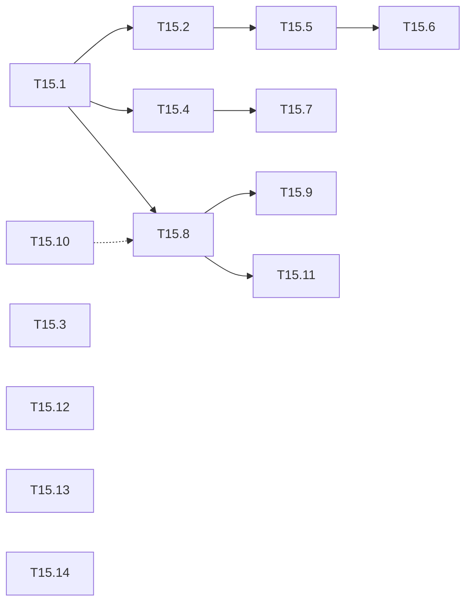

# M15 — Campagne d'entraînement (optionnel)

Objectif : passer des premiers balayages de M14 à des modèles affinés dont la mAP tient
sur le split complet, jeu par jeu. Le jalon liste les exécutions à lancer et les
améliorations d'outillage qu'elles demandent. VOC et VisDrone ont des résultats ; les
autres jeux ont une tâche prête, à remplir quand leurs runs auront tourné.

Constat de départ ([resultats-balayages.md](resultats-balayages.md), palier R,
50 images, 600 itérations par run, rév. `1a967f4`) :
- **VOC** : meilleur run `b32-sall` (lot 32, tout le split), mAP 36,27. Les poids COCO de
  départ font 68,45 sur les mêmes images : 600 itérations (1,16 époque) ne suffisent pas à
  réapprendre les têtes réinitialisées.
- **VisDrone** : meilleur run `b32-sall`, mAP 2,24 ; pertes de 186 à 252, aucun run n'a
  convergé ; seule `car` décolle (AP 17,4).
- **KITTI** : meilleur run `b32-sall`, mAP 2,38, en 416×416 `stretch` ; seule `Car`
  décolle (AP 16,8), loin des poids COCO hors domaine (20,55 sur 4 classes, car 49,7).
- Le classement repose sur 50 images : l'écart entre les deux meilleurs runs VOC
  (1,6 point) est dans le bruit.
- Seuls le lot et le sous-ensemble sont balayés ; LR (0,001), burn-in (500 sur 600
  itérations) et taille d'entrée sont fixes.
- **FLIR** (1 canal, rév. `4e47dbc`) : aucun run n'apprend, AP@[.5:.95] au plus 0,7 et
  AP50 au plus 2,9 (`b8-sall`, `b16-sall`) ; le classement des autres jeux ne s'y
  retrouve pas. Les poids COCO hors domaine font mieux sans affinage : AP 3,7, AP50 9,9
  (Tiny-YOLOv2 VOC : 2,3 et 8,3), sur 50 images (rév. `1723925`, `29a058a`).
- **ExDark** (rév. `35e949b`) : meilleur run `b32-sall`, mAP 13,29 (6,4 époques sur
  3 000 images) ; au-dessus de Tiny-YOLOv2 VOC hors domaine (11,84, 11 classes), sous les
  poids COCO (24,61, 12 classes).
- **CrowdHuman** (rév. `35e949b`) : meilleur run `b16-sall`, mAP 35,87, devant `b32-sall`
  (30,61, écart dans le bruit) ; le plus près des poids COCO (38,37 ; Tiny-YOLOv2 VOC
  26,29). Une seule classe, ancres k-means bien plus petites que celles de Darknet.
- Sur les six jeux, `b32-sall` fait en moyenne 91 % du meilleur run de chaque jeu, et
  tout le split bat 500 images dans 15 cas sur 18
  ([analyse_balayages](../../notebooks/analyse_balayages.ipynb)).

Coûts mesurés sur Colab : entraînement GPU ≈ 0,033 s/image (624 s pour 600 itérations
au lot 32, soit ≈ 1 s/itération) ; évaluation sur CPU ≈ 0,27 s/image, soit ≈ 22 min pour
VOC2007 test (4 952 images), ≈ 2,5 min pour VisDrone val (548 images) et ≈ 7 min pour
KITTI val (1 496 images).

**État** : 1 tâche faite sur 14 (T15.3) ; T15.1 et T15.2 prêtes à lancer sur Colab.

## Conventions communes

### Protocole par jeu

1. **Balayage** palier R (`_sweep`, lot × sous-ensemble, T14.10).
2. **Confirmation** du classement sur le split complet (`_infer`, `COMPARE = True`,
   `SUBSET = 0`).
3. **Run long** sur la meilleure configuration (`_train` ou `_sweep` à une case).
4. **Axe propre au jeu** : taille d'entrée (VisDrone, KITTI), canaux (FLIR), etc.
5. **Volet entier** (`INT8 = True`, T14.4) sur le run retenu.

### Règles

- Les résultats de chaque étape vont dans [resultats-balayages.md](resultats-balayages.md),
  une section par jeu, avec la révision et les paramètres.
- Une mAP sur `SUBSET` images classe les runs, elle ne se publie pas. Seule une mAP sur le
  split complet (palier N) peut aller dans `results/` (règles de
  [M12](M12-profils-pc.md#règles)).
- Un écart entre deux runs ne compte que s'il dépasse le bruit mesuré en T15.2.
- **Récolte** : sur Colab, chaque `tools/train.py` et `tools/eval_voc.py` lancé par un
  notebook écrit son `summary.json` et part sur le Drive dès sa fin (`colab.autosync`,
  [colab-vscode.md](colab-vscode.md#coupure-de-session)) ; en fin de session, rien n'est
  perdu au-delà de la commande en cours. Sur le PC, `make harvest` rapatrie journaux,
  résumés, tables et figures dans `build/notebooks/` (sans poids), puis
  `python -m tools.notebooks.balayages --runs` refait la synthèse ; ensuite seulement,
  reporter les chiffres ici et dans [resultats-balayages.md](resultats-balayages.md).
- Les notebooks restent versionnés sans sorties ([M14](M14-notebooks.md#règles)) ; un
  changement de paramètre par défaut passe par `tools/notebooks/gabarits.py` et
  `make notebooks`.

---

## A. Mesures fiables (VOC, VisDrone, KITTI)

### [ ] T15.1 — Classement sur le split complet
- **Spec** : §8 · **Dépend de** : T14.11 · **Taille** : S
- **Livrables** : table des 18 mAP (6 runs × 3 jeux) dans `resultats-balayages.md`
- **Acceptation** : chaque run de VOC, VisDrone et KITTI évalué sur tout le split ;
  meilleur run confirmé ou remplacé
- **Notes** : notebooks `_infer` de `tiny-yolov3-voc`, `tiny-yolov3-visdrone` et
  `tiny-yolov3-kitti` avec `COMPARE = True`, `SUBSET = 0`. Compter ≈ 2 h 15 pour VOC
  (6 × 22 min), ≈ 15 min pour VisDrone, ≈ 40 min pour KITTI.
- **Préparé** :
  - le run choisi (`RUN`) s'évalue dans `RUNS_DIR/eval/<run>/`, le cache de `COMPARE` et
    du `_sweep` : il n'est plus évalué deux fois ;
  - chaque évaluation va sur le Drive dès sa fin (`colab.autosync`) : après une coupure,
    relancer le notebook ne refait que les runs manquants ;
  - lecture : `make harvest` puis `python -m tools.notebooks.balayages` affiche la table
    « Split complet (T15.1) » (score 50 images et split complet, rangs, Spearman des deux
    classements) depuis `build/notebooks/<jeu>/<modèle>/eval/<run>/summary.json`, ou à
    défaut la table `éval. = tout` du notebook `_infer` versionné.
- **Procédure Colab** (notebooks archivés : les régénérer d'abord,
  `python -m tools.notebooks <jeu>/tiny-yolov3-<jeu>_infer --force`) :
  0. runtime **TPU** conseillé pour les `_infer` : le TPU ne sert pas (évaluation en
     NumPy), mais la VM a des dizaines de cœurs CPU ; `JOBS = None` (défaut) lance un
     processus `eval_voc.py --jobs` par cœur, plafonné par la mémoire (1,5 Go chacun, estimation large non mesurée).
     Mesure locale, 24 images : 168 → 86 ms/image de 1 à 3 processus, mAP identique ;
  1. `visdrone/tiny-yolov3-visdrone_infer`, puis `kitti/tiny-yolov3-kitti_infer` :
     `SUBSET = 0`, `COMPARE = True`, `INT8 = False`, `DRIVE_DIR` réglé ;
  2. `voc/tiny-yolov3-voc_infer`, mêmes réglages, **après** le balayage de T15.2 : une
     seule passe évalue les 6 runs de la grille et les 4 runs des graines
     (≈ 3 h 40 sur CPU, reprise automatique ; plusieurs sessions possibles).

### [ ] T15.2 — Bruit d'un run
- **Spec** : §7 · **Dépend de** : T15.1 · **Taille** : S
- **Livrables** : écart-type de la mAP sur 3 graines
- **Acceptation** : `b32-sall` et `b16-sall` de VOC relancés avec `--seed 1` et
  `--seed 2`, évalués sur le split complet ; écart-type rapporté
- **Notes** : ≈ 40 min de GPU pour les 4 runs. Le résultat sert de seuil de
  significativité pour toutes les comparaisons de M15.
- **Préparé** : paramètre `SEEDS` du `_sweep` (`[0]` par défaut) ; une graine non nulle
  passe `--seed` à `train.py` (têtes réinitialisées, tirage des lots, multiscale) et
  suffixe le run (`b32-sall-g1`), la graine 0 garde le nom court. `balayages.py` met ces
  runs à part (`seeds`, hors des statistiques de la grille) et affiche « Bruit d'un run
  (T15.2) » : moyenne ± écart-type (ddof = 1) par case, split complet et 50 images.
- **Procédure Colab** : `python -m tools.notebooks voc/tiny-yolov3-voc_sweep --force`,
  puis `voc/tiny-yolov3-voc_sweep` avec `BATCHES = [16, 32]`, `TRAIN_SUBSETS = [0]`,
  `SEEDS = [1, 2]`, `SUBSET = 50` (4 runs ≈ 40 min de GPU ; la comparaison à 50 images
  réévalue aussi les 6 runs existants, quelques minutes) ; ensuite l'étape 2 de T15.1.
  Le notebook réexécuté remplace l'archive : sa table liste les 10 runs.

### [x] T15.3 — Durée GPU dans le plan du balayage
- **Spec** : — · **Dépend de** : — · **Taille** : S
- **Livrables** : `S_PER_IMAGE["gpu"]` dans `tools/notebooks/matrice.py` (≈ 0,033 s)
- **Acceptation** : la table du plan de `_sweep` affiche une durée en GPU au lieu de
  « non mesurée » ; `python -m tools.notebooks --check` passe
- **Notes** : `estimate` lit déjà `loss.csv` quand un run existe ; la constante ne sert
  qu'avant le premier run.

## B. VOC

### [ ] T15.4 — Run long `tiny-yolov3-voc`
- **Spec** : §7.1 · **Dépend de** : T15.1 · **Taille** : M
- **Livrables** : run `long` dans `build/notebooks/voc/tiny-yolov3-voc/` ; courbe mAP /
  itérations
- **Acceptation** : mAP sur VOC2007 test complet comparée à la référence Tiny-YOLOv2
  (56,30, [map_float.md](../../results/map_float.md)) et aux poids COCO (T2.9)
- **Notes** :
  - lot 32, tout le split, 6 000 itérations (≈ 11,6 époques, ≈ 1 h 45 de GPU),
    `--burn-in 200`, `--steps 4800,5400 --scales 0.1,0.1`, `SAVE_EVERY = 500` ;
  - mAP palier R de chaque checkpoint pour la courbe, split complet sur le dernier ;
  - si la courbe monte encore à 6 000, prolonger par `--resume` vers 20 000 (exemple de
    `tools/train.py`).

### [ ] T15.5 — Axes LR et burn-in dans `_sweep`
- **Spec** : §7 · **Dépend de** : T15.2 · **Taille** : M
- **Livrables** : paramètres `LRS` et `BURN_INS` du gabarit `_sweep`
  (`tools/notebooks/gabarits.py`), nom de run étendu dans
  `tools/notebooks/runs.py:run_name` (ex. `b32-sall-lr2e-3-bi100`)
- **Acceptation** :
  - par défaut, `LRS = [LR]` et `BURN_INS = [BURN_IN]` : grille et noms de run actuels
    inchangés (test) ;
  - `--check` passe ;
  - balayage VOC LR {5e-4, 1e-3, 2e-3} × burn-in {100, 500} au lot 32, tout le split,
    600 itérations (6 runs, ≈ 1 h de GPU), comparé dans la table.
- **Notes** : à 600 itérations, le burn-in de 500 occupe presque tout l'entraînement ;
  c'est l'hypothèse principale derrière le mauvais score de `b8-sall`.

### [ ] T15.6 — Lot 64
- **Spec** : §7 · **Dépend de** : T15.5 · **Taille** : S
- **Livrables** : runs lot 64 (LR ×2) et lot 32 à nombre d'images vues égal
- **Acceptation** : mAP des deux runs sur le split complet ; mémoire GPU de pointe notée
- **Notes** : vérifier la mémoire du GPU Colab (T4 : 16 Go) en multi-échelle à 608.

### [ ] T15.7 — Volet entier du run retenu
- **Spec** : §9 · **Dépend de** : T15.4 · **Taille** : S
- **Livrables** : mAP flottante et INT8 du run retenu
- **Acceptation** : écart flottant → INT8 sur le split complet, comparé à celui de
  Tiny-YOLOv2 VOC ([map_int8.md](../../results/map_int8.md))
- **Notes** : `_infer` avec `INT8 = True` ; calibration sur 500 images du split `calib`.

## C. VisDrone

### [ ] T15.8 — Run long `tiny-yolov3-visdrone` à 416
- **Spec** : §7.1 · **Dépend de** : T15.1 · **Taille** : M
- **Livrables** : run `long` dans `build/notebooks/visdrone/tiny-yolov3-visdrone/`
- **Acceptation** : mAP sur visdrone val complet ; perte finale nettement sous 186
- **Notes** : même schéma que T15.4 (6 000 itérations ≈ 30 époques, ≈ 1 h 45 de GPU).
  Comparer l'AP de `car` à celle des poids COCO hors domaine (21,5 sur 50 images).

### [ ] T15.9 — Entrée 608 et 832
- **Spec** : §3, §10.2 · **Dépend de** : T15.8 · **Taille** : L
- **Livrables** : cfg et ancres à 608 et 832 ; runs longs ; AP par taille d'objet
- **Acceptation** : mAP et AP petits / moyens / grands objets (`--metric coco`) à 416, 608
  et 832 ; relie l'acceptation de [T11.5](M11-jeux-de-donnees.md)
- **Notes** :
  - `SIZE = '608'` ou `'832'` dans `_sweep` ou `_train` : la cellule de préparation refait
    ancres et cfg à cette taille ;
  - premier essai sans réentraînement : profil `tools/m11.sh visdrone-size` (mêmes
    poids, entrée plus grande) ;
  - coût par itération ×2,1 à 608, ×4 à 832.

### [ ] T15.10 — Régions ignorées de VisDrone
- **Spec** : §8.3 · **Dépend de** : — · **Taille** : M
- **Livrables** : régions ignorées (catégorie 0 des annotations) lues par le chargeur
  VisDrone et exclues de l'évaluation
- **Acceptation** : une détection dont le centre tombe dans une région ignorée n'est
  comptée ni vraie ni fausse (test) ; mAP avant / après sur le run retenu
- **Notes** : « Reste » de T11.5. Aujourd'hui, ces détections comptent comme fausses
  alarmes et sous-estiment la mAP.

### [ ] T15.11 — Une tête ou deux
- **Spec** : §3 · **Dépend de** : T15.8 · **Taille** : M
- **Livrables** : run long Tiny-YOLOv2 à 5 ancres (`NET=tiny-yolov2 tools/m11.sh
  visdrone-prep | visdrone-train`, init VOC hors tête)
- **Acceptation** : AP par taille d'objet de Tiny-YOLOv2 (13×13) face à Tiny-YOLOv3
  (13×13 et 26×26), même nombre d'itérations

## D. Autres jeux (en attente de résultats)

Chaque tâche suit le protocole commun. Sa table se remplit au fil des runs (mAP 50 images
au balayage, split complet ensuite).

### [ ] T15.12 — KITTI
- **Spec** : §5.2, §10.2 · **Dépend de** : T11.4 · **Taille** : L
- **Livrables** : runs longs en 416×416 et à 640×192 ; balayage à 640×192
  (`SIZE = '640x192'` dans `_sweep`)
- **Acceptation** : mAP sur KITTI val (1 496 images) aux deux entrées ; relie
  [T11.4](M11-jeux-de-donnees.md)
- **Notes** :
  - balayage 416×416 `stretch` fait (rév. `1a967f4`, détails dans
    [resultats-balayages.md](resultats-balayages.md#kitti)) : même meilleur run que VOC et
    VisDrone. Le notebook `_sweep` est à relancer en entier (« Run All », runs sautés par
    `SKIP_DONE`) pour être versionné avec ses sorties ;
  - en `stretch` 416×416, une image 1242×375 perd les deux tiers de sa hauteur relative ;
    en letterbox elle n'occupe que ≈ 30 % de l'entrée. À 640×192, elle occupe toute
    l'entrée.

  | run | lot | images | entrée | mAP (50 images) | mAP (complet) |
  |---|---|---|---|---|---|
  | b32-sall | 32 | tout | 416×416 | 2,38 | |
  | b16-sall | 16 | tout | 416×416 | 2,23 | |
  | b8-sall | 8 | tout | 416×416 | 2,18 | |
  | b32-s500 | 32 | 500 | 416×416 | 2,02 | |
  | b16-s500 | 16 | 500 | 416×416 | 0,50 | |
  | b8-s500 | 8 | 500 | 416×416 | 0,49 | |
  | à remplir (640×192) | | | 640×192 | | |

### [ ] T15.13 — FLIR
- **Spec** : §10.2 · **Dépend de** : T11.7 · **Taille** : L
- **Livrables** : FLIR sur le Drive (`kaggle-download flir` sur Colab, miroir Kaggle
  `samdazel/teledyne-flir-adas-thermal-dataset-v2`, puis `tools/get_datasets.sh push flir`) ;
  balayage ; runs
  longs à 1 et 3 canaux
- **Acceptation** : mAP (`--metric coco`, AP@[.5:.95] et AP50) à 1 canal face à
  3 canaux ; relie [T11.7](M11-jeux-de-donnees.md)
- **Notes** : `CHANNELS = 1` dans `_sweep` (cfg `tiny-yolov3-flir-c1.cfg`, L00 sommée sur
  les canaux RGB).

  | run | lot | images | canaux | AP (50 images) | AP50 (50 images) | AP (complet) |
  |---|---|---|---|---|---|---|
  | b8-sall | 8 | tout | 1 | 0,7 | 2,9 | |
  | b16-sall | 16 | tout | 1 | 0,7 | 2,6 | |
  | b16-s500 | 16 | 500 | 1 | 0,6 | 1,5 | |
  | b32-sall | 32 | tout | 1 | 0,4 | 1,7 | |
  | b32-s500 | 32 | 500 | 1 | 0,3 | 1,4 | |
  | b8-s500 | 8 | 500 | 1 | 0,3 | 1,3 | |
  | à remplir (3 canaux) | | | 3 | | | |

  Poids publiés hors domaine, sur les mêmes 50 images (classes communes seulement,
  `MAPPINGS`) :

  | modèle | classes évaluées | AP (50 images) | AP50 (50 images) | AP (complet) |
  |---|---|---|---|---|
  | `tiny-yolov3-coco` | 11 | 3,7 | 9,9 | |
  | `tiny-yolov2-voc` | 7 | 2,3 | 8,3 | |
  | `tiny-yolov3-flir` `b32-sall` | 15 | 0,4 | 1,7 | |

  Balayage à un canal fait (rév. `4e47dbc`) ; inférences faites (rév. `1723925` pour les
  poids publiés, `29a058a` pour le run affiné). Sur un runtime Colab neuf, la cfg à un canal
  est reconstruite depuis la table d'ancres du run (`env.restore_cfg`) : l'inférence
  retrouve la mesure du balayage. Le run affiné reste sous les poids publiés ; seule sa
  classe person (AP50 8,1) atteint COCO (7,6). Détail :
  [resultats-balayages.md](resultats-balayages.md#flir). Restent la comparaison à
  3 canaux, l'inférence des runs `b8-sall` et `b16-sall` (`COMPARE = True`) et les runs
  longs.

### [ ] T15.14 — ExDark et CrowdHuman
- **Spec** : §8 · **Dépend de** : T11.3, T11.6 · **Taille** : M
- **Livrables** : mAP hors domaine sur le split complet (poids Tiny-YOLOv2 VOC et
  Tiny-YOLOv3 COCO)
- **Acceptation** :
  - ExDark : écart à la mAP VOC par classe commune ; décision d'affinage
    ([T11.3](M11-jeux-de-donnees.md)) ;
  - CrowdHuman : AP et rappel de `person`, débordements de la NMS
    ([T11.6](M11-jeux-de-donnees.md), profil `tools/m11.sh crowdhuman`).
- **Notes** : affinage possible par `notebooks/<jeu>/tiny-yolov3-<jeu>_train.ipynb` et
  `_sweep.ipynb` (ExDark et CrowdHuman dans `TRAINABLE`, `tools/notebooks/matrice.py`) ;
  poids affinés évalués par `tiny-yolov3-<jeu>_infer.ipynb`.

  | jeu | modèle | classes évaluées | mAP (50 images) | mAP (complet) |
  |---|---|---|---|---|
  | ExDark | `tiny-yolov3-coco` | 12 | 24,61 | |
  | ExDark | `tiny-yolov2-voc` | 11 | 11,84 | |
  | ExDark | `tiny-yolov3-exdark` `b32-sall` | 12 | 13,29 | |
  | CrowdHuman | `tiny-yolov3-coco` | 1 | 38,37 | |
  | CrowdHuman | `tiny-yolov2-voc` | 1 | 26,29 | |
  | CrowdHuman | `tiny-yolov3-crowdhuman` `b32-sall` | 1 | 30,61 | |
  | CrowdHuman | `tiny-yolov3-crowdhuman` `b16-sall` | 1 | 35,87 (balayage) | |

  Balayages et inférences faits sur 50 images (rév. `35e949b`, détail :
  [resultats-balayages.md](resultats-balayages.md#exdark)) ; ExDark : affinage
  utile face à VOC, pas face à COCO. Restent le split complet, l'inférence de
  `b16-sall` (`COMPARE = True`) et, pour CrowdHuman, le rappel de
  `person` et les débordements de la NMS.

## Hors périmètre

- Entraînement sur COCO train2017 (trop grand, voir [M14](M14-notebooks.md)).
- Nouvelles architectures (troisième tête, autre backbone) : M9.
- QAT et ADMM : T14.7 et [M9.2](M9.2-req-yolo.md), [M9.3](M9.3-quant-4bits.md).

## Ordre conseillé

T15.3 et T15.10 sont indépendants et courts. Ensuite, confirmer le classement et le bruit
avant de lancer des heures de GPU.

