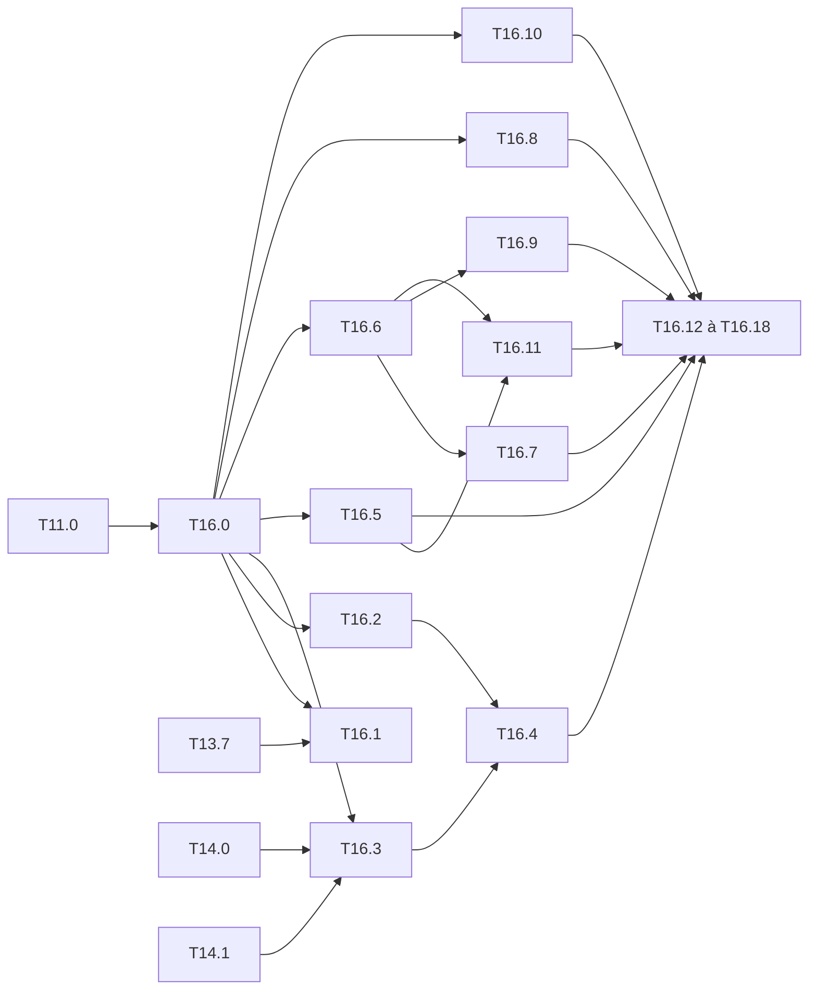

# M16 — Notebooks de présentation des jeux de données (optionnel)

Objectif : un notebook Jupyter par jeu de données qui le **présente** (origine, licence,
capteur, splits, classes) et en donne l'**analyse statistique** (comptes, classes,
géométrie des boîtes, densité, images, ancres, qualité des annotations), lue du point de
vue de Tiny-YOLO et de la cible embarquée (entrée 416, grilles 13×13 et 26×26, 256
emplacements de `yolo_post`, INT8).

Constat de départ :
- seul VOC a des statistiques : `tools/voc_stats.py` (comptes face aux chiffres du devkit,
  T0.6) et la figure `voc_stats.png` de [T13.7](M13-figures.md#x-t137--statistiques-du-jeu-voc) ;
- les six autres jeux de `DATASETS` (`python/yolo/data/datasets.py`) n'ont que leur
  chargeur ; leurs effectifs viennent des pages des jeux, **à vérifier**
  ([M11, Synthèse](M11-jeux-de-donnees.md#synthèse)), et `SPLIT_IMAGES` de
  `tools/notebooks/matrice.py` vaut encore `None` pour ExDark et FLIR ;
- les premiers balayages de [M15](M15-campagne-entrainement.md) donnent des mAP qu'on ne
  sait pas encore lire : sur VisDrone et KITTI, seule la classe voiture décolle. Il manque
  la part des petits objets après redimensionnement, le déséquilibre des classes et le
  nombre de cibles perdues par collision dans la grille ;
- `tools/kmeans_anchors.py` calcule les ancres d'un jeu, mais rien ne les compare à celles
  du cfg sur le jeu lui-même.

Comme en [M14](M14-notebooks.md), un notebook n'apporte **aucun calcul propre** : les
statistiques sont calculées par un outil du dépôt (`tools/data_stats.py`) et tracées par
un générateur de figures (`tools/figures/donnees.py`). Le notebook les enchaîne, les
affiche et les commente. Tout résultat du notebook se reproduit en ligne de commande.

**État** : 17 tâches faites sur 19. Outil, figures, fiches, gabarit et analyses en place ;
notebooks VOC, VisDrone, FLIR, ExDark et CrowdHuman exécutés et versionnés avec leurs
sorties, synthèse dans [stats-jeux.md](stats-jeux.md). Restent T16.13 (COCO : `data/coco`
absent du PC) et T16.14 (KITTI : images `training/` absentes, archive
`data_object_image_2.zip` incomplète) ; leurs notebooks sont générés et passeront tels quels
une fois les données là.

## Conventions communes

### Outillage

- **Calcul** : `tools/data_stats.py`, en NumPy pur, sur la liste d'échantillons des
  chargeurs (`DATASETS[jeu].load`). Il ne lit les pixels que pour les statistiques
  d'images (T16.8), sur un échantillon (`--sample`).
  ```
  python tools/data_stats.py --dataset kitti --split train,val --size 416 \
      --out build/notebooks/kitti/stats [--sample 500] [--markdown]
  ```
  Sorties : `stats.json` (toutes les grandeurs, une clé par analyse), `stats.md` (tables
  de la synthèse), `figures/` (si `--figures`).
- **Figures** : `tools/figures/donnees.py`, une fonction par panneau, appelée depuis
  `stats.json`. `plot_voc_stats` de `tools/figures/modeles.py` (T13.7) devient le cas VOC
  de ce module : `make figures` produit toujours `voc_stats.png`.
- **Notebooks** : rôle `stats` ajouté au registre de `tools/notebooks/matrice.py` et
  gabarit `stats_body` dans `tools/notebooks/gabarits.py`. Un notebook par jeu de
  `DATASETS`, sans modèle : `notebooks/<jeu>/<jeu>_stats.ipynb`. Ajouter un jeu à
  `DATASETS` ajoute son notebook sans toucher au générateur.
- **Fiche** : `FICHES` dans `tools/data_stats.py`, la seule partie écrite à la main (source,
  version, licence, capteur, effectifs officiels par split), comme `OFFICIAL` de
  `tools/voc_stats.py`.

### Sorties

- **Notebooks** : `notebooks/<jeu>/<jeu>_stats.ipynb`, listés dans `notebooks/README.md`
  (palier, données requises, badge Colab).
- **Résultats d'exécution** : `build/notebooks/<jeu>/stats/` (`stats.json`, `stats.md`,
  `figures/`, galerie). Rien dans `results/`.
- **Synthèse** : [stats-jeux.md](stats-jeux.md), une section par jeu (révision, splits,
  table de synthèse), et une table comparative des sept jeux. Ce document se remplit
  depuis `stats.md` ; il sert de référence aux tâches de M11 et M15.

### Règles

- Les règles de [M14](M14-notebooks.md#règles) s'appliquent : notebooks versionnés sans
  sorties ou exécutés en entier sans erreur, `--check`, commande CLI équivalente affichée
  à chaque étape.
- **Structure fixe** de chaque notebook, dans cet ordre :
  1. titre, fiche du jeu (T16.2), liens vers la tâche M11 et les notebooks du jeu ;
  2. **cellule de paramètres** (tag `parameters`) : `DATASET`, `SPLITS` (défaut : `train`
     et `test` du `Dataset`), `SIZE` (défaut : entrée du cfg du jeu, 416 sinon),
     `RESIZE` (`letterbox` ou `stretch`), `SAMPLE` (images lues pour les pixels, défaut
     200), `GALLERY` (images de la galerie, défaut 8), `SEED` ;
  3. **cellule d'environnement** de T14.1, sans poids ni cfg à vérifier ;
  4. corps du gabarit `stats` (sections B) ;
  5. résumé : table de synthèse, chemins des sorties, commande CLI équivalente.
- **Statistiques exactes ou échantillonnées, toujours dit** : tout ce qui vient des
  annotations porte sur le split entier ; ce qui demande les pixels porte sur `SAMPLE`
  images tirées avec `SEED`, et le titre de la table ou de la figure le dit.
- **Taille d'entrée explicite** : les grandeurs « vues par le réseau » (taille des boîtes
  en pixels d'entrée, cellules, collisions) sont calculées après `letterbox` ou `stretch`
  à `SIZE`, par `yolo.data.letterbox`, jamais par une réécriture.
- **Palier** : annotations seules → palier R ou M selon le nombre d'images (lecture des
  en-têtes d'image pour KITTI, VisDrone, CrowdHuman et ExDark) ; pixels → palier selon
  `SAMPLE`. Le notebook affiche le palier avant de lancer.
- **Acceptation commune** :
  - le notebook est produit par `make notebooks` et listé dans `notebooks/README.md` ;
  - `--check` passe ;
  - la fumée de T14.9 l'exécute avec `SAMPLE = 8` et `GALLERY = 2` ;
  - les totaux d'images et d'objets égalent ceux de la fiche, ou l'écart est expliqué
    dans la fiche (boîtes retirées par `make_sample`, régions `DontCare`, etc.).

### Questions par jeu

Chaque notebook répond aux analyses communes, plus une question propre au jeu, qui
renvoie à l'axe de M11 ou M15.

| Jeu | Question propre | Renvoi |
|---|---|---|
| voc | les classes à faible AP (bottle, pottedplant) sont-elles rares ou petites ? | T13.7, T13.13 |
| coco | quelle part des objets est petite (< 32²) une fois réduite à 416 ? | T11.1 |
| kitti | `letterbox` ou `stretch` : combien d'objets passent sous 8 px de haut ? | T11.4, T15 |
| visdrone | part des objets plus petits qu'une cellule 26×26 ; collisions de cibles | T11.5, T15 |
| flir | distribution des niveaux thermiques, et ce qu'en garde l'INT8 de L00 | T11.7 |
| exdark | luminosité par type d'éclairage, et écart aux images de calibration VOC | T11.3 |
| crowdhuman | objets par image face aux 256 emplacements ; part d'objets occultés | T11.6 |

---

## A. Infrastructure

### [x] T16.0 — Outil `tools/data_stats.py`
- **Spec** : — · **Dépend de** : T11.0 · **Taille** : M
- **Livrables** : `tools/data_stats.py` (fonctions pures + `main()`) ;
  `python/tests/test_data_stats.py`.
- **Comportement attendu** :
  - une fonction par analyse de la section B, qui prend la liste d'échantillons et rend un
    dict sérialisable ; `main()` les appelle toutes et écrit `stats.json` et `stats.md` ;
  - `--split` accepte plusieurs splits séparés par des virgules ; chaque analyse est
    donnée par split, et pour l'ensemble ;
  - la lecture des pixels (T16.8) est la seule à ouvrir les images, et seulement si
    `--sample` est non nul.
- **Acceptation** :
  - tests sur des échantillons synthétiques (comptes, aires, collisions connues) ;
  - sur VOC, les comptes égalent `OFFICIAL` de `tools/voc_stats.py`, que l'outil
    remplace (`voc_stats.py` reste comme raccourci et appelle `data_stats`).
- **Notes** : pas de pandas ; le paquet `yolo` reste en NumPy pur
  ([ADR 0001](../adr/0001-numpy-pur.md)) et l'outil vit dans `tools/`.

### [x] T16.1 — Figures `tools/figures/donnees.py`
- **Spec** : — · **Dépend de** : T16.0, T13.7 · **Taille** : M
- **Livrables** : `tools/figures/donnees.py` ; option `--figures` de `data_stats.py`.
- **Acceptation** :
  - chaque panneau de la section B se trace depuis `stats.json`, sans relire le jeu ;
  - `voc_stats.png` (T13.7) est produite par ce module et garde ses trois panneaux et ses
    totaux ;
  - style commun de `tools/figures/style.py`.

### [x] T16.2 — Fiche de chaque jeu
- **Spec** : — · **Dépend de** : T16.0 · **Taille** : S
- **Livrables** : `FICHES` dans `tools/data_stats.py`, une entrée par jeu de `DATASETS`.
- **Contenu** : source (URL), version, licence, capteur et conditions de prise de vue,
  résolution typique, splits utilisés par le dépôt (`test`, `calib`, `train`), effectifs
  officiels (images, objets) par split, particularités du chargeur (classes retirées,
  objets en `difficult`, découpage maison de KITTI).
- **Acceptation** :
  - un test vérifie que chaque jeu de `DATASETS` a une fiche, et que ses classes sont
    celles du `Dataset` ;
  - `SPLIT_IMAGES` de `matrice.py` est rempli pour tous les jeux (ExDark et FLIR compris),
    depuis les comptes mesurés, et le tableau Synthèse de M11 est corrigé si besoin.

### [x] T16.3 — Rôle `stats` dans le registre et gabarit
- **Spec** : — · **Dépend de** : T14.0, T14.1, T16.0 · **Taille** : M
- **Livrables** : rôle `stats` dans `tools/notebooks/matrice.py` ; `stats_body` dans
  `tools/notebooks/gabarits.py` ; 7 notebooks `notebooks/<jeu>/<jeu>_stats.ipynb`.
- **Acceptation** :
  - un test vérifie que chaque jeu de `DATASETS` a exactement un notebook `stats` ;
  - l'index range ces notebooks en tête de chaque jeu ;
  - les commandes affichées sont celles de `data_stats.py`, option par option.
- **Notes** : pas de poids ni de cfg dans les prérequis ; sur Colab, les données passent
  par `colab.prepare_data` comme en M14.

## B. Analyses (sections du gabarit)

### [x] T16.4 — Présentation et galerie
- **Spec** : — · **Dépend de** : T16.2, T16.3 · **Taille** : S
- **Contenu** :
  - la fiche (T16.2) en tableau, puis la liste des classes avec leurs correspondances VOC
    et COCO (`MAPPINGS`) ;
  - galerie : `GALLERY` images tirées avec `SEED` par split, boîtes dessinées par
    `tools/detect.py:draw` ;
  - une image par classe, au moins une boîte de la classe.
- **Acceptation** : à `SEED` fixé, la galerie ne change pas d'une exécution à l'autre.

### [x] T16.5 — Comptes et classes
- **Spec** : §8.3 · **Dépend de** : T16.0 · **Taille** : S
- **Contenu** :
  - images, objets, objets `difficult` ou `crowd`, images sans objet, par split ;
  - objets par classe et images contenant la classe, par split ; rapport entre classe la
    plus et la moins fréquente ;
  - matrice de co-occurrence des classes (images où deux classes apparaissent ensemble).
- **Acceptation** : totaux égaux à la fiche (voir Acceptation commune).

### [x] T16.6 — Géométrie des boîtes et taille d'entrée
- **Spec** : §5.1, §8.3 · **Dépend de** : T16.0 · **Taille** : M
- **Contenu** :
  - largeur, hauteur, aire relative et rapport d'aspect des boîtes, en pixels d'origine et
    en pixels d'entrée à `SIZE` ;
  - catégories COCO (petit < 32², moyen < 96², grand) avant et après redimensionnement ;
  - part des objets plus petits qu'une cellule de chaque tête (32 px pour 13×13, 16 px
    pour 26×26) ;
  - carte de chaleur des centres de boîtes (position dans l'image) ;
  - comparaison `letterbox` / `stretch` pour les jeux à image non carrée.
- **Acceptation** : un test vérifie le passage aux pixels d'entrée contre
  `yolo.data.letterbox.boxes_to_letterbox`.

### [x] T16.7 — Densité et collisions de cibles
- **Spec** : §5.1, §10.3 · **Dépend de** : T16.6 · **Taille** : M
- **Contenu** :
  - objets par image (histogramme, médiane, maximum) ;
  - **collisions** : objets qui tombent sur la même cellule et la même ancre d'une tête,
    donc dont un seul reçoit une cible ; comptés par `yolo.data.targets.build_targets`
    avec les ancres du cfg du jeu ;
  - images au-delà des 256 emplacements de `yolo_post` (et de 1 024, comme en T11.6).
- **Acceptation** : le nombre de cibles perdues égale, sur un lot, l'écart entre objets et
  cibles positives de `build_targets`.

### [x] T16.8 — Images : résolution, canaux, intensité
- **Spec** : §9 · **Dépend de** : T16.0 · **Taille** : S · **Palier** : selon `SAMPLE`
- **Contenu** :
  - résolutions et rapports d'aspect (depuis les en-têtes, split entier) ;
  - sur `SAMPLE` images : nombre de canaux, moyenne et écart type par canal,
    histogramme d'intensité, luminance moyenne par image ;
  - comparaison à VOC (même calcul sur `SAMPLE` images de VOC2007 test), qui a servi aux
    échelles INT8 de M4.
- **Notes** : pour FLIR, les images 8 bits du jeu ; une analyse 16 bits sort du
  périmètre.

### [x] T16.9 — Ancres du jeu
- **Spec** : §5.2 · **Dépend de** : T16.6 · **Taille** : S
- **Contenu** :
  - nuage (largeur, hauteur) des boîtes en pixels d'entrée, avec les ancres du cfg et
    celles de `tools/kmeans_anchors.py --dataset` ;
  - IoU moyenne de meilleure ancre (`yolo.data.anchors.mean_best_iou`) pour les ancres
    VOC, COCO et du jeu ;
  - courbe IoU moyenne selon k (comme `ancres_k` de T13).
- **Acceptation** : les ancres affichées sont celles qu'écrit `kmeans_anchors.py` aux
  mêmes `--size` et `--seed`.

### [x] T16.10 — Qualité des annotations
- **Spec** : — · **Dépend de** : T16.0 · **Taille** : S
- **Contenu** :
  - boîtes retirées ou rognées par `make_sample` (hors image, vides) ;
  - boîtes dégénérées (côté < 2 px), doublons (IoU > 0,95, même classe) ;
  - régions retirées par le chargeur (`DontCare` de KITTI, régions ignorées et `others`
    de VisDrone), comptées depuis les fichiers bruts ;
  - liste des 10 images les plus suspectes, affichées dans le notebook.
- **Notes** : l'analyse signale, elle ne corrige pas ; une correction de chargeur passe
  par une tâche de M11.

### [x] T16.11 — Écart entre splits et couverture hors domaine
- **Spec** : §8.3 · **Dépend de** : T16.5, T16.6 · **Taille** : S
- **Contenu** :
  - distributions train et test superposées (classes, tailles, densité), avec une
    distance simple par grandeur (écart des parts par classe, distance entre
    histogrammes) ;
  - couverture de `MAPPINGS` : part des objets du jeu qui ont une classe VOC ou COCO,
    c'est-à-dire ce qu'évaluent les notebooks hors domaine de T14.5.
- **Acceptation** : la couverture donnée égale le nombre d'objets évalués par
  `eval_voc.py` hors domaine sur le même split.

## C. Exécution par jeu

Chaque tâche lance le notebook du jeu sur les splits complets (`SAMPLE` par défaut),
remplit sa section de [stats-jeux.md](stats-jeux.md), et répond à la question propre au
jeu ([Questions par jeu](#questions-par-jeu)).

### [x] T16.12 — VOC
- **Dépend de** : T16.4 à T16.11 · **Taille** : S
- **Acceptation** : comptes de VOC2007 test, VOC2007 trainval et VOC2012 trainval égaux
  aux chiffres du devkit (`OFFICIAL`) ; AP par classe de T13.13 mise en regard du nombre
  et de la taille des objets.

### [ ] T16.13 — COCO val2017
- **Dépend de** : T16.4 à T16.11 · **Taille** : S
- **Acceptation** : 5 000 images, 36 781 objets (dont `iscrowd`) ; parts petit, moyen,
  grand avant et après réduction à 416.
- **Notes** : train2017 se limite aux annotations (pas de lecture de pixels) ; le split
  `calib2017` de `tools/coco_subset.py` est comparé à val2017.
- **Reste** : `data/coco` absent du PC ; lancer `tools/get_datasets.sh coco` puis le
  notebook `notebooks/coco/coco_stats.ipynb`.

### [ ] T16.14 — KITTI
- **Dépend de** : T16.4 à T16.11 · **Taille** : S
- **Acceptation** : comptes du découpage `kitti_ids` (5 985 train, 1 496 val) ; tailles
  d'objets en `letterbox` et `stretch` à 416, et à l'entrée non carrée de T11.4.
- **Reste** : seules les images `testing/` sont sur le PC (`data/kitti dataset/`), et
  `data/kitti/data_object_image_2.zip.part` est incomplet ; finir le téléchargement de
  `training/image_2`, puis lancer `notebooks/kitti/kitti_stats.ipynb` (la question propre
  refait la géométrie à 640x192).

### [x] T16.15 — VisDrone
- **Dépend de** : T16.4 à T16.11 · **Taille** : S
- **Acceptation** : 6 471 + 548 images ; part des objets sous 16 px à 416 et cibles
  perdues par collision, mises en regard des mAP par classe de M15.

### [x] T16.16 — FLIR
- **Dépend de** : T16.4 à T16.11 · **Taille** : S
- **Acceptation** : effectifs mesurés de la version v2 (le dépôt n'en a pas encore) ;
  histogramme thermique sur un canal, face à l'échelle d'entrée INT8 de L00.

### [x] T16.17 — ExDark
- **Dépend de** : T16.4 à T16.11 · **Taille** : S
- **Acceptation** : effectifs par split du découpage officiel ; luminance moyenne par
  type d'éclairage (colonne de `imageclasslist.txt`), face à VOC.
- **Notes** : le type d'éclairage n'est pas lu par le chargeur ; `data_stats.py` le lit
  dans `imageclasslist.txt` sans changer `load_exdark`.

### [x] T16.18 — CrowdHuman
- **Dépend de** : T16.4 à T16.11 · **Taille** : S
- **Acceptation** : 15 000 + 4 370 images ; part des images au-delà de 256 et de 1 024
  objets ; part des boîtes en `difficult` (`ignore`, `mask`).

---

## Hors périmètre

- Nettoyage ou réannotation des jeux.
- Statistiques sur les détections d'un modèle (elles relèvent de `eval_voc.py` et de M14).
- Analyse des images thermiques 16 bits de FLIR, et des images RGB appariées.
- Toute dépendance à pandas, seaborn ou une bibliothèque d'analyse de jeux.

## Ordre conseillé

T16.0 → T16.2 et T16.1 → T16.3 → sections B dans l'ordre, chacune vérifiée sur VOC ;
puis T16.12 (VOC, où tout est vérifiable contre le devkit), T16.15 et T16.14 (jeux
balayés en M15), et les autres jeux à mesure qu'ils sont sur le Drive.


