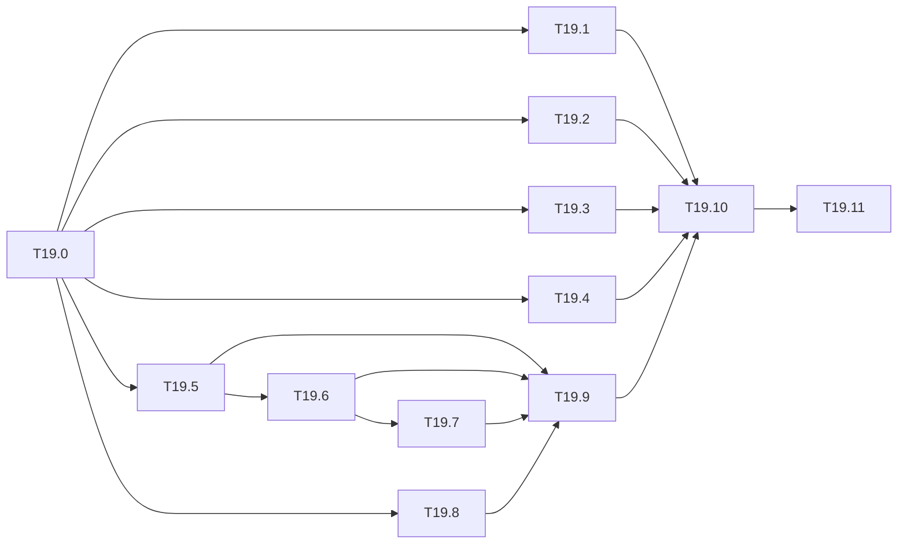

# M19 — Switch the project to English (optional)

Goal: make English the project's only language. The existing French material is
translated in stages: specification, docs, hand-written results, text produced by the
generators (notebooks, statistics, reports, figures), then code comments and messages.
The project must keep working at every stage: `make ci`, `--check` of the notebooks and
the figures stay green throughout.

**Rule from 2026-10-07 on**: everything **new** is written in English. That covers
documents, milestones, tasks, commit messages, notebook text added to the templates, and
new generated text. Existing French text stays as it is until its M19 task translates it.
Small edits inside a French document (a table cell, a checkbox) may stay in French to
match their surroundings. The first English documents are this milestone and the commit
messages from M18 on.

**State**: 0 of 12 tasks done. The rule above is in force; the translation itself has not
started.

## Inventory (measured on 2026-10-07)

| Area | Where | Size | Produced by |
|---|---|---|---|
| Specification | `yolo-embarque-de-zero.md` | ≈ 7 200 words | hand |
| Top-level docs | `README.md`, `docs/architecture.md`, `docs/conventions.md`, `docs/adr/*.md` (3) | ≈ 3 000 words | hand |
| Milestones and guides | `docs/tasks/*.md` (30, M0 to M19, plus Drive, Colab and sweep guides) | ≈ 50 000 words | hand, except the blocks filled by `data_stats --report` and `balayages` |
| Results | `results/*.md` (18) | — | mix: some hand-written (`protocole.md`, `rapport.md`), most written by tools |
| Notebook text | `tools/notebooks/gabarits.py` (templates, `QUESTIONS`, `FAMILY_INTROS`), `notebooks/README.md` | 62 notebooks + 2 analysis notebooks | `python -m tools.notebooks` |
| Generated markdown | `tools/data_stats.py` (`md_*`, `FICHES`), `tools/eval_voc.py`, `tools/m12_report.py`, `tools/notebooks/balayages.py` | — | tools |
| Figure labels | `tools/figures/*.py` (titles, axes, legends, `results/figures.md`) | 68 PNG files in `results/figures/` | `make figures` |
| Code text | docstrings, comments, CLI help and messages, in ≈ 160 of the 233 source files (`python/`, `tools/`, `sw/`, `hls/`, `cpp/`) | — | hand |
| Tests | 5 test files assert French strings | — | hand |

Number format: generated tables use the French convention, with a decimal comma and a
space as the thousands separator (`_f` of `tools/data_stats.py`, and in a similar way
`count_macs.py`, `tools/figures/resultats.py`, `tools/figures/balayages.py` and
`tools/notebooks/balayages.py`). English output uses a decimal point and a comma as the
thousands separator (56.30, 132,031).

## Conventions

- **Scope of the change**: prose, generated text, labels, docstrings, comments and
  messages. **Identifiers, file names and paths are kept** (`gabarits.py`,
  `M11-jeux-de-donnees.md`, `palier_of`, `FICHES`…). Renaming them would break imports,
  links, archived notebooks (`notebooks/archives.json`) and Drive paths for little gain.
  An optional final task (T19.11) lists the renames worth doing.
- **Glossary**: one English term for each project term, used everywhere. It is recorded
  in T19.0 and starts as:

  | French | English |
  |---|---|
  | jeu (de données) | dataset |
  | palier (R / M / N) | tier |
  | balayage | sweep |
  | affinage | fine-tuning |
  | gabarit | template |
  | fiche | datasheet |
  | témoin | marker file |
  | run retenu | selected run |
  | sous-ensemble | subset |
  | calibration | calibration |
  | entier / flottant | integer / float |
  | golden | golden model |
  | jalon / tâche | milestone / task |
  | hors domaine | out-of-domain |
  | cibles perdues (collisions) | lost targets |
  | recadrage | crop |

- **Numbers and dates**: decimal point, ISO dates (2026-10-07), units with a space
  (416 px, 0.45 s).
- **Measured values are not touched**: the translation never changes a number. A
  regenerated table must keep the same numbers, with only their formatting changed.
- **One area per commit**, so that a regression is easy to bisect.

---

## A. Rules and hand-written documents

### [ ] T19.0 — Rules and glossary
- **Depends on**: — · **Size**: S
- **Deliverables**: this document's conventions moved into `docs/conventions.md`
  (a "Language" section) once that file is translated; the glossary kept here.
- **Acceptance**: every later task follows the glossary; new docs since 2026-10-07 are in
  English.

### [ ] T19.1 — Specification
- **Depends on**: T19.0 · **Size**: M
- **Deliverables**: `yolo-embarque-de-zero.md` in English, keeping its section numbers
  (§4.1, §10.5…), which the tasks cite.
- **Acceptance**: every `§` reference in `docs/tasks/` still points to the right section.

### [ ] T19.2 — README, architecture, conventions, ADRs
- **Depends on**: T19.0 · **Size**: S
- **Deliverables**: `README.md`, `docs/architecture.md`, `docs/conventions.md`,
  `docs/adr/*.md`.
- **Acceptance**: all relative links still resolve (link check of T19.10).

### [ ] T19.3 — Milestones and guides
- **Depends on**: T19.0 · **Size**: L
- **Deliverables**: `docs/tasks/*.md`, one milestone per commit, the oldest (M0) first;
  `donnees-drive.md`, `colab-vscode.md`, `resultats-balayages.md`.
- **Acceptance**: same headings and anchors where other documents link to them (anchors
  change with the heading text, so links are updated in the same commit).
- **Notes**: the blocks filled by tools (`stats-jeux.md` from `data_stats --report`, the
  sweep tables) are translated through their generator (T19.6), not by hand.

### [ ] T19.4 — Hand-written results
- **Depends on**: T19.0 · **Size**: S
- **Deliverables**: the hand-written files of `results/` (protocol, report, comments
  around generated tables).
- **Acceptance**: no number changes (diff limited to text).

## B. Generators

### [ ] T19.5 — Notebook templates
- **Depends on**: T19.0 · **Size**: M
- **Deliverables**: `tools/notebooks/gabarits.py`, `matrice.py` (`how_to_get`, the README
  headers), `env.py` and `colab.py` messages; regenerated notebooks and
  `notebooks/README.md`.
- **Acceptance**: `python -m tools.notebooks all --check` passes; notebooks executed and
  versioned with outputs are frozen first with `--archive`, then re-executed (stats,
  `analyse_balayages`) or kept archived until their next run.
- **Notes**: changing a template drops the outputs of the notebooks it generates, so this
  is the most expensive task: plan the re-executions (Colab for the sweeps).

### [ ] T19.6 — Generated markdown and number format
- **Depends on**: T19.5 · **Size**: M
- **Deliverables**: `md_*` and `FICHES` of `tools/data_stats.py`, `eval_voc.py`,
  `eval_quant.py`, `m12_report.py`, `tools/notebooks/balayages.py`; a single number
  formatter (decimal point) replacing the French ones listed in the inventory;
  regenerated `stats-jeux.md`, sweep tables and `results/*.md` written by tools.
- **Acceptance**: each regenerated table has the same values as before; only the
  separators and the words change.

### [ ] T19.7 — Figure labels
- **Depends on**: T19.6 · **Size**: M
- **Deliverables**: titles, axes and legends of `tools/figures/*.py`;
  `results/figures.md`; regenerated figures (`make figures`).
- **Acceptance**: `make figures` passes; a visual spot check of one figure per family.

## C. Code and checks

### [ ] T19.8 — Docstrings, comments and messages
- **Depends on**: T19.0 · **Size**: L
- **Deliverables**: Python (`python/yolo/`, `tools/`), C++ (`sw/`, `cpp/`), HLS
  (`hls/`), shell scripts (`tools/*.sh`), the `Makefile` comments; one package per
  commit.
- **Acceptance**: `make ci` passes after each commit; no behaviour changes (tests
  unchanged except T19.9).

### [ ] T19.9 — Tests
- **Depends on**: T19.5 to T19.8 · **Size**: S
- **Deliverables**: the tests that assert French strings follow the new text; test
  docstrings translated.
- **Acceptance**: `make test` passes.

### [ ] T19.10 — Language check in CI
- **Depends on**: T19.1 to T19.9 · **Size**: S
- **Deliverables**: a small check (for example `tools/check_language.py`) that flags
  French in docs, generated output and code text (accented words, a short list of
  frequent French words), with an allow list (names, quotes, the glossary); a relative
  link check for `docs/`; both added to `make ci`.
- **Acceptance**: `make ci` passes on the translated tree and fails on a French sentence
  added to a doc.

### [ ] T19.11 — Renames (optional)
- **Depends on**: T19.10 · **Size**: M
- **Deliverables**: a list of French identifiers and file names worth renaming
  (`gabarits.py` → `templates.py`, `M11-jeux-de-donnees.md` → `M11-datasets.md`…), with
  their cost (imports, links, archived notebooks, Drive paths); renames done only where
  the gain is clear.

## Out of scope

- Commit history: past commit messages stay in French.
- Dataset class names and the names of upstream files (`ExDark_Annno`, `DontCare`…).
- A bilingual version: the French text is replaced, not kept beside the English.

## Recommended order

T19.0 → T19.1 and T19.2 → T19.3 (one milestone at a time, alongside other work) → T19.4.
The generators come next (T19.5 → T19.6 → T19.7) and should be grouped, because each
regeneration costs notebook re-executions. Then T19.8 → T19.9 → T19.10, and T19.11 last.

