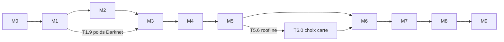

# Plan de travail

Le projet suit les six étapes de la feuille de route du §10.5 de la
[spécification](../../yolo-embarque-de-zero.md), découpées en jalons.

| Jalon | Objet | Sortie vérifiable |
|---|---|---|
| [M0](M0-infrastructure.md) | Infrastructure | `make test` passe, comptage des MACs conforme au §3 |
| [M1](M1-briques-numpy.md) | Briques NumPy (§4) | Tiny-YOLOv2/v3 en passes avant et arrière, gradcheck vert |
| [M2](M2-cibles-perte-entrainement.md) | Cibles, perte, entraînement (§5-§7) | une image surapprise ; fine-tuning VOC |
| [M3](M3-inference-evaluation.md) | Inférence et évaluation (§8) | **mAP flottante de référence** |
| [M4](M4-quantification.md) | Quantification, modèle entier (§9) | mAP entière + export `model/` |
| [M5](M5-golden-cpp.md) | Golden model C++ (§10.2) | 0 écart avec les dumps Python |
| [M6](M6-accelerateur-hls.md) | Accélérateur HLS (§10.2-§10.3) | C-sim et co-sim == golden |
| [M7](M7-integration-soc.md) | Intégration SoC | sortie sur carte == golden |
| [M8](M8-mesures.md) | Mesures (§10.4) | `results/benchmarks.csv`, mAP aux 3 stades |
| [M9](M9-extensions.md) | Extensions (optionnel) | — |

## Dépendances



- **Raccourci T1.9 → M3** : avec les poids Darknet pré-entraînés, la mAP de référence est
  disponible sans attendre un entraînement complet en NumPy. M2 peut avancer en parallèle
  de M3.
- **Choix de la carte (T6.0)** : seule décision bloquante avant le matériel ; elle dépend de
  l'outil roofline (T5.6). M0 à M5 sont indépendants de la carte.

## Format d'une tâche

```markdown
### T1.2 — Titre
- **Spec** : §4.1 · **Dépend de** : T1.1 · **Taille** : S | M | L
- **Livrables** : fichiers créés
- **Acceptation** : critère mesurable
- **Notes** : pièges, choix hors base
```

Tailles indicatives : **S** ≤ ½ journée, **M** 1-3 jours, **L** une semaine ou plus.

## Suivi

Cocher `[x]` dans le titre de la tâche quand le critère d'acceptation est atteint, et
reporter ici l'avancement par jalon.

| Jalon | Tâches | Faites |
|---|---|---|
| M0 | 6 | 1 |
| M1 | 9 | 0 |
| M2 | 9 | 0 |
| M3 | 4 | 0 |
| M4 | 7 | 0 |
| M5 | 6 | 0 |
| M6 | 6 | 0 |
| M7 | 4 | 0 |
| M8 | 3 | 0 |
| M9 | 5 | 0 |
