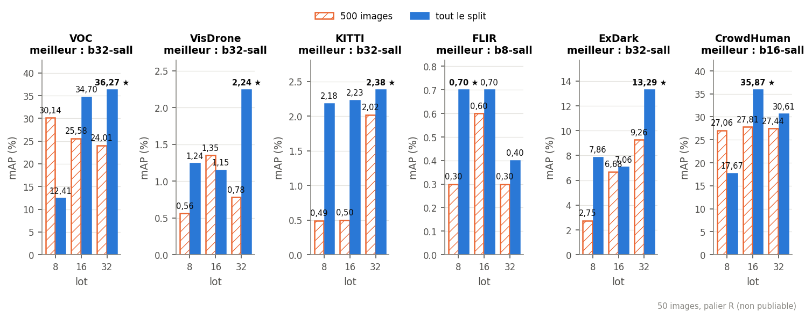
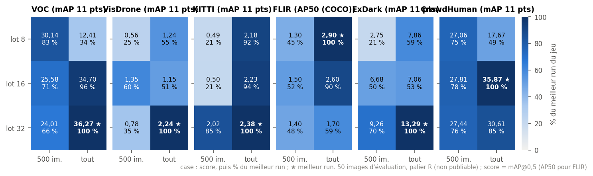
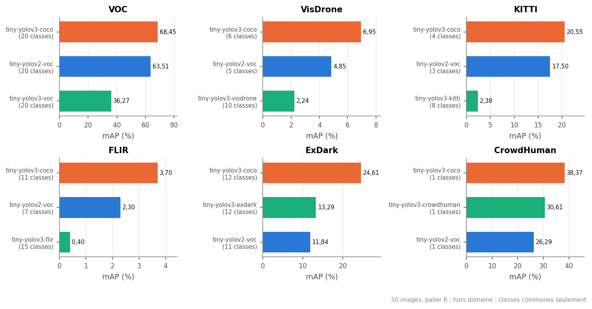
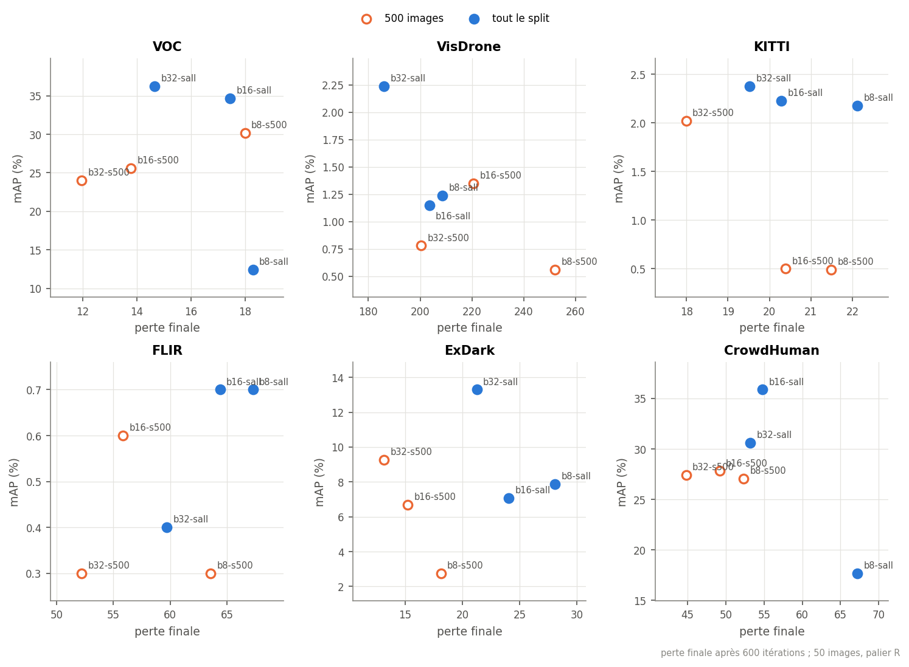

# Résultats des balayages et inférences (VOC, VisDrone, KITTI, FLIR, ExDark, CrowdHuman)

Premiers passages des notebooks `_sweep` (T14.10) et `_infer` (T14.3, T14.11) de
`notebooks/<jeu>/` (VOC, VisDrone, KITTI, FLIR, ExDark, CrowdHuman), sur un runtime
Colab à GPU ([colab-vscode.md](colab-vscode.md)), révision `1a967f4` (inférences KITTI :
`9a76534` ; balayage FLIR : `4e47dbc` ; inférences FLIR : `1723925` pour les poids publiés,
`29a058a` pour le run affiné ; balayages et inférences ExDark et CrowdHuman : `35e949b`). Les runs sont dans
`build/notebooks/<jeu>/<modèle>/runs/` et sur Drive (`<DRIVE_DIR>/runs/`,
[donnees-drive.md](donnees-drive.md)).

Les notebooks exécutés sont versionnés avec leurs sorties (règle de
[M14](M14-notebooks.md#règles)) ; toutes les tables et courbes ci-dessous s'y relisent :

| jeu | balayage | inférence |
|---|---|---|
| VOC | [tiny-yolov3-voc_sweep](../../notebooks/voc/tiny-yolov3-voc_sweep.ipynb) | [tiny-yolov3-voc](../../notebooks/voc/tiny-yolov3-voc_infer.ipynb), [tiny-yolov3-coco](../../notebooks/voc/tiny-yolov3-coco_infer.ipynb), [tiny-yolov2-voc](../../notebooks/voc/tiny-yolov2-voc_infer.ipynb) |
| VisDrone | [tiny-yolov3-visdrone_sweep](../../notebooks/visdrone/tiny-yolov3-visdrone_sweep.ipynb) | [tiny-yolov3-visdrone](../../notebooks/visdrone/tiny-yolov3-visdrone_infer.ipynb), [tiny-yolov3-coco](../../notebooks/visdrone/tiny-yolov3-coco_infer.ipynb), [tiny-yolov2-voc](../../notebooks/visdrone/tiny-yolov2-voc_infer.ipynb) |
| KITTI | [tiny-yolov3-kitti_sweep](../../notebooks/kitti/tiny-yolov3-kitti_sweep.ipynb) | [tiny-yolov3-kitti](../../notebooks/kitti/tiny-yolov3-kitti_infer.ipynb), [tiny-yolov3-coco](../../notebooks/kitti/tiny-yolov3-coco_infer.ipynb), [tiny-yolov2-voc](../../notebooks/kitti/tiny-yolov2-voc_infer.ipynb) |
| FLIR | [tiny-yolov3-flir_sweep](../../notebooks/flir/tiny-yolov3-flir_sweep.ipynb) | [tiny-yolov3-flir](../../notebooks/flir/tiny-yolov3-flir_infer.ipynb), [tiny-yolov3-coco](../../notebooks/flir/tiny-yolov3-coco_infer.ipynb), [tiny-yolov2-voc](../../notebooks/flir/tiny-yolov2-voc_infer.ipynb) |
| ExDark | [tiny-yolov3-exdark_sweep](../../notebooks/exdark/tiny-yolov3-exdark_sweep.ipynb) | [tiny-yolov3-exdark](../../notebooks/exdark/tiny-yolov3-exdark_infer.ipynb), [tiny-yolov3-coco](../../notebooks/exdark/tiny-yolov3-coco_infer.ipynb), [tiny-yolov2-voc](../../notebooks/exdark/tiny-yolov2-voc_infer.ipynb) |
| CrowdHuman | [tiny-yolov3-crowdhuman_sweep](../../notebooks/crowdhuman/tiny-yolov3-crowdhuman_sweep.ipynb) | [tiny-yolov3-crowdhuman](../../notebooks/crowdhuman/tiny-yolov3-crowdhuman_infer.ipynb), [tiny-yolov3-coco](../../notebooks/crowdhuman/tiny-yolov3-coco_infer.ipynb), [tiny-yolov2-voc](../../notebooks/crowdhuman/tiny-yolov2-voc_infer.ipynb) |

Figures : `python -m tools.figures balayage` (T13.53) relit les tableaux de ce fichier et
réécrit les PNG de [figures/resultats/](figures/resultats/). L'analyse transversale des six jeux (
grilles, classements, effets du lot et du sous-ensemble, époques, courbes et composantes
de la perte, AP par classe, poids publiés, coût) est dans
[notebooks/analyse_balayages.ipynb](../../notebooks/analyse_balayages.ipynb) : elle relit
directement les sorties des notebooks `_sweep` et `_infer` (`tools/notebooks/balayages.py`,
figures `python -m tools.figures balayages`). Toutes les figures du dépôt
s'affichent dans [notebooks/figures_live.ipynb](../../notebooks/figures_live.ipynb), sans
rien exécuter.

## Conditions

| | |
|---|---|
| palier | **R** : mAP sur les 50 premières images (`SUBSET = 50`) |
| évaluation | split d'évaluation du jeu (VOC2007 test, val pour les autres), 416×416 `stretch` (Pillow), conf 0,005, NMS 0,45 ; AP 11 points, sauf FLIR : métrique COCO (AP@[.5:.95], 101 points) |
| entraînement | 600 itérations par run, LR 0,001 (non ajusté au lot), burn-in 500, multi-échelle 320-608, init COCO (`weights/yolov3-tiny.weights`), `--device gpu` |
| grille | `BATCHES = [8, 16, 32]` × `TRAIN_SUBSETS = [500, 0]` (500 premières images, ou tout le split) |

Ces mAP **classent** les runs ; elles ne sont **pas publiables** (règles de
[M12](M12-profils-pc.md#règles)) et ne vont pas dans `results/`. Avec 50 images, une
classe peut n'avoir qu'une ou deux instances : son AP saute entre 0 et 100. Ordre de
grandeur du biais : Tiny-YOLOv2 VOC fait 63,51 sur ces 50 images contre **56,30** sur le
split complet ([results/map_float.md](../../results/map_float.md)).

## Vue d'ensemble



Chaque panneau a sa propre échelle : VOC plafonne à 36,27, VisDrone à 2,24, KITTI à 2,38,
FLIR à 0,7 (AP@[.5:.95], qui ne se compare pas aux AP 11 points des autres jeux), ExDark à
13,29 et CrowdHuman à 35,87.

Comparaison entre jeux (score relatif au meilleur run de chaque jeu, classements,
effets du lot et du sous-ensemble) :
[notebooks/analyse_balayages.ipynb](../../notebooks/analyse_balayages.ipynb).



## VOC

### Balayage `tiny-yolov3-voc` (16 551 images d'entraînement, VOC07+12)

| run | lot | images | époques | perte finale | mAP (50 images) |
|---|---|---|---|---|---|
| **b32-sall** | 32 | tout | 1,16 | 14,66 | **36,27** |
| b16-sall | 16 | tout | 0,58 | 17,45 | 34,70 |
| b8-s500 | 8 | 500 | 9,60 | 18,00 | 30,14 |
| b16-s500 | 16 | 500 | 19,20 | 13,78 | 25,58 |
| b32-s500 | 32 | 500 | 38,40 | 11,95 | 24,01 |
| b8-sall | 8 | tout | 0,29 | 18,29 | 12,41 |

Durée : environ 10 min par run de lot 32 sur le GPU Colab (624 s pour b32-sall).

### Inférence sur les mêmes 50 images

| modèle | poids | classes évaluées | mAP |
|---|---|---|---|
| `tiny-yolov3-coco` | Darknet COCO (`yolov3-tiny.weights`) | 20 (via `MAPPINGS`) | **68,45** |
| `tiny-yolov2-voc` | Darknet VOC (`yolov2-tiny-voc.weights`) | 20 | 63,51 |
| `tiny-yolov3-voc` | run `b32-sall` | 20 | 36,27 |

AP du run `b32-sall` : aeroplane et bicycle 100, cat 75,6, bus 59,1, tvmonitor 54,5,
bird 50,6, person 47,2 ; bottle et sofa 0, boat 1,8, cow 2,1, pottedplant 1,3.

## VisDrone

### Balayage `tiny-yolov3-visdrone` (cfg `build/m11/cfg/tiny-yolov3-visdrone.cfg`, 10 classes, 6 471 images)

| run | lot | images | époques | perte finale | mAP (50 images) |
|---|---|---|---|---|---|
| **b32-sall** | 32 | tout | 2,97 | 185,96 | **2,24** |
| b16-s500 | 16 | 500 | 19,20 | 220,65 | 1,35 |
| b8-sall | 8 | tout | 0,74 | 208,68 | 1,24 |
| b16-sall | 16 | tout | 1,48 | 203,54 | 1,15 |
| b32-s500 | 32 | 500 | 38,40 | 200,33 | 0,78 |
| b8-s500 | 8 | 500 | 9,60 | 252,11 | 0,56 |

Seule la classe `car` décolle (AP 17,4 pour b32-sall) ; van 2,0, truck 1,7, les autres
sous 0,5. Pertes de 186 à 252 : aucun run n'a convergé.

### Inférence hors domaine (T11.2) sur les mêmes 50 images

| modèle | classes évaluées | mAP |
|---|---|---|
| `tiny-yolov3-coco` | 6 (person, bicycle, car, motorbike, bus, truck) | 6,95 |
| `tiny-yolov2-voc` | 5 (person, bicycle, car, motorbike, bus) | 4,85 |
| `tiny-yolov3-visdrone` `b32-sall` | 10 | 2,24 |

Les mAP hors domaine portent sur les classes ayant un équivalent (`MAPPINGS` :
pedestrian et people → person, van → car, motor → motorbike ; tricycle et
awning-tricycle ignorés) : elles ne se comparent pas directement à la mAP à 10 classes.
Par classe, `car` est à 21,5 pour COCO contre 17,4 pour le run affiné.

## KITTI

### Balayage `tiny-yolov3-kitti` (cfg `build/m11/cfg/tiny-yolov3-kitti.cfg`, 8 classes, 5 985 images)

| run | lot | images | époques | perte finale | mAP (50 images) |
|---|---|---|---|---|---|
| **b32-sall** | 32 | tout | 3,21 | 19,52 | **2,38** |
| b16-sall | 16 | tout | 1,60 | 20,29 | 2,23 |
| b8-sall | 8 | tout | 0,80 | 22,12 | 2,18 |
| b32-s500 | 32 | 500 | 38,40 | 17,99 | 2,02 |
| b16-s500 | 16 | 500 | 19,20 | 20,39 | 0,50 |
| b8-s500 | 8 | 500 | 9,60 | 21,49 | 0,49 |

Même classement que sur VOC et VisDrone : `b32-sall` en tête, les runs sur tout le split
devant ceux à 500 images. Les quatre premiers se tiennent en 0,4 point, dans le bruit à
50 images. Seule `Car` décolle (AP 16,8 pour b32-sall) ; Truck et Pedestrian 1,1, les
autres classes à 0. Durée : ≈ 10 min par run de lot 32 (604 s pour b32-sall).

Les images de KITTI (1242×375) sont écrasées en 416×416 par `stretch` : les objets
perdent les deux tiers de leur hauteur relative. C'est l'argument pour l'entrée 640×192
de T11.4 ([M15, T15.12](M15-campagne-entrainement.md)).

### Inférence hors domaine (T11.2) sur les mêmes 50 images

| modèle | classes évaluées | mAP |
|---|---|---|
| `tiny-yolov3-coco` | 4 (person, car, train, truck) | 20,55 |
| `tiny-yolov2-voc` | 3 (car, person, train) | 17,50 |
| `tiny-yolov3-kitti` `b32-sall` | 8 | 2,38 |

Correspondances (`MAPPINGS`) : Car et Van → car, Pedestrian et Person_sitting → person,
Tram → train, Truck → truck (COCO seulement) ; Cyclist et Misc ignorés. Par classe, `car`
est à 49,7 pour COCO et 29,6 pour Tiny-YOLOv2 VOC, contre 16,8 pour le run affiné.



## FLIR

### Balayage `tiny-yolov3-flir` (cfg `build/m11/cfg/tiny-yolov3-flir-c1.cfg`, 15 classes, 1 canal, 10 742 images)

| run | lot | images | époques | perte finale | mAP AP@[.5:.95] (50 images) | AP50 |
|---|---|---|---|---|---|---|
| **b8-sall** | 8 | tout | 0,45 | 67,27 | **0,7** | 2,9 |
| **b16-sall** | 16 | tout | 0,89 | 64,38 | **0,7** | 2,6 |
| b16-s500 | 16 | 500 | 19,20 | 55,84 | 0,6 | 1,5 |
| b32-sall | 32 | tout | 1,79 | 59,68 | 0,4 | 1,7 |
| b32-s500 | 32 | 500 | 38,40 | 52,19 | 0,3 | 1,4 |
| b8-s500 | 8 | 500 | 9,60 | 63,55 | 0,3 | 1,3 |

Aucun run n'apprend : AP50 au plus 2,9, tous les écarts sont dans le bruit à 50 images, et
le classement des autres jeux (`b32-sall` en tête) ne se retrouve pas. Par classe, seules
person (AP50 11,6 pour b8-sall, 2,9 pour b16-sall), bike (7,9 et 9,8) et car (3,2 et 6,6)
sortent de zéro ; 7 des 15 classes n'ont aucune instance dans ces 50 images (AP -100 dans
la table de `eval_voc.py`). Pertes finales de 52 à 67, trois fois celles de KITTI.

Seules les têtes sont réinitialisées (couches 15 et 22) ; L00 vient des poids COCO, sommée
sur les canaux RGB. Le réseau voit pourtant des images thermiques, loin du domaine COCO,
et 600 itérations (moins de deux époques) ne suffisent pas à l'y adapter. Durée : ≈ 10 min par run de lot 32 (577 s pour b32-sall), comme sur
les autres jeux.

### Inférence sur les mêmes 50 images

| modèle | classes évaluées | mAP AP@[.5:.95] | AP50 |
|---|---|---|---|
| `tiny-yolov3-coco` | 11 (dont 5 présentes : person, bicycle, car, traffic light, fire hydrant) | **3,7** | 9,9 |
| `tiny-yolov2-voc` | 7 (dont 3 présentes : person, bicycle, car) | 2,3 | 8,3 |
| `tiny-yolov3-flir` `b32-sall` | 15 (dont 8 présentes) | 0,4 | 1,7 |

Les poids publiés tournent en RGB sur l'image thermique (trois fois le même canal) ; le
run affiné prend un canal. Correspondances (`MAPPINGS`) : bike → bicycle, motor →
motorbike, light → traffic light et hydrant → fire hydrant (COCO seulement) ; sign,
stroller, scooter et other vehicle ignorés. Par classe, en AP50 : bicycle 23,1 pour COCO
et 22,7 pour Tiny-YOLOv2 VOC ; car 12,7 pour COCO, 1,9 pour VOC, 1,6 pour le run affiné ;
person 7,6 pour COCO, 0,2 pour VOC, 8,1 pour le run affiné, sa seule classe au niveau
des poids publiés. Les poids publiés ne détectent bien que les grands objets (APl 49,0
pour COCO, 11,9 pour VOC, 5,5 pour le run affiné).

Le notebook d'inférence prend le run le plus récent (`RUN = None`), ici `b32-sall`, et
retrouve exactement la mesure du balayage (0,4 et 1,7). La cfg à un canal a été
reconstruite depuis la table d'ancres du run (`env.restore_cfg`, runtime Colab neuf sans
`build/m11/cfg/`) : même cfg qu'à l'entraînement. Les deux runs en tête du balayage
(`b8-sall`, `b16-sall`) ne sont pas évalués ici (`RUN = 'b8-sall'` ou `COMPARE = True`).

## ExDark

### Balayage `tiny-yolov3-exdark` (cfg `build/m11/cfg/tiny-yolov3-exdark.cfg`, 12 classes, 3 000 images)

| run | lot | images | époques | perte finale | mAP (50 images) |
|---|---|---|---|---|---|
| **b32-sall** | 32 | tout | 6,40 | 21,25 | **13,29** |
| b32-s500 | 32 | 500 | 38,40 | 13,13 | 9,26 |
| b8-sall | 8 | tout | 1,60 | 28,09 | 7,86 |
| b16-sall | 16 | tout | 3,20 | 24,04 | 7,06 |
| b16-s500 | 16 | 500 | 19,20 | 15,23 | 6,68 |
| b8-s500 | 8 | 500 | 9,60 | 18,11 | 2,75 |

Images de nuit et en basse lumière, split d'entraînement petit (3 000 images) : à lot 32,
600 itérations font déjà 6,4 époques. `b32-sall` est en tête, comme sur VOC, VisDrone et
KITTI, avec 4 points d'avance sur `b32-s500`. Les ancres k-means ne gagnent presque rien
sur celles de Darknet (IoU moyenne 0,615 contre 0,609). AP de
`b32-sall` : Boat 55,3, Bus 36,4, People 23,7, Bicycle 19,6, Chair 18,5, Car 5,7 ; Bottle,
Cat, Cup, Dog et Table à 0. Durée : 427 s pour `b32-sall`.

### Inférence sur les mêmes 50 images

| modèle | poids | classes évaluées | mAP |
|---|---|---|---|
| `tiny-yolov3-coco` | Darknet COCO (`yolov3-tiny.weights`) | 12 | **24,61** |
| `tiny-yolov3-exdark` | run `b32-sall` | 12 | 13,29 |
| `tiny-yolov2-voc` | Darknet VOC (`yolov2-tiny-voc.weights`) | 11 (sans cup) | 11,84 |

Correspondances (`MAPPINGS`) : People → person, Table → diningtable, les autres classes
sous leur nom ; Cup n'existe pas dans VOC. Le run affiné dépasse Tiny-YOLOv2 VOC mais reste sous les
poids COCO, qui voient bien les personnes (51,4) et les vélos (40,2) dans le noir. Le
notebook d'inférence retrouve exactement la mesure du balayage (13,29).

## CrowdHuman

### Balayage `tiny-yolov3-crowdhuman` (cfg `build/m11/cfg/tiny-yolov3-crowdhuman.cfg`, 1 classe, 15 000 images)

| run | lot | images | époques | perte finale | mAP (50 images) |
|---|---|---|---|---|---|
| **b16-sall** | 16 | tout | 0,64 | 54,77 | **35,87** |
| b32-sall | 32 | tout | 1,28 | 53,17 | 30,61 |
| b16-s500 | 16 | 500 | 19,20 | 49,17 | 27,81 |
| b32-s500 | 32 | 500 | 38,40 | 44,79 | 27,44 |
| b8-s500 | 8 | 500 | 9,60 | 52,35 | 27,06 |
| b8-sall | 8 | tout | 0,32 | 67,22 | 17,67 |

Une seule classe (`person`), des foules denses : le seul jeu où l'affiné approche les
poids publiés. `b16-sall` passe devant `b32-sall` (5 points, dans le bruit à 50 images) ;
les trois runs à 500 images se tiennent en 0,8 point ; `b8-sall` (0,32 époque) est
dernier, comme `b8-sall` sur VOC (burn-in sur 500 des 600 itérations, LR qui n'atteint sa
valeur qu'à la fin). Les ancres k-means sont bien plus petites que celles de Darknet
(`6,16 … 136,227` contre `10,14 … 344,319`) et les couvrent mieux (IoU moyenne 0,68 contre
0,53) : des personnes nombreuses et petites. Durée : 444 s pour `b32-sall`.

### Inférence sur les mêmes 50 images

| modèle | poids | classes évaluées | mAP |
|---|---|---|---|
| `tiny-yolov3-coco` | Darknet COCO (`yolov3-tiny.weights`) | 1 (person) | **38,37** |
| `tiny-yolov3-crowdhuman` | run `b32-sall` | 1 | 30,61 |
| `tiny-yolov2-voc` | Darknet VOC (`yolov2-tiny-voc.weights`) | 1 (person) | 26,29 |

Le notebook d'inférence prend le run le plus récent (`RUN = None`), ici `b32-sall`, et
retrouve exactement la mesure du balayage (30,61). Le meilleur run du balayage,
`b16-sall` (35,87), est à 2,5 points des poids COCO et 9,6 au-dessus de Tiny-YOLOv2 VOC ;
il n'est pas évalué ici (`RUN = 'b16-sall'` ou `COMPARE = True`).
Reste la question propre au jeu ([T11.6](M11-jeux-de-donnees.md)) : rappel de `person` et
débordement des 256 emplacements de la NMS sur les images les plus denses.

## Meilleurs paramètres

**Lot 32 sur tout le split d'entraînement (`b32-sall`)**, sur VOC, VisDrone, KITTI et
ExDark ; deuxième sur CrowdHuman, à 5 points de `b16-sall` (dans le bruit à 50 images).
FLIR ne départage aucun run, et tous restent sous les poids COCO hors domaine (voir plus
haut). Sur les six jeux, `b32-sall` fait en moyenne 91 % du meilleur run de chaque jeu ;
tout le split bat 500 images dans 15 cas sur 18 (jeu × lot)
([analyse_balayages](../../notebooks/analyse_balayages.ipynb)). C'est le
run par défaut des notebooks d'inférence (`RUN = None` prend le plus récent, ici
`b32-sall`).

```
python tools/train.py --net tiny-yolov3-voc --init coco --iters 600 --batch 32 \
    --lr 0.001 --burn-in 500 --multiscale --workers 4 --device gpu \
    --out build/notebooks/voc/tiny-yolov3-voc/runs/b32-sall
python tools/train.py --net build/m11/cfg/tiny-yolov3-visdrone.cfg --dataset visdrone \
    --init coco --iters 600 --batch 32 --lr 0.001 --burn-in 500 --multiscale \
    --workers 4 --device gpu --out build/notebooks/visdrone/tiny-yolov3-visdrone/runs/b32-sall
python tools/train.py --net build/m11/cfg/tiny-yolov3-kitti.cfg --dataset kitti \
    --init coco --iters 600 --batch 32 --lr 0.001 --burn-in 500 --multiscale \
    --workers 4 --device gpu --out build/notebooks/kitti/tiny-yolov3-kitti/runs/b32-sall
```

Ce que montre la grille :

- **Tout le split plutôt que 500 images.** Sur VOC, les runs `s500` font 10 à 38 époques
  sur les mêmes 500 images et surapprennent : `b32-s500` a la perte finale la plus basse
  (11,95) mais une mAP de 24,01, contre 36,27 pour `b32-sall` (écart de 12 points à lot
  32, de 9 points à lot 16). Seul le lot 8 fait exception, voir le point suivant.
- **Un grand lot.** À 600 itérations, le lot fixe le nombre d'images vues. `b8-sall`
  (0,29 époque) est le pire run VOC, et `b8-sall` (0,32 époque) le pire de CrowdHuman : le burn-in occupe 500 des 600 itérations, le LR
  n'atteint sa valeur qu'à la fin et le gradient d'un lot de 8 est bruité.
- **Écarts faibles entre les deux meilleurs.** `b32-sall` et `b16-sall` (1,6 point sur
  VOC, 0,15 sur KITTI) ne se départagent pas sur 50 images ; sur VisDrone, tous les runs
  sauf `b32-sall` restent dans le bruit (0,6 à 1,4).



Sur VOC, les runs à 500 images (marques creuses) ont les pertes les plus basses et les mAP
les plus faibles : ils surapprennent.

## Limites et suite

Exécutions et améliorations planifiées : [M15](M15-campagne-entrainement.md).

- **Entraînement trop court.** L'affinage de 600 itérations part des poids COCO, qui
  font 68,45 sur VOC avec la table de correspondance, et tombe à 36,27 : les têtes à
  20 classes repartent de zéro et n'ont vu qu'une époque. Sur les six jeux, le meilleur
  run affiné reste sous les poids COCO hors domaine ; CrowdHuman en est le plus près
  (35,87 contre 38,37, une seule classe), ExDark à mi-chemin (13,29 contre 24,61).
- **Pistes**, dans l'ordre :
  1. allonger `ITERS` sur la configuration retenue (lot 32, tout le split ; palier N) ;
     l'exemple de `tools/train.py` pour VOC est à 20 000 itérations ;
  2. raccourcir `BURN_IN` (100 à 200) ou ajuster le LR au lot pour les runs courts ;
  3. VisDrone : entrée plus grande (`SIZE`, ex. `608` ou non carrée) pour les petits
     objets, avec les ancres k-means recalculées à cette taille ; KITTI : entrée
     `SIZE = '640x192'`.
- **Confirmer le classement** sur le split complet : notebook `_infer` avec
  `COMPARE = True` et `SUBSET = 0` (palier N), puis volet entier (`INT8 = True`, T14.4)
  sur le run retenu.
- FLIR : le balayage a tourné mais n'apprend pas (AP50 ≤ 2,9), loin des poids COCO hors
  domaine (AP 3,7, AP50 9,9), qui gardent la L00 RGB d'origine. Avant un run long,
  comparer à 3 canaux (`CHANNELS = None`), pour savoir si la L00 sommée sur un canal
  coûte la différence ([M15, T15.13](M15-campagne-entrainement.md)).
- ExDark et CrowdHuman : split complet (palier N) et, pour CrowdHuman, l'inférence de
  `b16-sall` (`COMPARE = True` dans `tiny-yolov3-crowdhuman_infer`)
  ([M15, T15.14](M15-campagne-entrainement.md)).

## Récolte des runs

Depuis la révision qui suit `35e949b`, chaque commande `tools/train.py` ou
`tools/eval_voc.py` lancée par un notebook sur Colab écrit un `summary.json` dans son
dossier de sortie et le copie sur le Drive dès sa fin (`colab.autosync`), évaluations et
notebooks `_infer` compris. Sur le PC, `make harvest` rapatrie journaux, résumés, tables
et figures (sans poids) dans `build/notebooks/` ; le notebook d'analyse y reprend les runs
sans journal dans leur notebook (VisDrone : 4 runs d'une session précédente). Détail :
[colab-vscode.md](colab-vscode.md#coupure-de-session).
