# Figures (M13)

Galerie générée par `python -m tools.figures all` (`make figures`) à partir du registre de `tools/figures/` ; ne pas éditer à la main. Chaque figure se régénère par sa commande et lit ses données dans la source indiquée. Les figures absentes attendent leur donnée (voir la commande de la tâche).

## En bref : la chaîne de vérification

Chaîne de vérification bit-exact, du flottant NumPy à la carte : critère et état de chaque passage.

## Résultats (D)

### T13.13 — `map_stades`

AP par classe aux stades flottant, entier et C-sim (la carte quand elle sera mesurée), et écart entier − flottant trié.

- Commande : `python -m tools.figures map_stades`
- Source : `build/m8/<net>/map_stades.json (tools/map_stades.py --json)`

### T13.14 — `map_formats`

mAP de Tiny-YOLOv2 selon le format des poids (flottant, INT8, puissances de 2, 4 bits), et frontière précision / bits.

- Commande : `python -m tools.figures map_formats`
- Source : `build/m8/<net>/eval_float_int.json, build/m9/map_*.json`

### T13.15 — `pr`

Courbes précision-rappel par classe (11 points VOC07) pour chaque prétraitement évalué, puis les quatre superposées.

- Commande : `python -m tools.figures pr`
- Source : `build/eval/<net>-<variante>/comp4_det_test_*.txt + data/VOCdevkit`

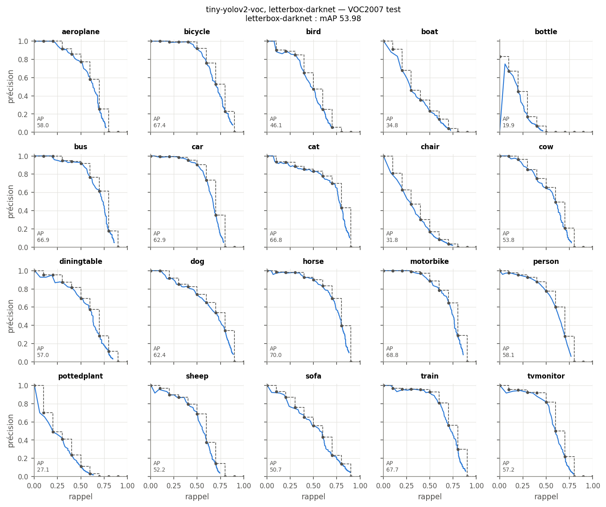
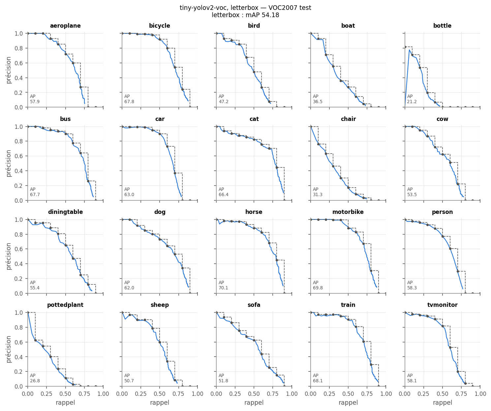
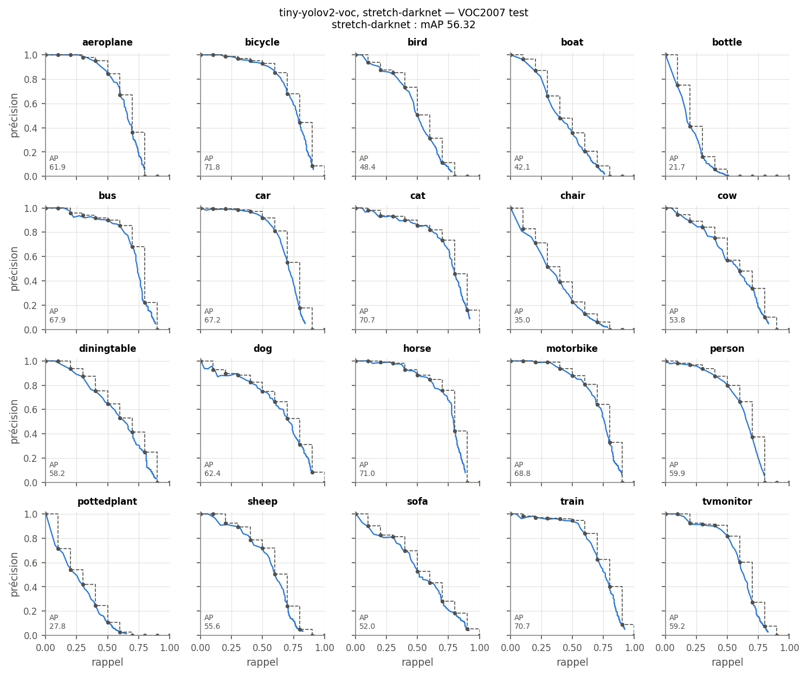
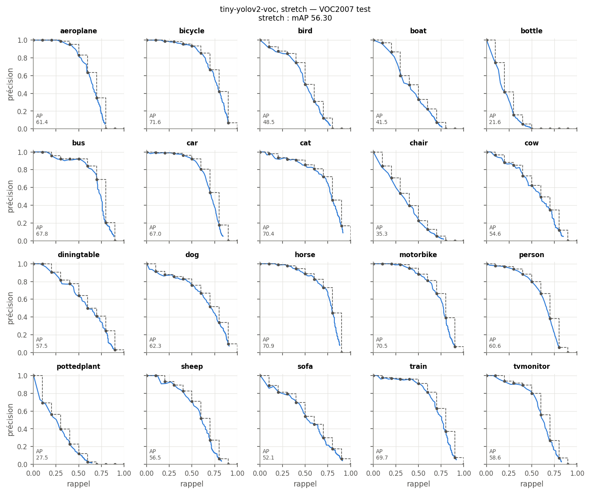

### T13.16 — `sensibilite`

Perte de mAP quand une seule couche est quantifiée (INT8 en fake-quant face au flottant ; uniform6, uniform4, mixed6 face à l'INT8). Sous-ensembles de VOC2007 test.

- Commande : `python -m tools.figures sensibilite`
- Source : `build/quant/<net>/eval_test_*_fq*.json, build/m10/mixed/sensitivity.csv`
- Sous-ensemble d'images : sortie dans `build/figures/resultats/`, non publiée dans `results/` (règle M12).

### T13.17 — `calibration`

Distribution des activations par couche et seuil de saturation retenu par la calibration ; échelles des poids par canal.

- Commande : `python -m tools.figures calibration`
- Source : `build/quant/<net>/calib.json, build/m9/stats_<net>.npz, weights/`

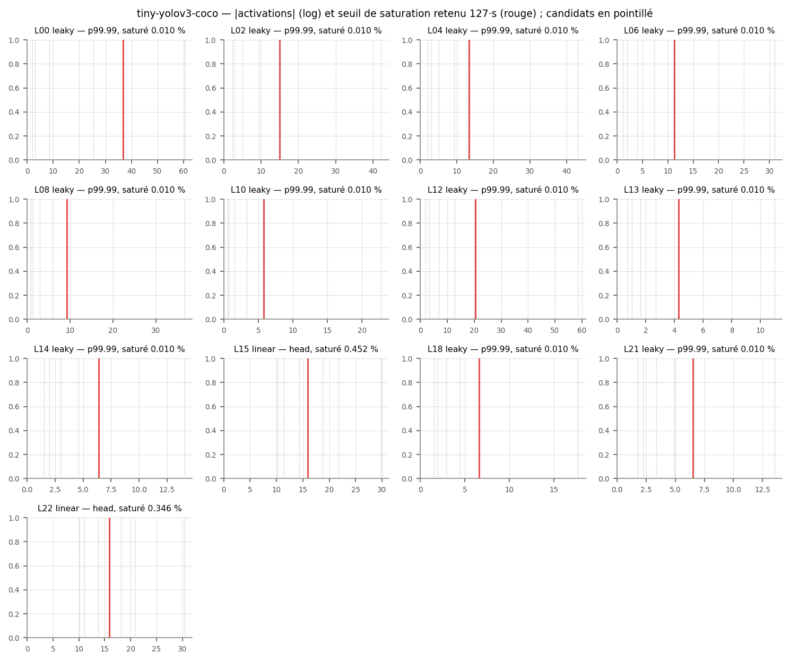

### T13.18 — `erreur_couches`

SNR par couche entre le flottant et l'entier déquantifié, et écart entier Python ↔ golden C++ (0 partout : bit-exact).

- Commande : `python -m tools.figures erreur_couches`
- Source : `model/<net>/dumps/, build/golden/out/<net>/, weights/`

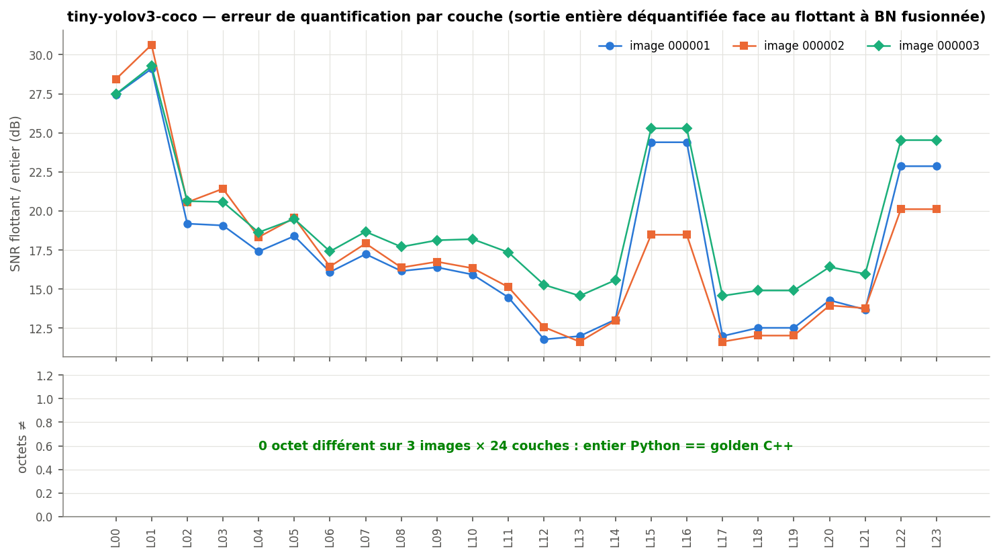

### T13.20 — `cycles_couches`

Cycles par couche du noyau actuel, décomposés en chargements, calcul et stockage ; le losange donne le temps réel avec recouvrement.

- Commande : `python -m tools.figures cycles_couches`
- Source : `build/hls/cycles_conv.csv (make hls-cycles)`

### T13.21 — `cascade_m10`

Temps par image de Tiny-YOLOv2 à chaque piste d'optimisation M10, face à la borne de calcul et au roofline KV260.

- Commande : `python -m tools.figures cascade_m10`
- Source : `tools/perf_model.py (SCENARIOS, scenario_table), tools/roofline.py`

### T13.22 — `roofline_couches`

Roofline KV260 avec un point par couche de Tiny-YOLOv2, avant et après les optimisations M10.

- Commande : `python -m tools.figures roofline_couches`
- Source : `hw/boards/kv260.yaml, model/<net>/manifest.json, tools/perf_model.py`

### T13.23 — `etat_art`

Comparaison aux accélérateurs publiés : GOPS et puissance, débit et mAP, GOPS par DSP (marque creuse : projection de ce travail).

- Commande : `python -m tools.figures etat_art`
- Source : `results/benchmarks.csv`

### T13.24 — `ressources`

DSP, mémoire sur puce et LUT des architectures (moteur unique INT8, pow2 et 4 bits, streaming) face au budget de la KV260 ; hachuré : estimation, plein : synthèse.

- Commande : `python -m tools.figures ressources`
- Source : `hw/boards/kv260.yaml, tools/roofline.py, build/m9/stream_plan_w*.json, hls/proj_kv260_synth*/sol/syn/report/csynth.xml`

### T13.25 — `hw_postproc`

mAP avec le post-traitement matériel, avec et sans plafond de boîtes, et nombre de boîtes par image face au plafond.

- Commande : `python -m tools.figures hw_postproc`
- Source : `build/m9/hwpp_map.json, hwpp_map_nocap.json, build/m8/<net>/int.jsonl`

### T13.26 — `entrainement`

Courbes d'entraînement : perte et composantes lissées, taux d'apprentissage, résidus ADMM ; puis tous les runs superposés.

- Commande : `python -m tools.figures entrainement`
- Source : `build/train/<run>/loss.csv, admm.csv (tools/train.py --out)`

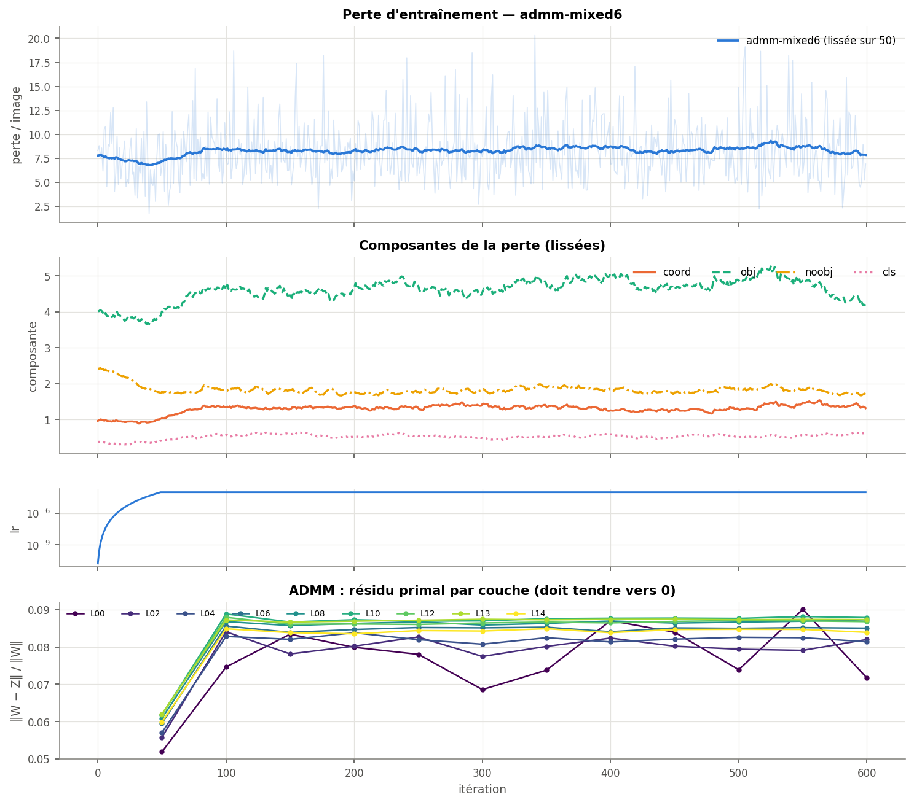
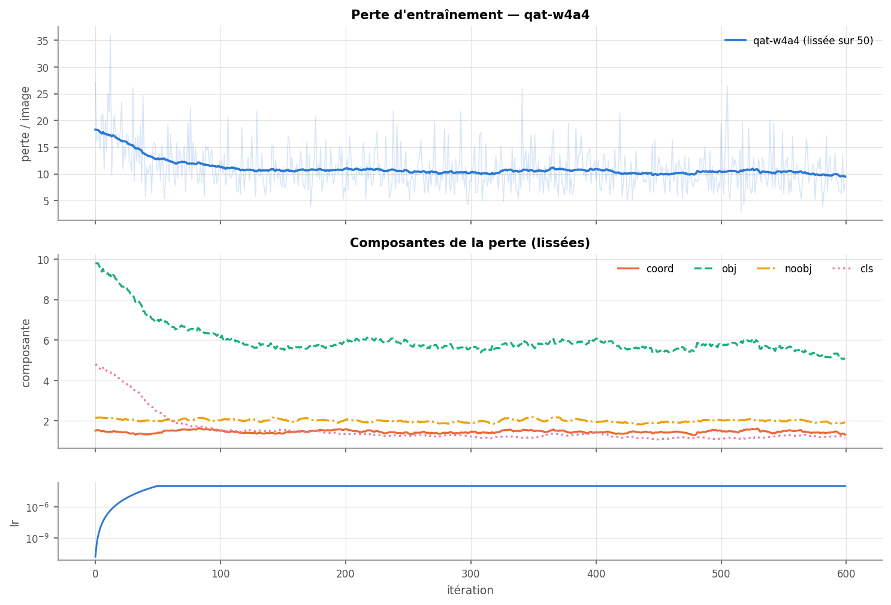
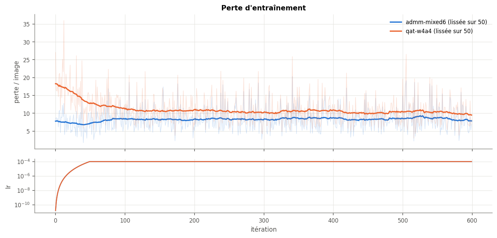

### T13.19 — `detections`

Vérité terrain, flottant, entier et C-sim sur quatre images de VOC2007 test : les colonnes entier et C-sim sont identiques.

- Commande : `python -m tools.figures detections`
- Source : `weights/, build/m8/<net>/int.jsonl et sim/dets_*.jsonl, data/VOCdevkit`

### T13.53 — `balayage`

Balayages lot × sous-ensemble (VOC, VisDrone) : mAP par lot, perte finale face à la mAP, et run affiné face aux poids publiés. 50 images, palier R.

- Commande : `python -m tools.figures balayage`
- Source : `docs/tasks/resultats-balayages.md (tables des notebooks _sweep et _infer)`
- Sous-ensemble d'images : sortie dans `docs/tasks/figures/resultats/`, non publiée dans `results/` (règle M12).

## Modèles (B)

### T13.2 — `profil_couches`

MACs, paramètres et taille des sorties int8 par couche, Tiny-YOLOv2 et Tiny-YOLOv3 superposés, avec les cumuls.

- Commande : `python -m tools.figures profil_couches`
- Source : `model/<net>/manifest.json via tools/count_macs.py`

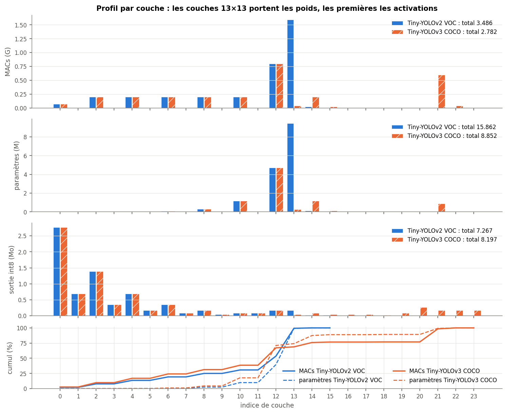

### T13.1 — `graphe`

Graphe couche par couche (type, noyau et stride, forme de sortie C×H×W ; bord épais = beaucoup de MACs).

- Commande : `python -m tools.figures graphe`
- Source : `model/<net>/manifest.json, yolo.models.specs (Graphviz dot)`

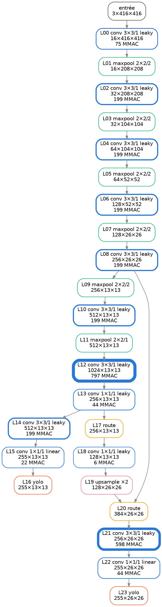

### T13.3 — `memoire`

Empreinte mémoire par conv (poids, biais, activations) face aux tampons BRAM du noyau et à l'arène DDR du driver.

- Commande : `python -m tools.figures memoire`
- Source : `model/<net>/manifest.json, sw/driver/program.hpp, tools/roofline.py`

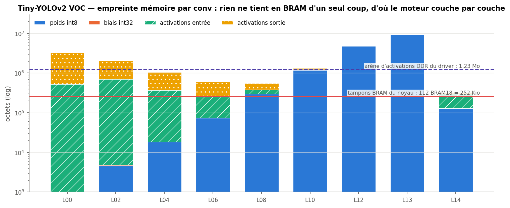
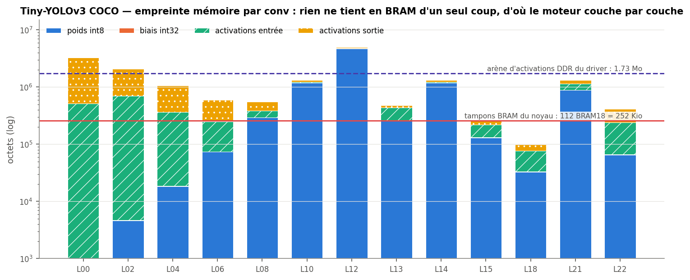

### T13.4 — `ancres`

Nuage (w, h) des boîtes VOC avec les ancres k-means (distance 1 − IoU) et les ancres Darknet.

- Commande : `python -m tools.figures ancres`
- Source : `data/VOCdevkit, results/anchors.md, tools/kmeans_anchors.py:dataset_wh`

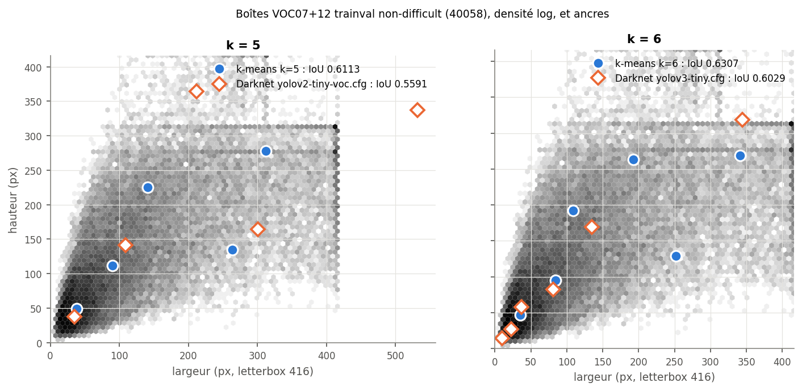
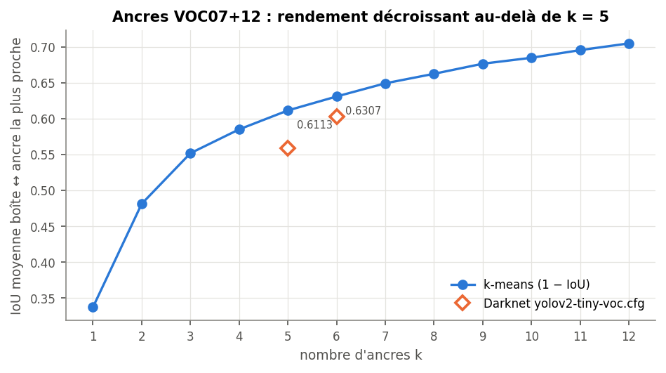

### T13.7 — `voc_stats`

Statistiques de VOC : objets par classe en trainval et en test, aires des boîtes, objets par image.

- Commande : `python -m tools.figures voc_stats`
- Source : `data/VOCdevkit (comptes égaux à tools/voc_stats.py)`

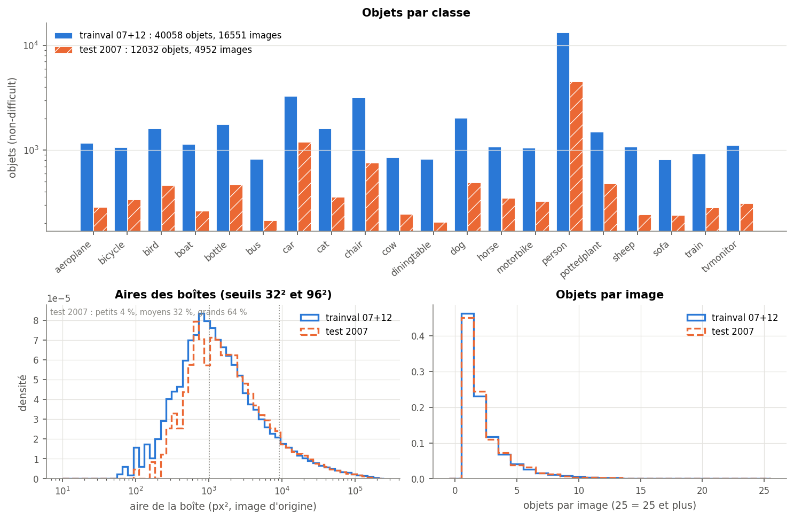

### T13.4 — `ancres_k`

IoU moyenne des ancres k-means selon k (1 à 12), avec les ancres Darknet en repère.

- Commande : `python -m tools.figures ancres_k`
- Source : `data/VOCdevkit, yolo.data.anchors.kmeans_anchors`

### T13.5 — `sortie_yolo`

Sortie YOLO pas à pas sur une image : grille, cellules responsables et ancres, boîtes décodées avant NMS (par tête), détections finales.

- Commande : `python -m tools.figures sortie_yolo`
- Source : `weights/*.weights, VOC2007/JPEGImages/000001.jpg, yolo.infer.decode et nms`

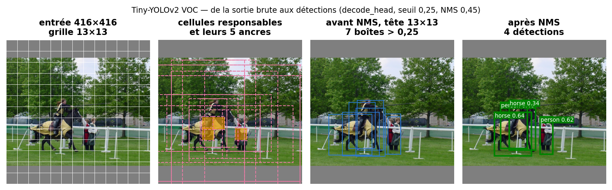
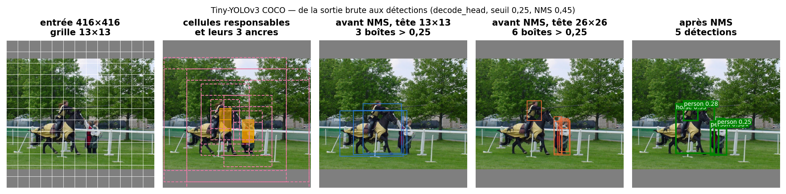

### T13.6 — `augmentations`

Images d'origine (letterbox) puis quatre tirages d'augmentation, boîtes cibles transformées.

- Commande : `python -m tools.figures augmentations`
- Source : `data/VOCdevkit, yolo.data.loader.VOCDataset (tirages de tools/show_augment.py)`

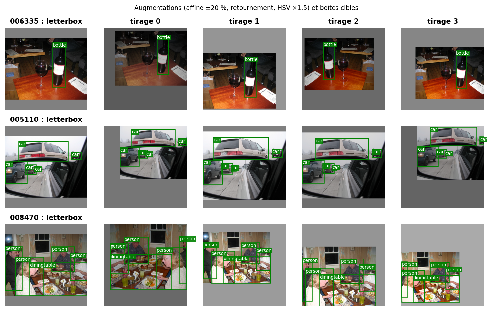

## Développement du projet (E)

### T13.27 — `chronologie`

Gantt des jalons reconstruit depuis les commits « Mx : », avec les commits de documentation en pointillé et les jalons non commencés en gris.

- Commande : `python -m tools.figures chronologie`
- Source : `git log --date=iso`

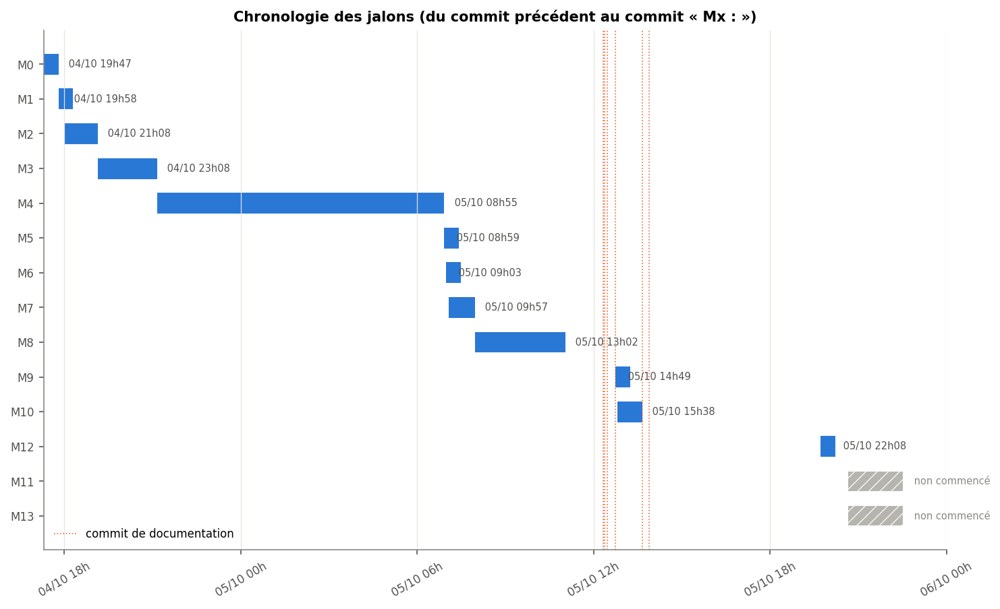

### T13.28 — `avancement`

Tâches faites, partielles, vérifiées sur PC (carte en attente) et ouvertes, par jalon.

- Commande : `python -m tools.figures avancement`
- Source : `docs/tasks/M*.md, tableau de suivi de docs/tasks/README.md`

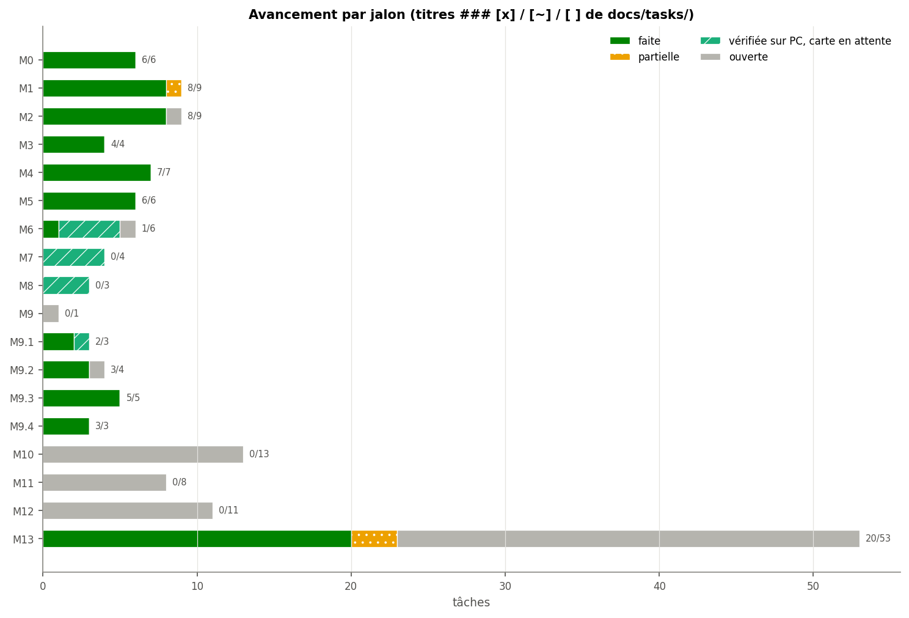

### T13.29 — `code`

Lignes par dossier (python, tools, cpp, hls, sw, docs, results) commit par commit.

- Commande : `python -m tools.figures code`
- Source : `git log --numstat`

### T13.30 — `tests`

Nombre de tests par module Python (pytest, slow compris) et par build C++ (ctest), et leur durée quand `make test-durations` a été lancé.

- Commande : `python -m tools.figures tests`
- Source : `pytest --collect-only -q, ctest -N, build/figures/pytest.xml, build/*/ctest.xml`

### T13.30 — `dependances`

Graphe des jalons du README (défini une seule fois, en mermaid), coloré selon l'avancement de T13.28.

- Commande : `python -m tools.figures dependances`
- Source : `docs/tasks/README.md (mermaid et suivi), docs/tasks/M*.md (Graphviz dot)`

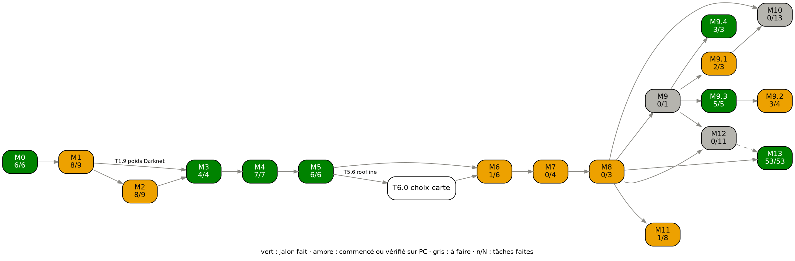

## Matériel (C)

### T13.8 — `soc`

Schéma du SoC : application et driver sur l'ARM, registres AXI-Lite, ports m_axi du noyau et découpage de l'arène DDR.

- Commande : `python -m tools.figures soc`
- Source : `sw/driver/regmap.hpp, pragmas de hls/kernels/conv_pe.cpp, model/<net>/manifest.json`

### T13.9 — `moteur`

Moteur unique : chargeurs ping-pong, réseau Tm × Tn de MACs, accumulateur, étage de sortie, et chronogramme du recouvrement sur 3 tuiles.

- Commande : `python -m tools.figures moteur`
- Source : `hls/kernels/accel_config.hpp, conv_pe.cpp, output_stage.hpp, tools/perf_model.py`

### T13.10 — `tuilage`

Tuilage de deux couches : tuiles spatiales et voies d'entrée, avec le pliage de L00 (cin = 3) et la couche 13×13 couverte par une seule tuile.

- Commande : `python -m tools.figures tuilage`
- Source : `model/<net>/manifest.json, tools/perf_model.py:tile_grid, accel_config.hpp`

### T13.11 — `streaming`

Architecture streaming face au moteur unique : mémoire et parallélisme par étage, cycles par couche, chronogramme sur deux images (estimations).

- Commande : `python -m tools.figures streaming`
- Source : `tools/stream_model.py:plan, tools/perf_model.py, hw/boards/kv260.yaml`

### T13.12 — `chaine_verif`

Chaîne de vérification bit-exact, du flottant NumPy à la carte : critère et état de chaque passage.

- Commande : `python -m tools.figures chaine_verif`
- Source : `tableau de suivi de docs/tasks/README.md, build/m8/<net>/map_stades.json, dumps`

## Réimplémentation de zéro (F)

### T13.31 — `carte`

Carte de la réimplémentation : chaque module de python/yolo/, la brique qu'il réécrit, la bibliothèque évitée, son test et la planche qui l'explique.

- Commande : `python -m tools.figures carte`
- Source : `python/yolo/ (parcours du paquet), python/tests/`

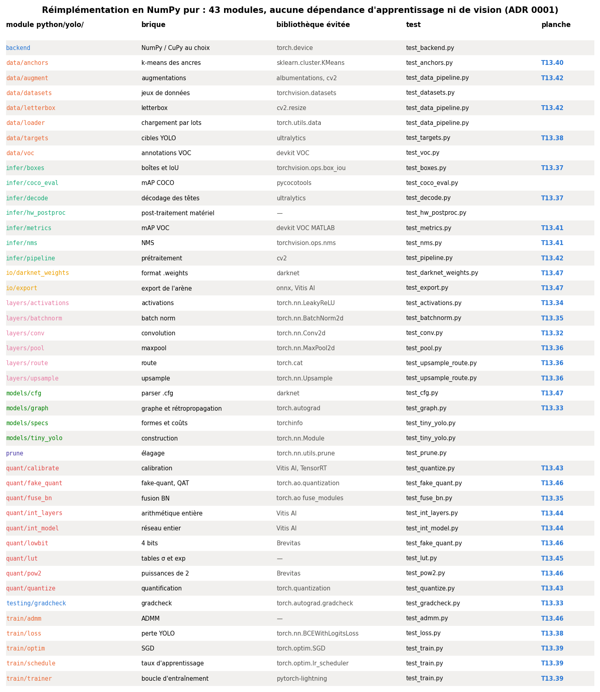

### T13.32 — `convolution`

Convolution : la formule sur un patch, le dépliage im2col en produit de matrices, et le temps des boucles face à im2col.

- Commande : `python -m tools.figures convolution`
- Source : `yolo.layers.conv (conv_forward_naive, conv_forward, conv_backward)`

### T13.33 — `retropropagation`

Rétropropagation écrite à la main : formule du gradient renvoyé par chaque couche, puis l'erreur du gradcheck par couche face au seuil 1e-7.

- Commande : `python -m tools.figures retropropagation`
- Source : `yolo.layers.*, yolo.models.graph, yolo.testing.gradcheck`

### T13.34 — `activations`

Leaky ReLU et sa dérivée, sigmoïde stable face à la forme naïve, BCE sur logits et son gradient, softmax stable.

- Commande : `python -m tools.figures activations`
- Source : `yolo.layers.activations, yolo.train.loss (softplus, bce_logits)`

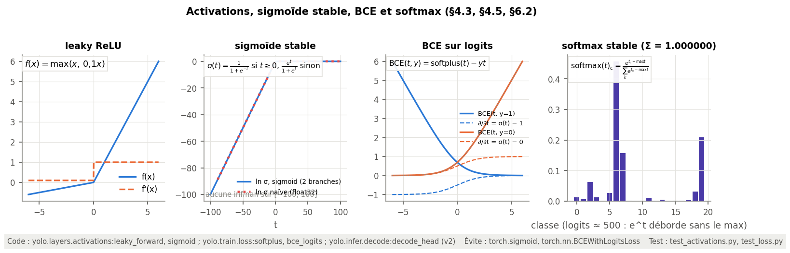

### T13.35 — `batchnorm`

Batch normalization : normalisation par canal, moyennes glissantes, puis fusion dans la convolution (sortie identique).

- Commande : `python -m tools.figures batchnorm`
- Source : `yolo.layers.batchnorm.bn_forward, yolo.quant.fuse_bn.fuse_bn`

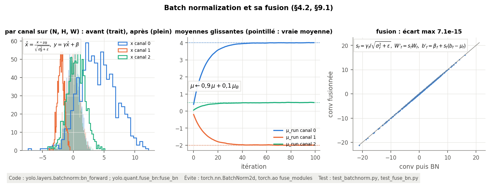

### T13.36 — `pool_upsample_route`

Maxpool 2×2/2 et 2×2/1 (avec la réplication du bord), upsample ×2 et route, avec les gradients qui remontent.

- Commande : `python -m tools.figures pool_upsample_route`
- Source : `yolo.layers.pool, upsample, route`

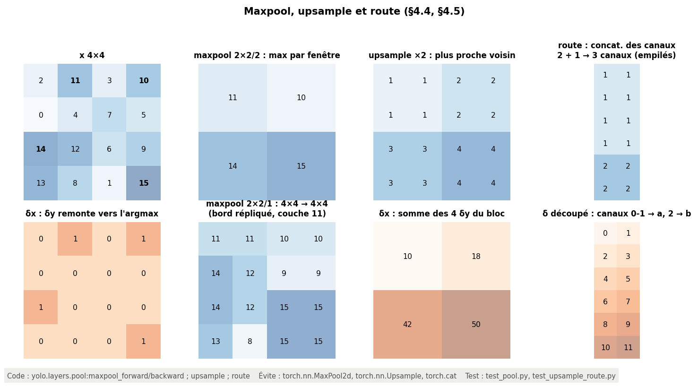

### T13.37 — `boites_decodage`

IoU de deux boîtes et IoU de forme des ancres, décodage du centre dans sa cellule, taille selon t_w pour les 5 ancres de Tiny-YOLOv2.

- Commande : `python -m tools.figures boites_decodage`
- Source : `yolo.infer.boxes (iou, iou_wh, cxcywh_to_xyxy), yolo.infer.decode.decode_head`

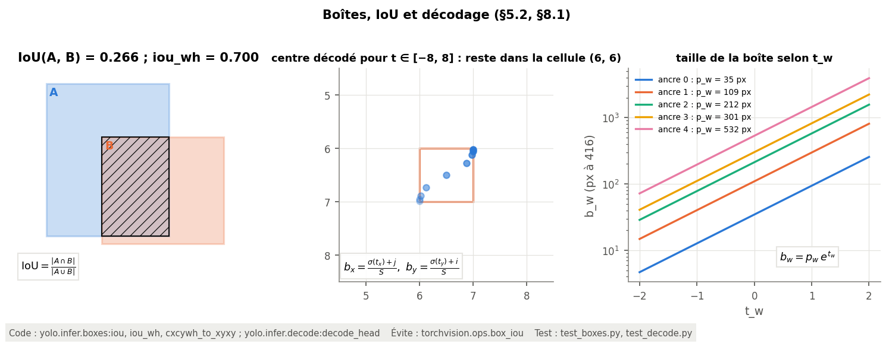

### T13.38 — `perte`

Cibles et perte YOLO : encodage d'une vérité, la perte terme par terme, le poids ω = 2 − g_w g_h, le masque ignore et la part de chaque terme sur un lot.

- Commande : `python -m tools.figures perte`
- Source : `yolo.data.targets.build_targets, yolo.train.loss (yolo_loss, ignore_mask)`

### T13.39 — `optimisation`

SGD avec et sans momentum sur une quadratique mal conditionnée, taux d'apprentissage (montée puis paliers) et tailles multi-échelles.

- Commande : `python -m tools.figures optimisation`
- Source : `yolo.train.optim.SGD, yolo.train.schedule.lr_at, yolo.train.trainer.multiscale_size`

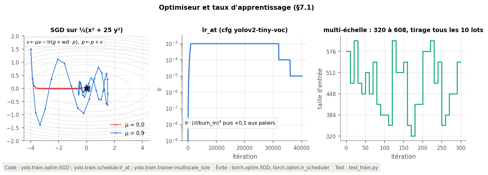

### T13.40 — `kmeans`

k-means des ancres avec la distance 1 − IoU face à la distance euclidienne, et l'initialisation k-means++ sur des boîtes jouets.

- Commande : `python -m tools.figures kmeans`
- Source : `yolo.data.anchors (kmeans_anchors, _init_plusplus, mean_best_iou)`

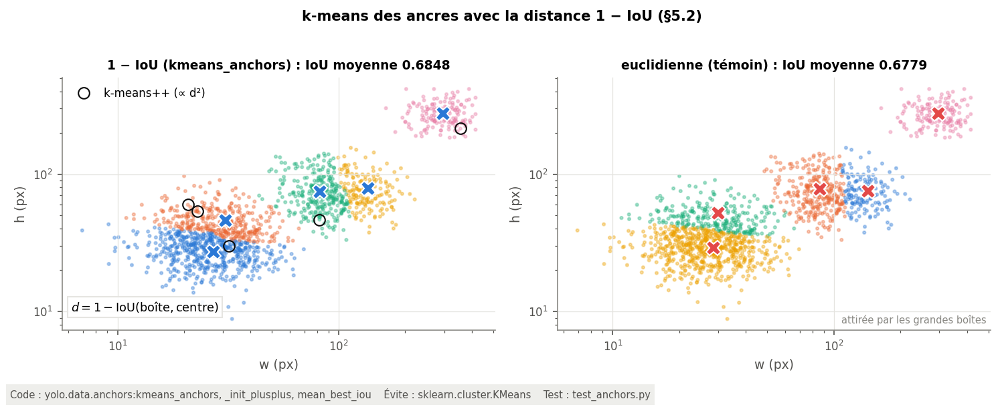

### T13.41 — `nms_map`

NMS pas à pas, appariement détections / vérités et courbe précision-rappel, AP VOC07 sur 11 points face à l'aire sous l'enveloppe, égale à la référence du devkit.

- Commande : `python -m tools.figures nms_map`
- Source : `yolo.infer.nms (nms), yolo.infer.metrics (eval_class, voc_ap), tests/voc_eval_ref.py`

### T13.42 — `pretraitement`

Letterbox face à stretch, interpolation bilinéaire de Darknet, aller-retour RGB → HSV → RGB et transformation affine des boîtes.

- Commande : `python -m tools.figures pretraitement`
- Source : `yolo.data.letterbox, yolo.infer.pipeline (resize_darknet, preprocess), yolo.data.augment`

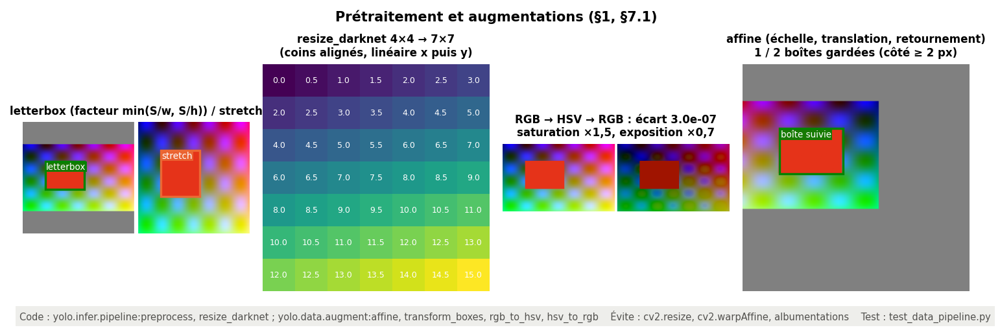

### T13.43 — `quantification`

Quantification symétrique : l'escalier et son erreur, échelles par canal face à une échelle par couche, choix du seuil d'écrêtage par la MSE.

- Commande : `python -m tools.figures quantification`
- Source : `yolo.quant.quantize (round_half_up, quantize, weight_scales), yolo.quant.calibrate`

### T13.44 — `entier`

Arithmétique entière du matériel : chaîne d'une sortie, multiplicateur fixe M0/2ⁿ, leaky entière 13/128 et marge des accumulateurs int32.

- Commande : `python -m tools.figures entier`
- Source : `yolo.quant.int_layers (conv_acc, requantize, leaky_int, clip_q), quantize.requant_params`

### T13.45 — `lut`

Sigmoïde et exponentielles par tables de 256 entrées en Q16 : valeurs, erreurs aux points de la grille et de bout en bout, seuil entier sans sigmoïde.

- Commande : `python -m tools.figures lut`
- Source : `yolo.quant.lut (sigmoid_lut, exp_lut, softmax_exp_lut, logit_threshold_q)`

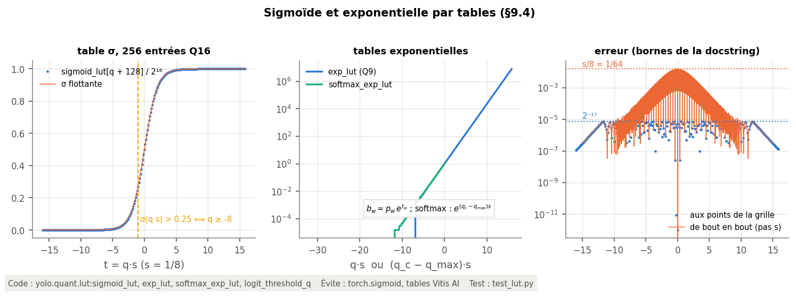

### T13.46 — `basse_precision`

Basse précision : fake-quant et estimateur straight-through, niveaux équidistants face aux puissances de 2 et multiplication par décalages, ADMM, découpage 4 bits.

- Commande : `python -m tools.figures basse_precision`
- Source : `yolo.quant.fake_quant, yolo.quant.pow2, yolo.train.admm, yolo.quant.int_layers.split4`

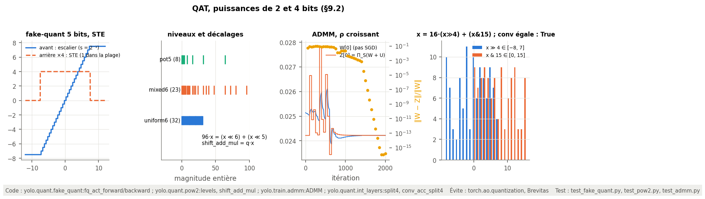

### T13.47 — `formats`

Formats lus et écrits à la main : un .weights Darknet octet par octet, le parser .cfg et l'arène exportée (décalages égaux au manifest).

- Commande : `python -m tools.figures formats`
- Source : `yolo.io.darknet_weights, yolo.models.cfg.parse_cfg, yolo.io.export.layout`

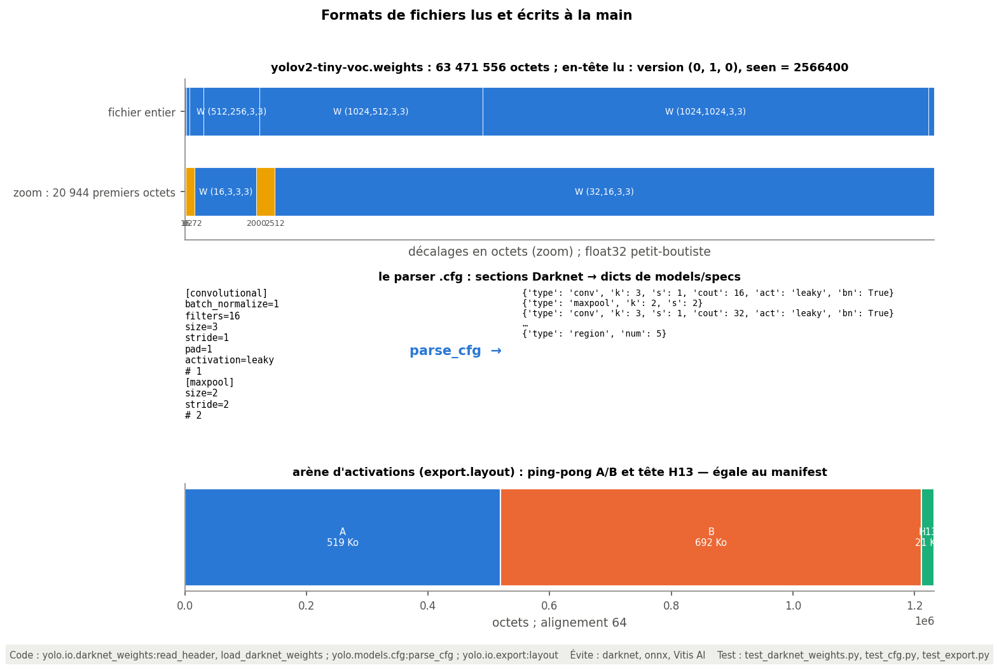

## Réseaux en détail (G)

### T13.48 — `fiche`

Fiche couche par couche : type, noyau, formes, paramètres, MACs et leur part, champ réceptif et pas cumulé (CSV à côté de l'image).

- Commande : `python -m tools.figures fiche`
- Source : `model/<net>/manifest.json, yolo.models.specs`

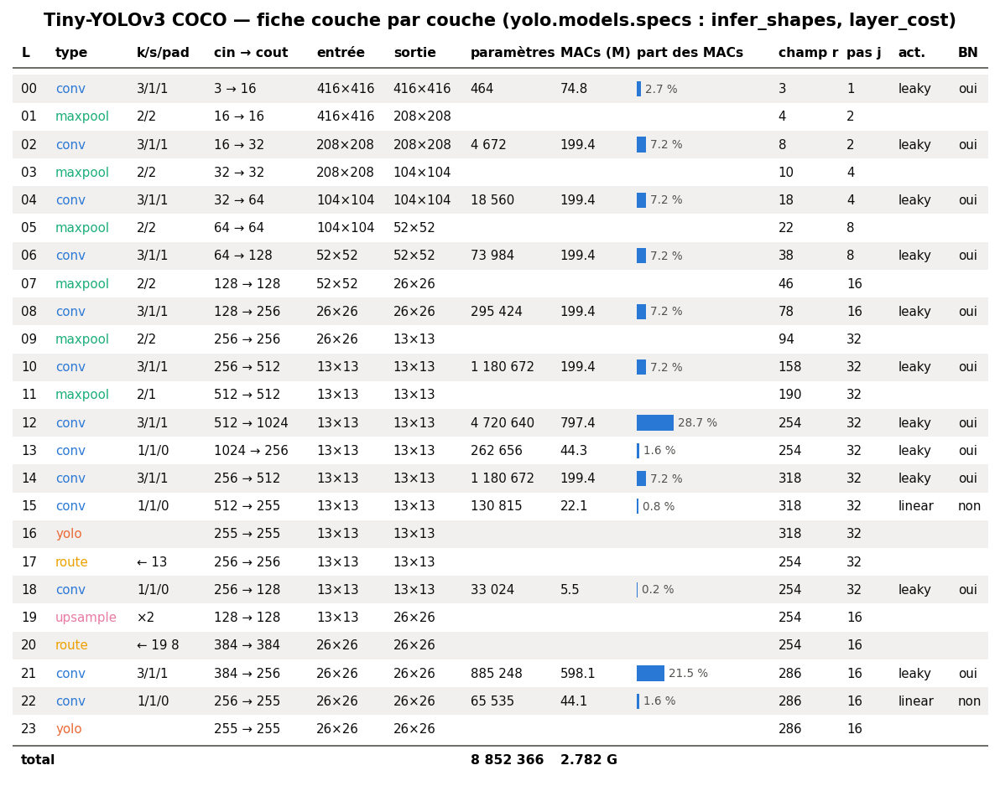

### T13.49 — `champ_receptif`

Champ réceptif et pas cumulé par couche, puis une cellule de chaque tête sur une image 416 avec son champ réceptif et ses ancres.

- Commande : `python -m tools.figures champ_receptif`
- Source : `model/<net>/manifest.json, yolo.models.cfg (ancres, masques)`

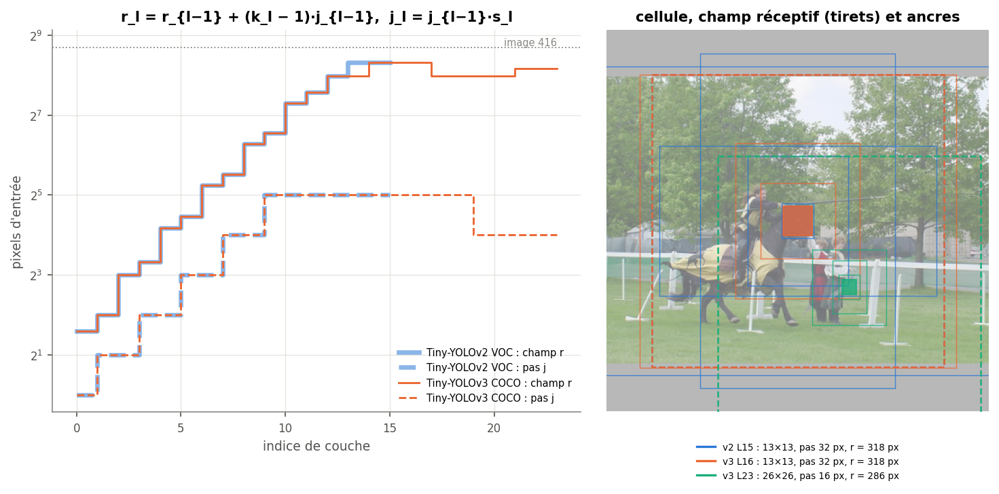

### T13.50 — `flux`

Flux des tenseurs couche par couche, un bloc par tenseur (largeur selon C, hauteur selon H) ; en v3, route, upsample et seconde tête.

- Commande : `python -m tools.figures flux`
- Source : `model/<net>/manifest.json, yolo.models.specs.infer_shapes`

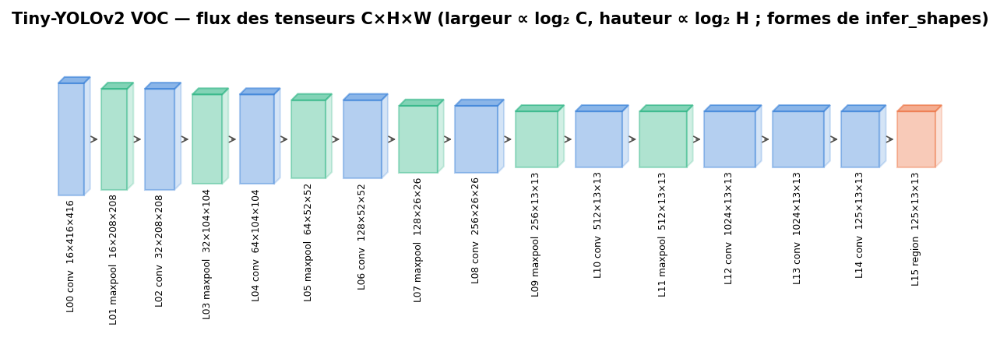
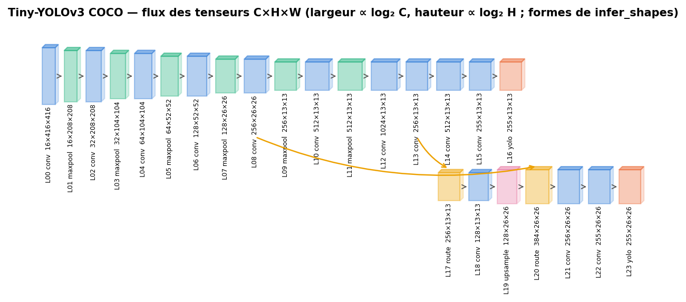

### T13.51 — `tete`

La tête de sortie : disposition des canaux (ancres × (5 + C)), puis le vecteur d'une cellule en int8 et décodé (sigmoïdes, exponentielles, softmax).

- Commande : `python -m tools.figures tete`
- Source : `model/<net>/dumps/<image>/L<tête>.npy, manifest, yolo.infer.decode.decode_head`

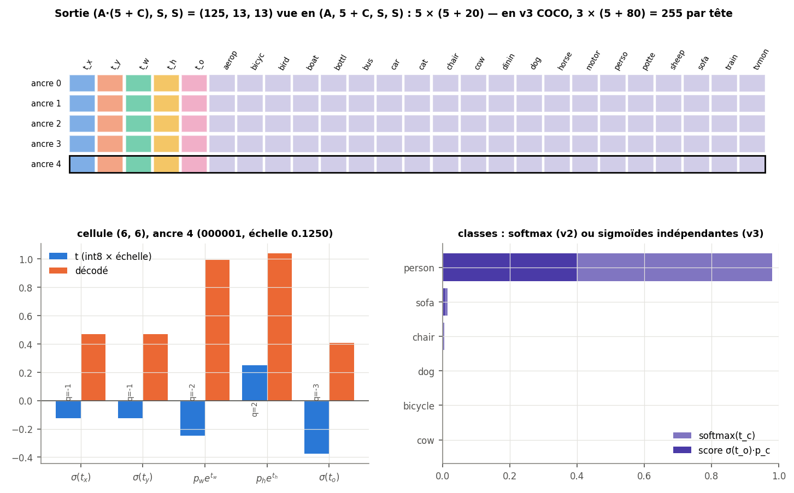

### T13.52 — `une_couche`

Une couche suivie du flottant au noyau HLS : formules, types et largeurs, écarts mesurés entre stades (SNR, octets).

- Commande : `python -m tools.figures une_couche`
- Source : `model/<net>/dumps, build/golden/out, suivi du README ; noms vérifiés dans le code`

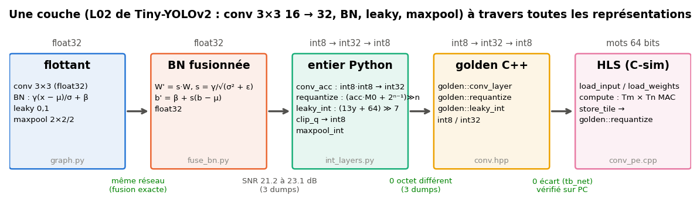
